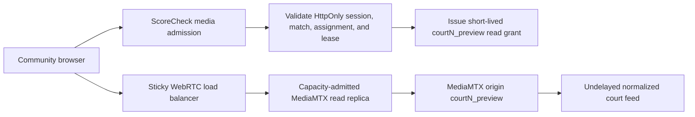

# Community Witness low-latency playback hard cut

## Decision

The Community Witness scoring player should ultimately use ScoreCheck's undelayed `courtN_preview` stream over WHEP/WebRTC. It should not use the delayed `courtN_program` branch, the raw camera path, or YouTube as its primary evidence feed.

The current single MediaMTX Droplet remains the origin. It must not become an anonymously readable public fan-out tier. The YouTube embed stays advisory until the authenticated playback edge, connectivity fallbacks, and intended viewer capacity are proven; then Community Witness cuts directly to the owned player with no feature flag or compatibility adapter.

## Why a direct public-Droplet switch is unsafe

- `infra/mediamtx/mediamtx.template.yml` currently grants anonymous read/playback access to preview, program, monitor, and calibration paths. Guessed URLs can bypass assignment admission and can start expensive on-demand monitor/calibration branches.
- `src/lib/video.ts` can append a static MediaMTX username and password to browser-visible query URLs. Reusing that mechanism for community viewers would expose replayable credentials in networking tools, logs, and copied links.
- The configured preview is roughly 2.6 Mbps per reader. Five hundred viewers on one court would require about 1.3 Gbps of origin egress; 500 viewers on each of eight courts would require about 10.4 Gbps. MediaMTX does not re-encode per viewer, but it still sends an independent stream to each reader.
- The current origin has been qualified for production ingest and tightly bounded operator playback, not community fan-out. Existing capacity evidence does not establish even one 500-reader court, much less eight concurrent courts.
- WHEP currently has UDP/STUN connectivity but no qualified TURN/TCP fallback. Cellular, hotel, school, and corporate networks can block the available path.
- `StreamPlayer` advertises an HLS fallback, while the MediaMTX template has `hls: no`. Community scoring cannot rely on a fallback that is not deployed or silently move to a different latency class.

## Target architecture

1. A same-origin community media endpoint validates the existing HttpOnly session cookie, active match, assignment role, lease, and court.
2. It returns a two-to-five-minute bearer grant scoped to `read` on exactly one `courtN_preview` path. Tokens never appear in query strings and cannot authorize raw, program, monitor, calibration, publish, API, or metrics access.
3. The owned player sends the grant in the WHEP `Authorization` header. Reconnect refreshes admission only while the assignment remains active.
4. Release, revocation, match transition, and lease expiry stop grant renewal and terminate any broker-owned WHEP resource.
5. A sticky Layer-7 load balancer assigns viewers to health-checked, event-scoped MediaMTX read replicas. The origin supplies replicas; it does not directly serve the audience.
6. WebRTC connectivity includes measured UDP, TCP, and TURN paths. Failure is explicit rather than silently switching an authoritative scorer to delayed media.
7. Admin, commentary, program, and community players fast-forward to the same server-authorized contract. Anonymous read/playback grants and browser-visible static credentials are removed in the same release.

A same-origin WHEP signaling broker is also acceptable if it forwards SDP and DELETE lifecycle requests with server-only credentials and returns opaque ScoreCheck resource URLs. The browser's media packets can still flow directly to an admitted replica. Either design must keep court/path selection server-side.

## Playback hierarchy

1. Capacity-admitted WHEP `courtN_preview`: primary scoring evidence feed.
2. Explicitly labeled CDN HLS: continuity fallback only after its measured latency is represented in the observation contract.
3. YouTube: external spectator broadcast or clearly delayed advisory fallback, never an authoritative community scoring feed.
4. Score-only: fail closed when no latency-qualified media path is available.

Transport changes must be visible to the participant. A scorer cannot unknowingly move from sub-second WHEP to a multi-second stream while continuing to submit against the current canonical revision.

## Hard-cut implementation order

1. Ship the provider-neutral responsive geometry: exact 16:9 containment, phone-landscape video first, score below, safe-area protection, and a reliable route past an embedded player's captured gestures.
2. Replace anonymous MediaMTX playback with assignment-scoped authorization and fast-forward every existing browser consumer.
3. Add read replicas, sticky routing, viewer admission, TURN/TCP connectivity, and per-replica bandwidth/reader health.
4. Prove reconnect, revocation, expiry, origin/replica failure, Wi-Fi, cellular, and UDP-blocked behavior on real iOS Safari and Android Chrome.
5. Ramp 25, 50, 100, 250, and 500 readers on one court, then test the intended eight-court aggregate. Stop admission before measured reader, egress, packet-loss, or origin headroom limits are crossed.
6. Hard-cut the Community Witness DTO and UI from `youtubeVideoId`/iframe playback to the owned media descriptor/player. Remove the community YouTube control in the same commit.
7. Correlate playback time with canonical rally/event time before any remote viewer can gain score authority. Low latency reduces error; it does not prove which rally a remote viewer saw.

## Release gates

- No reusable credential, internal hostname, unrestricted path, or raw stream identifier crosses the community API boundary.
- Anonymous MediaMTX read/playback permissions are absent for every court path.
- One active assignment cannot mint unbounded simultaneous media sessions.
- Revocation and lease expiry prevent renewal and close owned signaling resources.
- The full source frame remains visible at 320x480, 390x844, 568x320, 844x390, 768x1024, 1024x768, and desktop sizes.
- Scoring remains reachable without pausing, seeking, or remounting playback during rotation and focus-mode transitions.
- Viewer admission and alerts use measured concurrent readers and egress, not assumed Droplet capacity.
- Media latency and canonical-event correlation are observable in receipts and operator diagnostics.

No feature flag is part of this plan. Health/capacity fallback is an explicit runtime state, not a hidden rollout mechanism.
