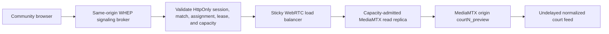

# Community Witness low-latency playback hard cut

## Decision

The Community Witness scoring player uses ScoreCheck's undelayed `courtN_preview` stream over WHEP/WebRTC. It does not use the delayed `courtN_program` branch, the raw camera path, or YouTube.

The application hard cut is complete: Community Witness contains no YouTube embed or direct media descriptor. Its player signals only through a same-origin broker. Production video remains fail-closed until the capacity-qualified read edge, connectivity fallbacks, and explicit admission ceilings are configured; the current single MediaMTX Droplet remains an origin, never the community fan-out tier.

## Why a direct public-Droplet switch is unsafe

- `infra/mediamtx/mediamtx.template.yml` currently grants anonymous read/playback access to preview, program, monitor, and calibration paths. Guessed URLs can bypass assignment admission and can start expensive on-demand monitor/calibration branches.
- `src/lib/video.ts` can append a static MediaMTX username and password to browser-visible query URLs. Reusing that mechanism for community viewers would expose replayable credentials in networking tools, logs, and copied links.
- The configured preview is roughly 2.6 Mbps per reader. Five hundred viewers on one court would require about 1.3 Gbps of origin egress; 500 viewers on each of eight courts would require about 10.4 Gbps. MediaMTX does not re-encode per viewer, but it still sends an independent stream to each reader.
- The current origin has been qualified for production ingest and tightly bounded operator playback, not community fan-out. Existing capacity evidence does not establish even one 500-reader court, much less eight concurrent courts.
- WHEP currently has UDP/STUN connectivity but no qualified TURN/TCP fallback. Cellular, hotel, school, and corporate networks can block the available path.
- `StreamPlayer` advertises an HLS fallback, while the MediaMTX template has `hls: no`. Community scoring cannot rely on a fallback that is not deployed or silently move to a different latency class.

## Target architecture

1. The same-origin broker validates the existing HttpOnly session cookie, active match, assignment role, lease, court, one-resource-per-assignment rule, and measured per-court/total capacity.
2. It derives exactly one `courtN_preview` path server-side, forwards bounded SDP with server-only Basic credentials, rejects redirects/foreign `Location` headers, and returns only SDP plus an opaque same-origin DELETE URL.
3. The browser never receives the read-edge URL, reusable credential, path, upstream WHEP resource location, or sticky cookie. Media still flows directly from the admitted replica using the ICE answer.
4. Release, revocation, match transition, lease expiry, replacement, and worker cleanup terminate broker-owned WHEP resources.
5. A sticky Layer-7 load balancer assigns viewers to health-checked, event-scoped MediaMTX read replicas. The origin supplies replicas; it does not directly serve the audience.
6. WebRTC connectivity includes measured UDP, TCP, and TURN paths. Failure is explicit rather than silently switching an authoritative scorer to delayed media.
7. Admin, commentary, program, and community players fast-forward to the same server-authorized contract. Anonymous read/playback grants and browser-visible static credentials are removed in the same release.

A same-origin WHEP signaling broker is also acceptable if it forwards SDP and DELETE lifecycle requests with server-only credentials and returns opaque ScoreCheck resource URLs. The browser's media packets can still flow directly to an admitted replica. Either design must keep court/path selection server-side.

## Playback hierarchy

1. Capacity-admitted WHEP `courtN_preview`: primary scoring evidence feed.
2. Explicitly labeled CDN HLS: continuity fallback only after its measured latency is represented in the observation contract.
3. YouTube: external spectator broadcast or clearly delayed advisory fallback, never an authoritative community scoring feed.
4. Media unavailable: remote authoritative controls pause until WHEP reconnects; only an organizer-verified scorer physically viewing the court may continue without video.

Transport failures are actionable rather than branded: the participant sees reconnect/pause state, not a latency identifier bubble. Scoring mode never silently changes from WHEP to HLS or YouTube.

## Hard-cut implementation order

1. **Implemented:** provider-neutral responsive geometry, exact 16:9 containment, stacked portrait fallback, paired movable corner docks, safe areas, and one mounted player through focus transitions.
2. **Implemented for Community Witness:** same-origin broker admission, opaque resource lifecycle, service-only cleanup ledger, no YouTube/direct descriptor, and WHEP-only scoring mode.
3. Add read replicas, sticky routing, viewer admission, TURN/TCP connectivity, and per-replica bandwidth/reader health.
4. Prove reconnect, revocation, expiry, origin/replica failure, Wi-Fi, cellular, and UDP-blocked behavior on real iOS Safari and Android Chrome.
5. Ramp 25, 50, 100, 250, and 500 readers on one court, then test the intended eight-court aggregate. Stop admission before measured reader, egress, packet-loss, or origin headroom limits are crossed.
6. Fast-forward remaining admin/commentary/program consumers before removing anonymous origin playback; the community browser is already cut over.
7. Complete source-clock correlation before non-courtside remote authority. The shipped playback snapshot is diagnostic and fail-closed, not proof of rally identity.

## Release gates

- No reusable credential, internal hostname, unrestricted path, or raw stream identifier crosses the community API boundary.
- Anonymous MediaMTX read/playback permissions are absent for every court path.
- One active assignment cannot mint unbounded simultaneous media sessions.
- Revocation and lease expiry prevent renewal and close owned signaling resources.
- The full source frame remains visible at 320x480, 390x844, 568x320, 844x390, 768x1024, 1024x768, and desktop sizes.
- Scoring remains reachable without pausing, seeking, or remounting playback during rotation and focus-mode transitions.
- Viewer admission and alerts use measured concurrent readers and egress, not assumed Droplet capacity.
- Broker admission, active-session identity, cleanup attempts, and capacity denials are observable. Browser playback evidence remains explicitly uncorrelated; receipts must not claim measured source latency or source-frame/canonical-rally correlation.

No feature flag is part of this plan. Health/capacity fallback is an explicit runtime state, not a hidden rollout mechanism.
