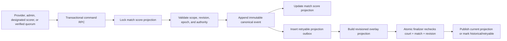

# Community Witness scorekeeping hard cutover

## Outcome

Community scorekeeping is a match-scoped evidence and authority system, not a collection of browser sessions that can each overwrite a court row. Every participant can record what they saw. Only the currently authorized source advances the broadcast score, and every canonical change is revisioned, attributable, and projected through one transactional path.

This is a hard cutover. The reusable court-token routes, active/backup/waiting session model, shadow scores, and direct browser score mutations are removed. No feature flag or compatibility adapter is retained.

## Product assumptions and trade-offs

- Anyone with the public court link may join as an ordinary observer without a code. This keeps the experience inclusive.
- An ordinary observer's tap is evidence, not an immediate score mutation. Letting an anonymous majority directly own the broadcast would invite brigading, accidental double taps, and remote stream-latency conflicts.
- Verified courtside witnesses can drive the score only after a deterministic quorum. A verified or designated role requires a match-scoped, expiring grant or a trusted internal assignment.
- Engagement uses truthful contribution receipts and collective progress, not competitive points or a leaderboard. Rewarding tap volume would incentivize speed and repetition over accuracy.
- Community watch-and-score is hard-cut to the owned `courtN_preview` WHEP player through a same-origin signaling broker. YouTube and direct MediaMTX URLs are absent from the Community Witness DTO and UI. The broker is deliberately fail-closed until a capacity-qualified read edge is configured; the origin Droplet is never the public fan-out tier.
- Focus mode keeps one contained 16:9 player mounted while the Corner Docks overlay moves between responsive states. Phone portrait retains score below video; phone/tablet landscape and desktop fullscreen place explicit score actions in safe-area-aware corners without cropping the court frame.
- `Switch sides` is a local display preference. It swaps the complete blue and red team panels for that match on that device while preserving canonical Team A/Team B identity in every request.
- The full-screen team docks move together between top and bottom corners. That viewer preference is device-local and never changes score meaning or team identity.
- Current-set selection is not local. Only the active designated scorer or an authenticated organizer can issue a confirmed, revisioned `SET_CURRENT_SET` correction; every witness immediately receives the same canonical set. A remote designated scorer must have the same qualified brokered court frame required for point commands, while an organizer-verified courtside scorer may rely on direct sight of the physical court.
- A match accepts at most 500 simultaneously active ordinary or verified witnesses, plus a designated scorer. The bound protects the database and operator tools; a shared venue IP is deliberately not treated as a person or device identity.
- Admin revocation blocks the same stable device cookie for the current match, not a durable human identity. An anonymous participant can clear local state, so distributed quotas and the active-witness cap remain the real abuse boundaries.

## Review findings resolved

| Area | Previous failure mode | Hard-cut resolution |
| --- | --- | --- |
| Canonical architecture | Browser sessions and reusable court tokens could compete to overwrite court-scoped score state. | One match-scoped score projection, immutable canonical events, authority epochs, and transactional command RPCs replace every legacy writer. |
| Source authority | Session labels blurred provider, operator, scorer, and crowd authority. | Explicit priority is enforced in the database; every write checks revision and authority epoch. |
| Crowd concurrency | A synchronized audience could serialize every tap on the canonical score row and delay the real scorer. | Ordinary evidence takes compatible shared score locks; only verified courtside consensus candidates and canonical writers take the exclusive path. |
| Anonymous abuse | Process-local rate limits and unlimited session creation were ineffective across server instances. | A stable HttpOnly device identifier, committed database quota counters, generous venue-NAT backstop, match capacity, and one-hour counter-retention target provide distributed admission control. |
| Review noise | Two anonymous dissenting taps could open an operator review and make the rally journey claim a dispute. | Anonymous disagreement remains a truthful personal receipt; a post-canonical review and global disputed state require two active verified-courtside dissenters. |
| Operator scalability | Admin pages loaded every historical assignment and could be silently truncated by a row limit. | A bounded operational projection returns every live elevated assignment, the newest 25 ordinary observers per court, and truthful total counts. Open reviews are capped to the newest 200. |
| Write amplification | Every visible-client sync renewed the lease and rewrote assignment timestamps. | Adaptive snapshot sync remains frequent enough for scoring, while the database renews only in the latter half of the lease. |
| Projection races | A delayed outbox item from an old match could publish after the court advanced. | The atomic finalizer rechecks court, match, and revision under lock before publishing or marking work historical. |
| Browser trust boundary | Raw Realtime rows and broadly granted routines made future schema additions risky. | Browser roles lose direct table/function access; Realtime is only an invalidation hint followed by an allowlisted HTTP fetch. |
| Scorekeeper UX | Ambiguous No point/Unsure controls, generic team labels, weak set context, and invisible participation reduced confidence. | Actual names, total scores, explicit Add/Remove actions, a prominent set marker, local Switch sides, rally journey, personal receipts, and collective coverage make each action legible. |
| Watch-and-score | The scorekeeper did not adapt to phone, tablet, desktop, orientation, fullscreen availability, or an existing commentary player. | Mobile/tablet preserve a contained 16:9 video above score in both orientations, desktop uses a stable split, phone-landscape focus opens video-first with score below, and focus mode falls back to a full-window dialog when container fullscreen is unavailable. Commentary uses the same assignment-bound, same-origin WHEP scoring player for both action qualification and audio-preview timing; it mounts no second feed and receives no raw media source. |
| Media security | A direct-origin preview path would expose reusable MediaMTX credentials, stream paths, and unbounded fan-out. | A same-origin broker derives the exact preview path from the HttpOnly assignment, atomically admits one resource per assignment, retains edge credentials/affinity server-side, returns an opaque DELETE URL, and reaps resources on release, revocation, transition, expiry, or browser loss. The edge URL is separate from the origin configuration. |
| Client reliability | A heartbeat race could strand a successful tap as `sending`; retryable failures could leave saved input disabled forever; a delayed remote retry could incorrectly apply an old point. | Ordinary evidence uses bounded idempotent retry. An uncertain remote point is never submitted later: reconnect checks only whether its command id already committed, then reports recorded or requires a fresh live re-entry. Failed feedback survives refreshes and heartbeats until acknowledged. Commentary promotes its observer assignment in place and reuses a live same-match cookie, so a lost response or transient session read cannot orphan or silently replace the scorer seat. |
| Durable engagement credit | Resolving a review replaced the receipt status and erased the user's final recap credit for helping open it. | Immutable `review_triggered_at` history survives applied or dismissed reviews and drives the personal review-trigger count. |

## Authority model

Authority is explicit and epoch-scoped:

1. `ADMIN_LOCKED` — an operator correction is authoritative until deliberately released.
2. `PROVIDER_PRIMARY` — a healthy official provider owns the score.
3. `DESIGNATED_PRIMARY` — one active, leased designated scorekeeper owns the score.
4. `VERIFIED_CONSENSUS` — verified courtside witnesses can advance a rally at quorum.
5. `PAUSED_DISPUTE` — the system fails closed when authority or evidence cannot be resolved safely.

A stale client cannot write through an authority change: commands carry both an expected score revision and authority epoch. Provider updates cannot overwrite an admin lock. Assignment promotion, release, revocation, and match transitions change authority atomically.

## Canonical write path

`score_states` is the single match-centric canonical projection, keyed uniquely by `match_id`. Canonical score values and source metadata are written in the same transaction. Overlay publication happens after the commit through an outbox so a transient overlay failure does not lose the score revision. The finalizer locks and rechecks the outbox, current court match, and canonical score together; an old match can never publish its projection onto a newly transitioned court.

Unchanged provider payloads do not create revisions or outbox work. Provider liveness belongs in `score_source_heartbeats`; it does not manufacture score changes.

## Community evidence flow

- Add point and Remove point are explicit actions. There is no No point or Unsure action.
- Observations are immutable and idempotent. An assignment gets one vote for a base revision.
- After a witness records that vote, Add/Remove remain disabled with an explicit waiting message until the canonical revision advances. Repeated taps are never silently accepted or dropped.
- Ordinary observers receive a `RECORDED` receipt and remain non-authoritative.
- Verified witnesses count toward consensus only while active, unexpired, and verified courtside.
- At least three eligible witnesses are required. An exact action/team choice needs a two-thirds majority.
- A successful quorum appends one `CONSENSUS` canonical event. Concurrent submissions serialize on the match score lock.
- Matching contributors receive `CONFIRMED`; dissenting contributors receive `DIFFERED`.
- Five eligible votes without a two-thirds choice pause the match for review and open a dispute.
- After a designated, provider, or admin score is committed, anonymous dissent remains visible to that contributor but does not manufacture an operator alert. Two active verified-courtside dissenters are required to open a post-canonical score review.
- A global rally is shown as disputed only when a real review exists. A lone differing receipt never tells every viewer that the rally is under review.
- Late input is retained as evidence and receives `LATE`; it is never silently applied to a newer score.
- Review credit is historical, not inferred from the receipt's current status. A database guard prevents `review_triggered_at` from being cleared after the user helps open a real score check.

## Scorekeeper experience

Every layout keeps the match context and action semantics visible:

- Court and match number in the header.
- A prominent current set marker.
- A designated-only current-set selector that confirms the official change and updates all viewers; ordinary witnesses always follow the canonical set.
- Actual team names, total score, and sets won.
- Large `Add point` and secondary `Remove point` controls for each team.
- A compact `Switch sides` button that moves the entire team panels and announces the change to assistive technology.
- A rally journey showing confirmed, pending, corrected, or disputed rallies.
- A personal receipt such as `Recorded for Rally 38` or `You helped confirm Rally 38`.
- Collective coverage such as `8 witnesses · 7 rallies confirmed together`.

Watch-and-score has four deliberate presentations:

- Phone portrait: a complete 16:9 video first, compact scorekeeper directly below, with the primary Add actions reachable in the initial score region.
- Tablet portrait: video above a roomier two-team scorekeeper.
- Desktop/laptop: one persistent player beside the scorekeeper so neither context resets while the page scrolls.
- Focus mode: the player and score controls share one fullscreen container. Portrait/zoom retains a stacked score region; landscape/fullscreen uses paired corner docks over the complete contained frame. A single `Controls: Top/Bottom` preference moves both teams together, and `Switch sides` moves the full team identity/action dock while preserving canonical A/B handlers. Browsers that reject element fullscreen keep the same experience as a fixed full-window dialog.

The owned video element stays mounted through focus transitions. Focus sentinels contain keyboard navigation, background session controls become inert for the life of the dialog, Escape exits, and focus returns to the trigger. Visible media controls expose play, mute, and reconnect without a non-actionable latency badge.

Accepted remote authoritative point commands retain a seven-day browser playback diagnostic keyed to the canonical action. Ordinary crowd taps do not store frame blobs. The diagnostic records WHEP session identity, presented-frame age, media time, connection state, and score revision, but is explicitly `uncorrelated_client_diagnostic`: it can fail closed and support investigation, but cannot prove source-frame/rally identity. Every remote designated scorer, including trusted commentary, pauses without a fresh brokered frame; an organizer-verified scorer physically viewing the court retains the explicit no-video exemption.

The side order is stored at `scorecheck:community-side-order:<matchId>`. The paired control position is stored at `scorecheck:community-score-controls-position`. Both survive refreshes on that device; neither changes canonical team identity or the official set.

The join flow deliberately does not ask users to self-declare “courtside” versus “online.” Self-reported location cannot establish score authority. An ordinary participant is an unverified witness until an organizer-issued, match-scoped grant changes that role. A bearer designated invite still creates `REMOTE` trust and therefore keeps the owned-video gate; only the authenticated verify-then-promote workflow establishes the physical-courtside exemption.

## Reliability and abuse controls

- Raw session tokens exist only in an HttpOnly, Secure, SameSite=Lax cookie and are stored server-side only as hashes.
- Public joins and commands are rate-limited; all assignment and grant scopes include event, court, and match. Admission quota decisions are committed in a separate database transaction so a denied attempt cannot roll its own counter back.
- Admission counters are indexed by update time, pruned in bounded batches after one hour, and never store raw IP addresses or raw device identifiers.
- A device may hold one active assignment per match. Rejoining rotates its session token instead of consuming another slot, and an expired elevated assignment returns as an ordinary observer unless a still-valid matching grant is supplied again.
- Leases expire quickly and are renewed explicitly. Expired assignments do not count toward coverage or quorum. The client uses one adaptive lease-and-snapshot sync (2 seconds briefly after a contribution, 8 seconds while visibly idle, 30 seconds while hidden) instead of stacking personalized polling and heartbeat traffic. Healthy early heartbeats are read-only; renewal writes occur only when the lease enters its renewal window.
- Ordinary observations share-lock the current score and retain a per-assignment write lock. Crowd taps therefore ingest concurrently without allowing a canonical score update to interleave ambiguously with their captured revision.
- Admin assignment data is operationally bounded: all live designated/verified assignments remain actionable, only the newest 25 ordinary observers per court are rendered, and total counts stay exact.
- Client action IDs make retries safe. Device-local retry state preserves one pending contribution across a brief network loss. Retryable online failures back off at 1, 2, 4, 8, and 16 seconds, then pause behind an explicit `Retry saved contribution` action; offline state waits for reconnection without minting a new action id.
- A score revision, authority epoch, state hash, immutable event, and outbox row make races and partial projection failures diagnosable.
- Match reassignment, force-next, completion, and event transitions end old assignments so a stale scorer cannot affect the next match.

## Security boundary

- Browser roles have no direct table or function access.
- Service tables use forced deny-by-default RLS; `PUBLIC`, `anon`, and `authenticated` privileges are revoked.
- Security-definer RPC execution is restricted to `service_role`.
- Public APIs construct allowlisted DTOs field by field and never spread database rows.
- Raw Postgres row replication is removed from public Realtime publication. Public Realtime messages are treated only as untrusted invalidation hints: their body is discarded and the overlay refetches its allowlisted HTTP projection before applying any score.
- Community session responses contain no YouTube id, MediaMTX username/password, WHEP/HLS path, internal hostname, ingest key, or reusable preview URL. Browser signaling uses only same-origin broker URLs; upstream credentials, affinity, and resource locations remain in the service-only cleanup ledger. The deployment boundary is defined in `docs/community-low-latency-playback-plan.md`.

## Verification gates

- Schema contract tests cover table scope, immutable evidence, function privilege revocation, unique match projections, and one-vote rules.
- Engine tests cover idempotency, stale revisions, authority changes, provider/admin precedence, consensus, disputes, score corrections, and set/match transitions.
- API tests cover cookie handling, scope rejection, rate limits, safe DTOs, release, heartbeat, and truthful receipts.
- UI tests cover explicit actions, actual team names, prominent set context, local side switching, stable A/B request identity, bounded retry, projection catch-up copy, receipt reconciliation, watch preference validation, and accessibility labels.
- Admission tests cover same-device reuse, expired-role downgrade, grant-backed elevation, match-scoped revocation, durable quota denial, capacity, bounded admin summaries, and counter retention.
- Contention checks cover concurrent ordinary observers sharing the score boundary while canonical and verified-consensus writers retain exclusive ordering.
- Release validation requires migration canary checks, unit/integration tests, typecheck, production build, browser interaction, mobile visual comparison, phone/tablet/desktop and portrait/landscape focus checks, accessibility review, and a clean merged worktree.

## Operational measurements after deployment

The code path is complete without a feature flag, but production rollout still needs event-specific observation rather than optimistic assumptions. Track observation p95 latency and score-row lock wait, quota/cap denials, active witnesses per match, verified-review rate, client retry exhaustion, lease-renewal writes, oldest outbox age, projection retry count, active/closing media sessions, cleanup retries, and read-edge saturation. Alert on sustained lock waits, an outbox item older than one scoring interval, stranded cleanup resources, or a review rate inconsistent with the verified-dissent threshold.

## Recommended follow-through

| Priority | Recommendation | Why |
| --- | --- | --- |
| Release gate | Run a representative 500-client personalized heartbeat/observation load test behind both distributed and venue-NAT traffic shapes. | The SQL locking model and request budgets are bounded, but local tests do not prove database connection, compute, and serverless concurrency capacity at event scale. |
| Before remote authority | Complete source-clock/canonical-event correlation beyond the shipped client diagnostic snapshot. | Browser media time can fail closed locally but cannot by itself bind an authoritative tap to a source frame/rally. |
| Before enabling owned scoring playback in production | Provision and qualify the configured read edge, sticky routing, explicit capacity ceilings, TURN/TCP connectivity, and private origin pull. | The application hard cut is present, but zero configured capacity deliberately leaves remote authoritative scoring paused rather than fan out from the origin. |
| Abuse hardening | Replace deterministic request-IP hashing with keyed HMAC and validate trusted-proxy parsing. | The current value is bounded operational metadata, not a durable abuse identity; keying prevents offline correlation if counters are exposed. |
