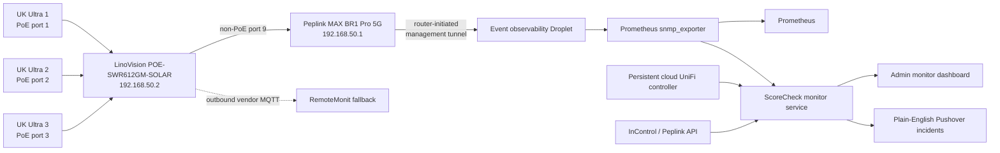

# LinoVision PoE Switch Integration Research

Status: purchase-validation decision and implementation plan

Last researched: 2026-08-04

Target model: LinoVision `POE-SWR612GM-SOLAR`

## Executive decision

Keep the ordered switch. It has a real, subscription-independent, headless
integration path through SNMPv3. ScoreCheck does not need to scrape the
RemoteMonit website, depend on a Mac, expose the switch publicly, or trust an
undocumented cloud API.

The recommended production path is:

1. The switch stays on the private venue management LAN.
2. The Peplink initiates a management-only tunnel to the temporary event
   observability Droplet.
3. Prometheus `snmp_exporter` polls the switch through that tunnel with a
   read-only SNMPv3 `authPriv` identity.
4. ScoreCheck interprets the admitted switch metrics, correlates them with
   UniFi and Peplink state, and presents plain-English status in the existing
   monitor dashboard.
5. RemoteMonit remains an optional vendor troubleshooting and manual-control
   fallback. It is not an availability dependency for ScoreCheck.

The $239 switch is not the cheapest LinoVision cloud-managed model. The cheaper
`POE-SWR308G` is currently advertised at $99 and also provides eight gigabit
PoE ports and cloud port control. It is an indoor AC-powered, fan-cooled switch
with a 120 W budget and a 0-40 C operating range. The ordered model adds the
features that matter to the traveling event kit: direct 8-57 V DC input,
voltage boost, dual power inputs, fanless industrial construction, DIN-rail
mounting, -40-75 C operation, two additional copper uplinks, a 70 W budget even
at 12 V, and richer local L2+ management. Three UK-Ultra access points consume
at most 24 W total, so the 12 V budget has substantial margin.

If the venue kit will always have protected AC power and indoor temperatures,
the $99 model is a defensible cost reduction. It is not a better monitoring
choice. Because ScoreCheck is a one-operator outdoor production system, the
ordered industrial DC model is the better operational choice.

## What is officially confirmed

The LinoVision product page and datasheet confirm:

- ten 10/100/1000 copper ports, of which ports 1-8 provide PoE, plus two SFP
  slots;
- an 8-57 V dual DC input with a total PoE budget of 70 W at 12 V, 180 W at
  24 V, and 240 W at 48 V;
- HTTPS, console, Telnet, SSH, CLI, SNMP v1/v2c/v3, and SNMP traps;
- RemoteMonit and third-party cloud-platform support;
- configurable PoE on/off, power budget, PD Alive, and PoE scheduling;
- VLAN, LLDP, ACL, QoS, spanning-tree, link aggregation, and static-routing
  functions;
- a fanless IP40 enclosure, dual power inputs, DIN-rail/wall mounting, and a
  -40-75 C operating range.

The official RemoteMonit product page confirms that its PoE view can display:

- per-port on/off state;
- negotiated speed;
- power consumption;
- port priority;
- remote PoE port control;
- event-triggered and scheduled workflows.

The publicly delivered RemoteMonit client application also contains a dedicated
PoE-management module with port state, link state, speed, power use, priority,
PoE limit, history, VLAN, firmware, checks, and remote control. That confirms
these capabilities exist in the vendor platform. Its internal web endpoints are
not a documented customer API and must not become a ScoreCheck dependency.

## What is not yet proven

The following cannot be honestly certified until the physical unit arrives or
LinoVision supplies additional documentation:

- the exact vendor MIB and enterprise OID tree;
- whether per-port watts, total PoE use, power-input state, CPU, memory, and
  temperature are exposed through SNMP rather than only MQTT/RemoteMonit;
- the exact SNMPv3 authentication and privacy algorithms in the shipped
  firmware. Available material describes SHA and AES, not SHA-2;
- whether link-state and PoE events produce useful SNMP traps;
- whether the MQTT screen accepts an arbitrary broker in practice;
- MQTT payload schema, message versioning, QoS, retained-message behavior, and
  reconnect semantics;
- MQTT TLS support. The available configuration example uses TCP port 1883 and
  does not document TLS;
- whether RemoteMonit access is included indefinitely, for one year, or under a
  separate subscription for this exact model;
- any supported public RemoteMonit API, webhook, or telemetry export. None was
  found in the official material.

These unknowns do not block the purchase because standard SNMPv3 is sufficient
for the required link and traffic monitoring. They control only how much PoE
detail can be added after commissioning.

## Integration methods evaluated

| Method | Telemetry | Control | Works behind NAT | Stable public contract | Decision |
| --- | --- | --- | --- | --- | --- |
| SNMPv3 polling | Identity, uptime, interfaces, counters, errors; PoE if exposed by the MIB | Possible but deliberately read-only | Yes, through the router-initiated management tunnel | Yes, standards-based | Primary ScoreCheck source |
| SNMPv3 traps | Link/PoE events if emitted | No | Yes, through the same tunnel | Yes, but device event coverage must be tested | Optional acceleration, never sole state |
| RemoteMonit web application | Confirmed port state, speed, watts, priority, history | Confirmed PoE control and workflows | Yes, outbound MQTT | No documented customer API | Human troubleshooting fallback |
| RemoteMonit private web calls | Same vendor-cloud data | Yes | Yes | No | Reject; do not scrape or reverse-engineer |
| Customer MQTT broker | Potentially all cloud fields | Potential bidirectional commands | Yes, outbound | No documented schema or TLS | Evaluate only if vendor documents TLS and payloads |
| SSH/CLI | Local status and configuration | Broad | Yes, through tunnel | Command output may change by firmware | Commissioning and bounded recovery only |
| HTTPS web interface | Full local UI | Broad | Yes, through tunnel | Human UI, not an API | Commissioning only; never scrape |
| Telnet | Similar to CLI | Broad | Yes | Plaintext | Disable |
| Serial console | Emergency local access | Broad | No remote path | Physical recovery | Retain as break-glass only |
| ONVIF discovery | Discovery of ONVIF devices | Limited | Local only | Not switch telemetry | Not used by ScoreCheck |

## Recommended no-Mac architecture

No Mac participates in event operation. The switch accepts no inbound public
management traffic. Dynamic venue IP addresses and carrier NAT do not matter
because the Peplink starts the management tunnel from inside the venue network.

## ScoreCheck collection design

Use the Prometheus project `snmp_exporter`, not a custom SNMP implementation.
It is the Prometheus-recommended bridge for SNMP, supports SNMPv3 credentials,
standard `IF-MIB`, generated vendor MIB modules, and environment-expanded
secrets.

The minimal implementation after physical commissioning is:

1. Add one pinned `snmp_exporter` container to the existing observability
   Compose project.
2. Store the read-only SNMPv3 username, authentication secret, and privacy
   secret only in the protected event secrets directory.
3. Generate, do not hand-edit, the exporter module from the archived vendor MIB
   when vendor OIDs are admitted.
4. Poll the switch every 15 seconds while event media is expected and every 60
   seconds during non-coverage preflight.
5. Have Prometheus retain high-frequency counters and run alert rules.
6. Have the monitor service read a bounded admitted metric set from the exporter
   and add a `switch` object to the existing snapshot contract.
7. Render that object beside the existing Peplink and UniFi venue-network data.

The collector must fail closed on malformed or missing values. A missing PoE
OID is `unavailable`, not zero watts and not proof that an AP is unpowered.

## Initial admitted telemetry

The following standards-based data is the first release target:

### Switch-wide

- reachable and sample freshness;
- model, hostname, firmware, and system description;
- uptime and unexpected restart detection;
- management address;
- total interface count;
- SNMP request health and duration.

### Ports 1-3: access points

- administrative and operational state;
- negotiated speed and duplex when exposed;
- inbound and outbound 64-bit byte counters;
- current receive/transmit bitrate derived from counter deltas;
- input/output errors and discards derived from counter deltas;
- last operational-state transition;
- port name/alias bound to `UK Ultra 1`, `UK Ultra 2`, or `UK Ultra 3`.

### Port 9: router uplink

- operational state and negotiated speed;
- current receive/transmit bitrate;
- errors and discards;
- last state transition.

### Vendor PoE fields, admitted only after a real MIB walk

- configured PoE state and actual delivery state;
- current watts per AP and total watts;
- per-port maximum and priority;
- total budget and remaining headroom;
- PD Alive and schedule state;
- input 1/input 2 state if actually exposed;
- documented, bounded per-port cycle operation.

Voltage, current, powered-device class, switch temperature, CPU, and memory are
desirable but remain optional until observed on the exact firmware.

## Dashboard behavior

Add one `Venue LAN and PoE` section rather than a separate technical switch
dashboard. It should answer the operator's questions directly:

- Is the switch reporting now?
- Is the router uplink at 1 Gbps and free of errors?
- Are UK Ultra 1, 2, and 3 powered and linked?
- How much traffic is each AP carrying?
- Is any cable or port accumulating errors?
- How much PoE power is being used and how much remains?
- Did the switch reboot or a link flap recently?

Per AP, combine three independent views:

| Layer | Authority | Example conclusion |
| --- | --- | --- |
| Power and cable | LinoVision switch | Port has power, link, speed, and no wired errors |
| Radio and cameras | UniFi | AP is online; cameras have acceptable signal and retries |
| WAN and tunnel | Peplink | Camera traffic has bonded upload capacity and protected routing |

This correlation avoids incorrect camera restarts. For example:

- switch PoE/link down and UniFi AP offline: check AP cable, switch power, or
  that PoE port;
- switch link healthy but UniFi AP offline: check the AP/controller state;
- AP and switch healthy but all its cameras fail: check Wi-Fi association/RF;
- all APs and switch healthy but publishing fails: check Peplink/WAN/media;
- one switch port has rising CRC errors: replace or reseat that Ethernet cable.

## Alerts and operator actions

Only sustained active-event conditions page the operator. Suggested starting
rules are intentionally simple and must be tuned with real evidence:

| Condition | Initial gate | Plain-English notification |
| --- | --- | --- |
| Switch telemetry unavailable | 60 seconds while media is required | `The venue network switch stopped reporting. Keep the cameras on and check that the router and switch have power.` |
| Expected AP port link down | 30 seconds | `UK Ultra 2 lost its wired connection. Check its PoE cable and switch port 2.` |
| Uplink port 9 down | 10 seconds | `The switch lost its connection to the event router. Check the cable between the switch and router.` |
| Wired errors increasing | sustained nonzero rate for 2 minutes | `UK Ultra 1 has a bad wired connection. Reseat or replace its Ethernet cable.` |
| PoE budget near exhaustion | above 80 percent for 2 minutes | `The PoE switch is close to its power limit. Check for an unexpected powered device.` |
| Unexpected switch restart | uptime decreases | `The venue switch restarted. Check its power connection; cameras may reconnect automatically.` |

Do not page for lifetime error totals, one missed poll, an unused port, or an AP
that event expectations declare off.

## Remote control safety

Remote PoE cycling is useful, but it must not be automatic in the first release.
A port cycle can turn a working AP outage into a multi-camera outage.

Initial rules:

- SNMP is read-only.
- RemoteMonit, HTTPS, or SSH write access uses a separate operator credential.
- The monitor dashboard does not expose a port-cycle button until a physical
  AP recovery rehearsal proves the exact port mapping and failure behavior.
- If later added, a port cycle requires explicit confirmation, records the
  operator and reason, cycles exactly one named AP port, and verifies recovery.
- PD Alive remains disabled initially. Do not allow both the switch and
  ScoreCheck to independently reboot the same AP.
- PoE schedules remain disabled during events.

## Security contract

- Static management address: `192.168.50.2`, reserved outside DHCP.
- Retain the default administrator credential per Nathan's explicit decision;
  compensate by keeping management private, HTTPS-only, and unexposed to the
  public Internet.
- Enable HTTPS; disable plain HTTP and Telnet.
- Enable SNMPv3 only. Disable v1/v2c and remove default communities.
- Use `authPriv` with the strongest shipped combination. Current evidence
  supports SHA plus AES; use SHA-2 only if the physical firmware offers it.
- Create a read-only SNMP view containing only the admitted system, interface,
  LLDP, and verified PoE OIDs.
- Restrict SNMP by the switch's security-IP feature to the collector address.
- Do not open UDP 161/162, HTTPS, SSH, or MQTT management to the public Internet.
- Keep SNMP secrets out of source control, URLs, dashboard payloads, logs, and
  evidence archives.
- Disable SSH after commissioning unless a supported recovery procedure needs
  it. Keep serial console as the physical break-glass path.
- If RemoteMonit is enabled, use a unique account with MFA if the platform
  offers it and do not reuse ScoreCheck credentials.

## Physical commissioning checklist

The switch is not production-admitted until these steps pass on the exact unit:

1. Photograph and record model, serial, hardware revision, and shipped firmware.
2. Download and checksum the exact firmware and all vendor documentation.
3. Export the factory and configured backups.
4. Assign `192.168.50.2`; retain the user-approved default administrator
   credential; configure NTP and timezone.
5. Disable HTTP, Telnet, SNMPv1, and SNMPv2c.
6. Configure read-only SNMPv3 `authPriv` and security-IP restrictions.
7. Walk standard `SNMPv2-MIB`, `IF-MIB`, `IF-MIB::ifXTable`, LLDP, and the
   enterprise tree. Archive sanitized OID names/types, never credentials.
8. Map physical ports to stable `ifIndex` values and prove the mapping survives
   reboot.
9. Compare SNMP data with the local web UI and RemoteMonit for every desired
   PoE field.
10. Verify ports 1-3 power the correct AP and port 9 is the sole router uplink.
11. Unplug/replug one AP cable and verify link timestamps, traps, counters, and
    UniFi correlation.
12. Reboot the switch once and verify PoE continuity behavior, telemetry
    recovery, unchanged port identity, and no configuration loss.
13. Run all three APs under camera load and confirm the uplink remains 1 Gbps,
    wired errors remain flat, and total PoE draw stays well below budget.
14. Verify the event observability Droplet can poll through the router-initiated
    management tunnel with no public switch exposure and no Mac present.
15. Record RemoteMonit entitlement/expiration and test manual access separately.

## Acceptance decision after commissioning

Keep and integrate the switch if all of these are true:

- SNMPv3 `authPriv` works through the management tunnel;
- standard interface counters are stable and port mappings survive reboot;
- all three APs remain powered under load with ample budget;
- no link errors accumulate on known-good cables;
- remote management does not require a Mac or a public inbound port;
- RemoteMonit subscription status is known, even if ScoreCheck does not use it.

Return or replace it only if SNMPv3 is materially broken on the shipped firmware,
port identity is unstable across reboot, PoE power is unreliable, or required
management cannot be secured. Absence of a RemoteMonit public API is not a return
reason because RemoteMonit is not the production integration path.

## Source quality and confidence

High confidence:

- hardware, power, environmental, SNMP, trap, SSH, PoE control, and RemoteMonit
  capabilities stated in official LinoVision product material;
- RemoteMonit display fields stated on the official LinoVision cloud page;
- standard SNMP collection architecture based on the official Prometheus
  `snmp_exporter` project;
- UK-Ultra 8 W maximum consumption from Ubiquiti's official specification.

Medium confidence pending physical verification:

- SHA/AES SNMPv3 combinations and detailed local port statistics described in
  the January 2025 121-page LinoVision manual mirrored by device.report. The
  official product page currently labels a nine-page quick guide as its user
  manual, so the mirror is useful corroboration, not the final contract;
- customer-configurable MQTT broker fields and RemoteMonit connection example.

Not established:

- a supported RemoteMonit API;
- TLS MQTT or a stable customer payload schema;
- exact vendor PoE OIDs;
- RemoteMonit subscription terms for this exact purchase.

## Sources

- [LinoVision POE-SWR612GM-SOLAR product page](https://linovision.com/products/12-ports-l2-cloud-managed-poe-switch-with-dc12v-to-dc48v-voltage-booster)
- [Official POE-SWR612GM-SOLAR datasheet](https://cdn.shopify.com/s/files/1/0401/9657/1304/files/POE-SWR612GM-SOLAR_datasheet_v1.pdf?v=1778139248)
- [Official POE-SWR612GM-SOLAR quick guide](https://cdn.shopify.com/s/files/1/0401/9657/1304/files/POE-SWR612GM-SOLAR_Quick_Guide_1.pdf?v=1773382739)
- [LinoVision RemoteMonit overview](https://linovision.com/pages/remotemonit-cloud)
- [RemoteMonit application](https://remotemonit.com/login)
- [LinoVision POE-SWR308G product page](https://linovision.com/products/8-ports-cloud-managed-poe-switch-with-2-sfp-uplink-full-gigabit-ports)
- [Prometheus SNMP Exporter](https://github.com/prometheus/snmp_exporter)
- [Ubiquiti UK-Ultra specifications](https://techspecs.ui.com/unifi/wifi/uk-ultra)
- [January 2025 full manual mirror used only for corroboration](https://device.report/m/ec3041ab701460961434877b02c8b66adc762f358fd02712cf762c7da0998808)
