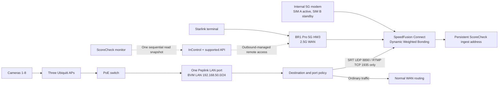

# ScoreCheck Peplink MAX BR1 Pro 5G HW3 Commissioning Plan

Status: implementation plan for the incoming replacement router

Target product: `MAX-BR1-PRO-5GK-T-PRM`, hardware revision 3

Prepared: 2026-07-29

Scope: venue router, Starlink, one internal cellular modem, SpeedFusion Connect,
the PoE switch, three Ubiquiti access points, eight cameras, remote management,
and router monitoring

## Executive Decision

The incoming BR1 Pro 5G HW3 is a reasonable production router for ScoreCheck.
Its published 256-bit AES SpeedFusion throughput is 200 Mbps, well above the
current roughly 24-30 Mbps eight-camera source payload. The prior GL-XE3000
failure does not prove this router will pass, but the HW3 has enough specified
throughput to justify a physical qualification before considering another
purchase.

The first production profile will be deliberately narrow:

- Wired Starlink on the 2.5 Gbps WAN port.
- One active internal cellular modem, normally using the T-Mobile SIM.
- Starlink and cellular both available to one SpeedFusion Connect profile.
- Dynamic Weighted Bonding with faster link-failure detection.
- No manual WAN Smoothing in the initial baseline.
- No FEC in the initial baseline; Low FEC is the first measured reliability
  candidate because its documented 13.3% overhead can fit the existing
  25-30% reserve target.
- Only camera publishing traffic is forced through SpeedFusion Connect.
- Camera publishing fails closed if the SpeedFusion tunnel is unavailable.
- Operator and ordinary control traffic use normal internet routing.
- A flat `192.168.50.0/24` LAN for the first qualification.
- One LAN cable to the PoE switch and no LACP.
- The three Ubiquiti APs remain the primary camera radio layer.
- The Peplink Wi-Fi network remains fallback/operator access.
- InControl and supported Peplink APIs provide remote management; no public
  SSH, port forward, static public IP, or on-site Mac is required.
- No Docker workload on the router during initial production qualification.

This is a clean rebuild from a settings manifest. Do not import the full binary
backup from either returned `5GH` HW1 router into the incoming `5GK` HW3 router.
The backup is evidence and rollback material for the old unit, not a safe
cross-model image.

## Material Hardware Facts

The exact current product information establishes these limits:

| Capability | HW3 fact | ScoreCheck consequence |
| --- | --- | --- |
| Router throughput | 1 Gbps | Not expected to be the camera bottleneck |
| Encrypted SpeedFusion | 200 Mbps | Published ceiling is well above the event payload; physical testing still controls admission |
| Ethernet | One 2.5 Gbps WAN, two 1 Gbps LAN | Starlink uses WAN; only one LAN connects to the PoE switch |
| Cellular | One 5G modem, two nano-SIM slots | The SIMs are failover choices, not two simultaneously bonded cellular links |
| Wi-Fi | Dual-radio 2x2 Wi-Fi 6 | Fallback/operator AP only; external Ubiquiti APs carry cameras |
| Edge storage | 8 GB on HW3 | Available, but not a reason to put monitoring or VPN containers on the critical path yet |
| Power | 12 V adapter or 802.3at PoE input; 19 W maximum | Put the router and network equipment on measured UPS power |
| SpeedFusion Connect allowance | 1 TB/year with PrimeCare | Track usage; do not assume unlimited service |

One terabyte is not unlimited. Eight 3 Mbps cameras are about 10.8 GB/hour of
raw payload before tunnel and retransmission overhead. A 28 Mbps source mix is
about 12.6 GB/hour before overhead. The usable number of event hours therefore
depends on Peplink's accounting and the selected protection mode. The actual
allowance counter, renewal date, and billing semantics must be recorded during
commissioning.

## Target Topology



The incoming public IP can change and cellular can remain behind carrier NAT.
That does not block management because the router initiates its InControl
connection outbound. It also does not change the camera destination because
the cameras publish to the persistent cloud ingest address, not to the router.

## Configuration Contract

### 1. Identity, entitlement, and firmware

Before applying event settings:

1. Photograph the box label, router label, serial number, product code, and
   physical condition.
2. Verify the Router API and InControl both report:
   - `MAX-BR1-PRO-5GK-T-PRM`;
   - hardware revision 3;
   - the expected new serial number.
3. Verify PrimeCare, warranty start, InControl membership, SpeedFusion feature
   entitlement, 1 TB/year allowance, current allowance balance, and renewal
   date before accepting the TechnoRV exchange.
4. Export a factory-state configuration backup and a supported API snapshot.
5. Record the firmware and cellular module firmware before upgrading.
6. If the unit is older than 8.5.4, upgrade to stable 8.5.4 first. Reboot and
   verify the active slot. Only then upgrade to stable 8.6.0 and verify again.
   Peplink explicitly requires the 8.5.4 intermediate step for BR1 Pro 5G.
7. Do not enable automatic firmware changes during event coverage. Pin the
   version that passed the real-camera qualification.

Firmware 8.6.0 supports this exact hardware, but several new items in its
release notes remain Beta or RC. Do not enable SpeedFusion Boost, beta
WireGuard remote access, forced 5G SA Carrier Aggregation, IPv6, or unrelated
new features in the first production profile.

### 2. Administrator and remote-management security

Configure:

- Device name: `scorecheck-event-router`.
- Time zone: `America/Chicago`.
- A unique protected local administrator credential.
- HTTPS local Web Admin, reachable from the LAN only.
- HTTP-to-HTTPS redirect.
- Remote Web Admin through InControl.
- InControl organization two-factor authentication required.
- Nathan as an individual full administrator, not a shared account.
- A dedicated least-privilege OAuth client for ScoreCheck monitoring.
- An explicit InControl idle timeout.
- Email or push notification for administrative login and configuration
  changes where InControl supports it.

Keep disabled:

- WAN Web Admin.
- WAN SSH and console access.
- UPnP and NAT-PMP.
- Port forwarding and public inbound management rules.
- SNMP until a specific monitored consumer and access restriction are ready.
- Peplink support blocking during initial commissioning. Reconsider it after
  acceptance; blocking support while an exchange is still being verified can
  delay diagnosis.

No inbound WAN opening is required. If an upstream network applies outbound
filtering, preserve Peplink's documented InControl paths on UDP `5246`, HTTPS
TCP `443`, and fallback TCP `5246`, plus the configured SpeedFusion data ports
(normally TCP/UDP `32015` and UDP `4500`). Also preserve DNS and time sync.

Supported API clients have distinct read-only and read-write scopes. Routine
monitoring must use read-only access. Commissioning writes must use a separate,
protected write credential and preserve a matching pre-change response.

### 3. Physical wiring and power

Use this fixed wiring:

| Router interface | Connection | Rule |
| --- | --- | --- |
| 2.5G WAN | Starlink Ethernet adapter/router | DHCP; retain as WAN |
| Cellular | Internal modem | SIM A active; SIM B standby if a second carrier is installed |
| LAN 1 | PoE switch uplink | The only switch uplink |
| LAN 2 | Disconnected | Do not connect to the same switch |
| Wi-Fi radios | Fallback/operator SSID | Not the primary camera access layer |

Do not enable LACP for the first deployment. Do not connect both LAN ports to
the same switch. Do not convert the WAN port into LAN. These changes add no
capacity to the camera path and introduce avoidable loop or wiring risk.

The router's HW3 PoE capability is input only, not output. Use the supplied
12 V power adapter on the event UPS for the first qualification. Do not assume
dual-input failover behavior between 12 V and PoE until Peplink confirms it and
it is physically tested. Keep the heat sinks exposed, use the grounding point
where the venue power design supports it, and record router, modem, switch, and
UPS temperatures under load.

The UPS must cover the router, Starlink equipment, PoE switch, and all three
APs. Size it from measured whole-system watts plus reserve, not from the
router's 19 W maximum alone.

### 4. LAN, DHCP, and access points

Initial LAN profile:

| Setting | Initial value |
| --- | --- |
| Name | `BVM LAN` |
| Router address | `192.168.50.1/24` |
| DHCP range | `192.168.50.10-192.168.50.250` |
| Lease | One day |
| DNS proxy | Enabled |
| VLANs | None for the first physical qualification |

Create DHCP reservations after the actual hardware is attached:

- Camera 1 through Camera 8.
- Each Ubiquiti AP.
- The PoE switch if it is managed.
- The UniFi controller or management host if one is present.
- An operator laptop only if a stable reservation materially helps support.

Do not invent reservations from old client records. Capture each device's real
MAC address from the incoming router and match it to the physical camera label.

Keep the first qualification flat because VLAN success depends on the exact
PoE switch model, VLAN trunk support, UniFi controller configuration, and
camera behavior. After the baseline passes, a separate measured hard cutover
may introduce camera, operator, and infrastructure-management VLANs. Until the
switch model is known, VLANs would add uncertainty without fixing the already
observed WAN queue problem.

The Peplink AP Controller manages Peplink APs, not the Ubiquiti Swiss Army Knife
Ultra units. Ubiquiti RF, channel, retry, association, and roaming telemetry
must come from the UniFi management path.

Peplink fallback Wi-Fi:

- SSID: `BeachVolleyballMedia.com`.
- Protected existing event credential, never committed to Git.
- WPA2/WPA3 Personal as previously captured.
- Both radios enabled only after validating the local regulatory country.
- No guest/open network.
- Operator/fallback role only.

### 5. WAN profiles

#### Wired Starlink

Initial settings:

- Name: `Starlink`.
- Connection: DHCP.
- Priority: 1.
- Starlink integration: enabled when detected correctly.
- Starlink bypass mode: preferred when the terminal generation supports it,
  but not an acceptance blocker because SFC is outbound and works behind NAT.
- Health check: DNS Lookup using independent public resolvers.
- MTU: automatic for the first pass.
- Bandwidth values: conservative sustained measurements, never ISP plan speed
  or a single speed-test peak.

Firmware 8.6 includes Starlink detection and status fixes, but the prior dry
run proved that a newly returning Starlink path can be harmful before it is
stable. The qualification must therefore include a real Starlink reboot and
rejoin while camera traffic remains active. A dashboard `connected` label is
not sufficient; the pass condition is bounded queue, loss, and recovery at the
camera and YouTube layers.

Do not enable `Ignore Obstruction Outages` during the first baseline. Record
normal behavior first. It can be compared later if brief obstruction reports
cause false WAN removal rather than real media loss.

#### Internal cellular

Initial settings:

- Name: `T-Mobile 5G` or the actual carrier name.
- Priority: 1.
- SIM A: primary event SIM.
- SIM B: standby only if a separate carrier SIM is installed and activated.
- APN and carrier selection: automatic unless the carrier requires explicit
  values.
- Network mode and 5G SA carrier aggregation: automatic.
- Health check: default cellular SmartCheck; do not mark an unhealthy modem
  permanently available by disabling health checks.
- Data allowance monitor: enabled with the real billing date and allowance.
- MTU: automatic.
- Bandwidth values: conservative sustained venue measurement.

There is one modem. SIM A and SIM B cannot supply two simultaneous bonded
cellular connections. A second active cellular path would require separate
hardware exposed as another WAN.

### 6. SpeedFusion Connect

Initial profile:

| Setting | Initial value | Reason |
| --- | --- | --- |
| Service | SpeedFusion Connect | Removes dependence on public venue IP and provides path continuity |
| Location | Automatic, then pin only if measurements justify it | Avoid an assumed region |
| Starlink priority | 1 | Active member |
| Cellular priority | 1 | Active member |
| Link-failure detection | `Faster` | Existing profile; approximately two-second detection |
| Traffic distribution | Dynamic Weighted Bonding | Can reduce weight on a degrading link |
| Congestion latency | Low | Peplink's Starlink starting recommendation |
| WAN Smoothing | Off | Packet duplication can exceed the upload reserve |
| FEC | Off for baseline | Establish clean comparison first |
| SpeedFusion Boost | Off | Beta in 8.6.0 |

Peplink recommends WAN Smoothing Normal plus Low FEC as a generic stable
Starlink/cellular profile, but that combination is not automatically correct
for ScoreCheck. WAN Smoothing duplicates traffic and can approach 2x bandwidth
at its lowest protection level; Low FEC adds 13.3%. The previous event already
failed when available upload reserve was too small. Therefore:

1. Establish a clean physical baseline with Dynamic Weighted Bonding and no
   manual protection.
2. Compare Low FEC using the same real cameras and venue links.
3. Keep Low FEC if loss/freeze behavior improves and at least 25% sustained
   reserve remains after overhead.
4. Test WAN Smoothing Normal only after a measured capacity table proves its
   duplication cannot saturate either the aggregate uplink or the cellular
   plan. It is a reliability tool, not free bandwidth.
5. Never leave a WAN disabled after a diagnostic comparison. Restore every
   intended event WAN to its documented production state.

Dynamic Weighted Bonding can shift traffic away from a degraded link; it
cannot manufacture throughput. Starlink plus cellular bonding can improve
continuity, but Peplink itself warns that aggregate-throughput gains can be
mixed. Admission remains based on sustained camera delivery with reserve.

### 7. Fail-closed camera routing

Create these outbound policies above persistence and default automatic rules:

| Rule | Source | Destination | Protocol | Route | Tunnel unavailable |
| --- | --- | --- | --- | --- | --- |
| `ScoreCheck SRT` | Event LAN | Protected persistent ingest IPv4 | UDP destination `8890` | Enforced `SFC` | Drop |
| `ScoreCheck RTMP` | Event LAN | Protected persistent ingest IPv4 | TCP destination `1935` | Enforced `SFC` | Drop |

Do not put the protected ingest address or credentials in a public document.
Use the current protected lifecycle/event manifest when applying the rules.

The RTMP rule remains as a controlled fallback even though the intended camera
profile is SRT. All other traffic uses the normal automatic policy. This keeps
operator browsing, InControl, camera setup pages, and software management from
consuming SFC allowance or interfering with camera admission.

Required proof:

- With SFC healthy, every camera publisher appears from the expected SFC exit.
- With SFC intentionally unavailable during a bounded test, no camera can
  reach ingest directly through Starlink or cellular.
- When SFC returns, cameras reconnect without manual key or URL changes.
- The public IP may change without changing camera configuration or remote
  router reachability.

### 8. Monitoring and automation

Use the checked-in supported API client:

```sh
node infra/venue-router/peplinkctl.mjs status
node infra/venue-router/peplinkctl.mjs snapshot
```

Commissioning automation boundary:

| Function | Method |
| --- | --- |
| WAN, tunnel, LAN, client, SSID, allowance, firmware reads | Supported API through InControl OAuth |
| Supported WAN/SSID/SpeedFusion protection writes | Explicit API write with pre-change backup |
| SFC distribution/FEC/Smoothing details | Authenticated Web Admin/InControl unless a documented endpoint exists |
| Outbound-policy creation | Authenticated Web Admin/InControl unless a documented endpoint exists |
| Configuration backup | Web Admin initially; qualify 8.6 token-based backup API before relying on it |
| Camera/AP radio telemetry | UniFi plus camera and media monitoring, not the Peplink AP Controller |

Do not reverse-engineer undocumented UI endpoints. Do not open SSH. Do not
create overlapping OAuth sessions: the observed 8.6 behavior invalidated older
Remote Web Admin sessions when concurrent token grants were created.

Event polling profile:

- One sequential API snapshot every 30 seconds while event expectations are
  active.
- No separate process per endpoint.
- A faster bounded read only during an explicitly observed transition.
- Persist WAN state, cellular signal and mode, SFC tunnel state, per-link
  traffic, client associations, allowance, and firmware identity.
- Correlate router timestamps with camera ingest loss, MediaMTX counters,
  browser quality, Egress, and YouTube health.

Initial alert semantics:

- Critical: all intended WANs unavailable, SFC unavailable while cameras are
  expected, camera traffic bypass detected, router monitoring stale, or router
  unreachable from both InControl and local management.
- Warning: one intended WAN unavailable, camera association below expectation,
  sustained load near the measured upload ceiling, cellular allowance nearing
  threshold, or repeated SFC link churn.
- Informational: expected WAN rejoin, SIM failover, firmware/config drift, or
  temporary operator maintenance.

No router-local Docker agent is required for first production. InControl and
the supported API already solve dynamic-address and carrier-NAT management.
Firmware 8.6 fixed Docker CPU issues but still documents a DHCP-related Docker
known issue. A router container adds a new process to the critical media path.
Only consider a small push-only telemetry container after the router passes the
full physical gate, and only with explicit resource limits and removal proof.

### 9. Settings explicitly deferred

Do not enable these during the first iteration:

- Full binary restore from the returned 5GH HW1 unit.
- SpeedFusion Boost.
- Beta WireGuard remote-user access.
- Router-local Tailscale or monitoring Docker containers.
- IPv6.
- Forced cellular bands, RAT, SA mode, or carrier aggregation.
- WAN Smoothing.
- VLAN segmentation.
- LACP or two LAN uplinks.
- Wi-Fi WAN.
- Air Monitor as a release gate; firmware 8.6 lists a BR1 Pro 5G issue.
- Automatic firmware upgrades during events.
- Public Web Admin, SSH, port forwards, UPnP, or NAT-PMP.

These are deferred because they are not needed for the first production
objective or need physical evidence. This is not a permanent rejection.

## Arrival-Day Procedure

### Phase 0: Intake, before powering the router

- Match the box and chassis to `MAX-BR1-PRO-5GK-T-PRM`, HW3.
- Capture serial/product photographs in the protected exchange folder.
- Confirm all antennas, power supply, and accessories.
- Do not return or close the TechnoRV exchange until entitlements are verified.

### Phase 1: Isolated local setup

- Attach all four cellular antennas and both Wi-Fi antennas before cellular or
  Wi-Fi transmission.
- Power with the supplied adapter on a UPS.
- Connect one trusted Mac by Ethernet only.
- Change the local admin credential.
- Record factory firmware, modem firmware, MAC addresses, serial, and license
  state.
- Export and hash a factory backup.
- Perform the required 8.5.4 to 8.6.0 firmware path if needed.
- Verify boot, active firmware slot, local login, and factory backup restore
  visibility without actually restoring the old router.

### Phase 2: InControl and API control plane

- Add the new serial to the ScoreCheck InControl organization/group.
- Verify PrimeCare and SFC allowance.
- Require 2FA and confirm individual administrator access.
- Enable Remote Web Admin and keep WAN local admin disabled.
- Create the replacement read-only OAuth client.
- Replace the serial in the protected local credential file.
- Run one sequential `peplinkctl snapshot` and verify all expected endpoints.
- Export and hash a post-control-plane backup.

### Phase 3: LAN and radio foundation

- Apply `BVM LAN` at `192.168.50.1/24`.
- Restore the fallback SSID using the protected credential.
- Connect exactly one LAN port to the PoE switch.
- Connect and identify all three Ubiquiti APs.
- Confirm DHCP, DNS, NTP, local management, and camera SSID reachability.
- Capture MAC-based reservations from the real hardware.
- Confirm the Mac can leave the event router while remote management continues.
- Export and hash a post-LAN backup.

### Phase 4: WANs independently with real media

Use physical cameras and real unlisted ScoreCheck outputs, not a synthetic
media generator or a speed-test result, to qualify each link:

- Starlink alone: carry one real camera first, then the measured camera ramp;
  record loss, continuity, health-check behavior, public-address changes,
  Starlink status, and thermal state.
- Cellular alone: repeat the same real-camera stages; record signal metrics,
  network mode, tower behavior, allowance counter, and thermal state.
- Record conservative sustained values from actual media delivery. A web
  speed-test peak is not an admission result.

### Phase 5: SpeedFusion and fail-closed routing

- Build the SFC profile with both WANs at Priority 1.
- Apply Dynamic Weighted Bonding, Faster detection, Smoothing off, FEC off.
- Apply the two protected camera outbound rules.
- Prove normal traffic remains direct.
- Prove camera destinations use SFC.
- Perform the bounded tunnel-unavailable test and prove direct camera bypass is
  impossible.
- Export and hash a post-routing backup.

### Phase 6: Real-camera ramp

No synthetic media workload is required. Use the actual cameras and unlisted
ScoreCheck outputs:

1. One physical camera for at least 15 minutes.
2. Two cameras, including both intended camera-model/codec paths, for at least
   30 minutes.
3. Four cameras for at least 30 minutes.
4. Eight cameras for at least two hours before the event-length soak.
5. Event-length eight-camera soak with all final monitoring and unlisted
   YouTube outputs.
6. If the event profile calls for a Mevo at 1080p60, repeat the relevant ramp
   with that real 60 fps source and recalculate reserve from the measured
   payload. A 1080p30 pass does not qualify 1080p60 automatically.

At every stage require:

- Stable camera association.
- Positive 1080p30 source bitrate and fresh frames.
- No sustained SRT loss growth.
- Normalizer/branch speed near real time with zero frame errors.
- Continuous 1080p YouTube program output and interruption slate during source
  failure.
- Audio/video and scoreboard synchronization.
- SFC tunnel continuity and known per-link behavior.
- Measured upload reserve of at least 25% after protection overhead.
- No router CPU, thermal, queue, or process-growth signal correlated with
  viewer degradation.

### Phase 7: Failure and rejoin matrix

Run these only after the clean eight-camera baseline:

| Test | Required outcome |
| --- | --- |
| Starlink unplug | Cellular carries the protected camera path; YouTube outputs remain active |
| Starlink reboot/rejoin | No stale multi-second queue, sustained packet-loss growth, or unrelated camera collapse |
| Cellular disconnect/rejoin | Starlink carries the path; cellular rejoins without poisoning the scheduler |
| SFC endpoint interruption | Camera publishing fails closed; outputs retain slate; reconnect is bounded |
| Public IP change | No camera reconfiguration and no management loss |
| Router reboot | Configuration returns exactly, remote management returns, cameras reconnect automatically |
| InControl unavailable | Local routing and SFC continue; local Web Admin remains available from LAN |
| Mac removed from event network | Monitoring and router management continue remotely; camera bandwidth is unchanged |

After the baseline, repeat the highest-value media sections with Low FEC. Keep
it only if it reduces end-viewer impairment without breaking reserve or
increasing router instability. WAN Smoothing is a later separate comparison.

## Acceptance Gates

The router is production-qualified only when all are true:

- Exact model, HW3 revision, warranty, PrimeCare, and SFC allowance verified.
- Stable supported firmware reached through the required upgrade path.
- Factory and final protected backups exist and have integrity hashes.
- InControl 2FA and read-only API monitoring work without public management
  ports.
- Starlink and cellular each pass an independent sustained test.
- The eight-camera physical workload retains at least 25% measured reserve.
- Camera traffic is provably fail-closed through SFC.
- Ordinary traffic remains outside SFC.
- The Starlink rejoin test does not reproduce the old 11.8 MB / 4.4-5.8 second
  queue event or simultaneous SRT loss.
- Eight unlisted YouTube outputs remain continuous through controlled source
  and WAN transitions.
- No sustained router CPU, temperature, queue, modem, tunnel, or process
  anomaly correlates with media loss.
- Remote operation continues with the Mac disconnected from the event router.
- The monitor dashboard presents plain-language router, WAN, SFC, client,
  allowance, and media-path status without excessive polling.

## Rollback and Evidence

Create a protected directory for the new serial containing:

- Intake photographs.
- Factory configuration backup.
- Firmware-before and firmware-after snapshots.
- Entitlement and allowance screenshots.
- API snapshots after each phase.
- Settings manifest with secrets redacted.
- Configuration backups after control-plane, LAN, routing, and final changes.
- SHA-256 hashes.
- Real-camera test timestamps and event IDs.
- Router, media, Egress, and YouTube logs for every failure gate.
- Final accepted settings and rejected comparison settings.

If a phase fails, restore only the most recent same-model backup from the
incoming router. Do not restore the returned-router binary. Preserve failed
evidence before rollback.

## Information Still Needed At Arrival

- New serial number and confirmed product/HW revision.
- PrimeCare and SFC allowance transfer status.
- Current firmware and cellular module firmware.
- Actual event SIM carrier(s), plan allowance, and billing date.
- Exact PoE switch model and whether it is managed/VLAN-capable.
- UniFi controller location and credentials.
- Starlink terminal/router generation and whether bypass mode is available.
- Desired UPS runtime and whole-system measured power.
- Physical camera/AP MAC-address mapping.

None of these prevent preparing the configuration plan. They prevent claiming
that the physical router has passed production acceptance before it arrives.

## Primary Sources

- [Peplink MAX BR1 Pro 5G product page](https://www.peplink.com/products/mobile-routers/max-br1-pro-5g/)
- [Current BR1 Pro 5G technical specifications](https://www.peplink.com/compare/tech-specs/br1-pro-5g.pdf)
- [BR1 Pro 5G hardware reference guide](https://download.peplink.com/manual/br1_pro_5g_hardware_reference_guide.pdf)
- [Peplink firmware downloads and supported models](https://www.peplink.com/support/downloads/firmware/)
- [Firmware 8.6.0 release notes](https://download.peplink.com/resources/firmware-8.6.0-release-notes.pdf)
- [InControl 2 user guide](https://download.peplink.com/resources/InControl2_User_Guide.pdf)
- [Peplink Router API documentation](https://download.peplink.com/resources/Peplink-Router-API-Documentation-for-Firmware-8.5.0.pdf)
- [SpeedFusion best-practices whitepaper](https://download.peplink.com/resources/whitepaper-speedfusion-and-best-practices-2019.pdf)
- [Peplink Starlink solutions and guidance](https://www.peplink.com/solutions/starlink-solutions-page/)
- [Peplink Starlink FAQ](https://download.peplink.com/resources/peplink_with_starlink_faq.pdf)
- [Peplink service port reference](https://forum.peplink.com/t/overview-of-ports-used-by-peplink-sd-wan-routers-and-other-peplink-services/21023)
