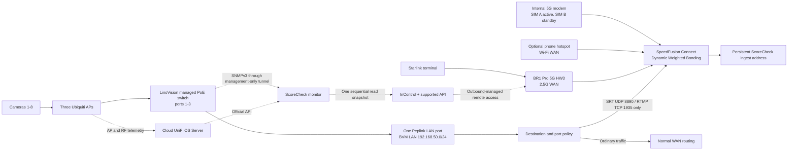

# ScoreCheck Peplink MAX BR1 Pro 5G HW3 Commissioning Plan

Status: implementation plan for the incoming replacement router

Target product: `MAX-BR1-PRO-5GK-T-PRM`, hardware revision 3

Prepared: 2026-07-29

Revised: 2026-08-04

Scope: venue router, Starlink, one internal cellular modem, SpeedFusion Connect,
the PoE switch, three Ubiquiti access points, eight cameras, remote management,
and router monitoring

## Executive Decision

The incoming BR1 Pro 5G HW3 is a reasonable production router for ScoreCheck.
Its published 256-bit AES SpeedFusion throughput is 200 Mbps, well above the
current roughly 24-30 Mbps eight-camera source payload. The prior GL-XE3000
failure does not prove this router will pass, but the HW3 has enough specified
throughput to justify a physical qualification before considering another
purchase.

The first production profile will be deliberately narrow:

- Wired Starlink on the 2.5 Gbps WAN port.
- One active internal cellular modem, normally using the T-Mobile SIM.
- A phone hotspot as a third Wi-Fi WAN when it is available, preferably on a
  carrier other than T-Mobile.
- Every intended WAN available to one SpeedFusion Connect profile at Priority
  1; Dynamic Weighted Bonding still decides how much each link contributes.
- Dynamic Weighted Bonding with `Fast` link-failure detection for the baseline.
- No manual WAN Smoothing in the initial baseline.
- No FEC in the control profile; Adaptive FEC is the only initial A/B candidate.
- Only camera publishing traffic is forced through SpeedFusion Connect.
- Camera publishing fails closed if the SpeedFusion tunnel is unavailable.
- Operator and ordinary control traffic use normal internet routing.
- A flat `192.168.50.0/24` LAN for the first qualification.
- One LAN cable to the PoE switch and no LACP.
- The PoE switch is the managed LinoVision `POE-SWR612GM-SOLAR`; ports 1-3
  power the three Ubiquiti APs and non-PoE port 9 is the sole router uplink.
- ScoreCheck reads the switch through SNMPv3 over a router-initiated,
  management-only site-to-site tunnel to the event observability Droplet. The
  switch has no public management exposure and the router runs no collector.
- The Peplink 5 GHz `BVM` client AP remains available alongside the three
  Ubiquiti camera SSIDs. It provides direct-router coverage and a controlled
  fallback without replacing the wired Ubiquiti production radio layer.
- Six AVKANS cameras remain SRT/H.264 at 1080p30 around 3 Mbps and two Mevo
  Cores remain SRT/HEVC at 1080p30 for the router qualification.
- 1080p60 is a later profile test, not part of the router baseline.
- InControl and supported Peplink APIs provide remote management; no public
  SSH, port forward, static public IP, or on-site Mac is required.
- No Docker workload on the router during initial production qualification.

This is a clean rebuild from a settings manifest. Do not import the full binary
backup from either returned `5GH` HW1 router into the incoming `5GK` HW3 router.
The backup is evidence and rollback material for the old unit, not a safe
cross-model image.

## Scope Decisions After Architecture Review

Adopt for the first qualification:

- The latest stable firmware that Peplink offers for the exact HW3 product at
  commissioning time. Never downgrade. If Peplink's supported updater requires
  an intermediate release from the factory version, use it only as an upgrade
  step and qualify only the final latest-stable release.
- Retained native Peplink 5 GHz `BVM` camera WLAN alongside the external
  Ubiquiti radio layer.
- Optional phone hotspot as a third Priority 1 Wi-Fi WAN.
- One production-candidate DWB profile with Adaptive FEC; FEC-off is only a
  short diagnostic if the primary run fails.
- `Fast` detection, Low congestion latency, 150 ms jitter buffer, 0 ms receive
  buffer, and the deployed 500 ms latency-difference cutoff.
- San Francisco SFC endpoint by default; San Jose is only a diagnostic fallback.
- Conservative Starlink readmission and camera SRT QoS.
- Fixed 5 GHz Ubiquiti radio plan with mesh off.
- One 60-minute physical eight-camera capacity and failover gate.

Defer unless the initial evidence requires it:

- VLAN migration and camera Internet allowlists.
- Router SNMPv3, router-local collectors, and remote syslog. Switch SNMPv3 is
  part of the purchased managed-switch commissioning path.
- Router Docker, Tailscale, or a second management system.
- Plain Bonding and multi-variable buffer tuning.
- Routine FEC and SFC endpoint A/B testing when the primary profile is healthy.
- Long WAN Smoothing tests.
- Multi-hour and event-length router-only soaks.
- Synthetic media or network load.

This keeps the test focused on the actual reliability question: whether the
incoming router, three real WANs, the Ubiquiti radio layer, and eight physical
cameras can sustain continuous unlisted 1080p program outputs.

## Material Hardware Facts

The exact current product information establishes these limits:

| Capability | HW3 fact | ScoreCheck consequence |
| --- | --- | --- |
| Router throughput | 1 Gbps | Not expected to be the camera bottleneck |
| Encrypted SpeedFusion | 200 Mbps | Published ceiling is well above the event payload; physical testing still controls admission |
| Ethernet | One 2.5 Gbps WAN, two 1 Gbps LAN | Starlink uses WAN; only one LAN connects to the PoE switch |
| Cellular | One 5G modem, two nano-SIM slots | The SIMs are failover choices, not two simultaneously bonded cellular links |
| Wi-Fi | Dual-radio 2x2 Wi-Fi 6 | Native 5 GHz AP for initial camera onboarding; external Ubiquiti APs carry the production camera load |
| Edge storage | 8 GB on HW3 | Available, but not a reason to put monitoring or VPN containers on the critical path yet |
| Power | 12 V adapter or 802.3at PoE input; 19 W maximum | Put the router and network equipment on measured UPS power |
| SpeedFusion Connect allowance | 1 TB/year with PrimeCare | Track usage; do not assume unlimited service |

One terabyte is not unlimited. Eight 3 Mbps cameras are about 10.8 GB/hour of
raw payload before tunnel and retransmission overhead. A 28 Mbps source mix is
about 12.6 GB/hour before overhead. The usable number of event hours therefore
depends on Peplink's accounting and the selected protection mode. The actual
allowance counter, renewal date, and billing semantics must be recorded during
commissioning.

## Target Topology



The incoming public IP can change and cellular can remain behind carrier NAT.
That does not block management because the router initiates its InControl
connection outbound. It also does not change the camera destination because
the cameras publish to the persistent cloud ingest address, not to the router.

## Configuration Contract

### 1. Identity, entitlement, and firmware

Before applying event settings:

1. Photograph the box label, router label, serial number, product code, and
   physical condition.
2. Verify the Router API and InControl both report:
   - `MAX-BR1-PRO-5GK-T-PRM`;
   - hardware revision 3;
   - the expected new serial number.
3. Verify PrimeCare, warranty start, InControl membership, SpeedFusion feature
   entitlement, 1 TB/year allowance, current allowance balance, and renewal
   date before accepting the TechnoRV exchange.
4. Export a factory-state configuration backup and a supported API snapshot.
5. Record the firmware and cellular module firmware before upgrading.
6. Check Peplink's current stable channel and release notes for this exact HW3
   product on commissioning day.
7. Upgrade to that latest stable release, reboot, and verify the active slot.
   Never downgrade a router that already ships on the same or a newer stable
   supported release.
8. If the factory version cannot jump directly to the latest stable release,
   follow only Peplink's documented intermediate upgrade path. An intermediate
   image is transit, not a qualification target; all testing occurs on the final
   latest-stable firmware.
9. Keep unrelated optional features disabled unless they are needed and
   qualified. WireGuard remote-user access remains outside the initial profile.
10. Do not enable automatic firmware changes during event coverage. Pin the
   version that passed the real-camera qualification.

Firmware 8.6.0 build 6450 is the stable release offered by the router and
InControl for this exact HW3 product as of 2026-08-06. It is the commissioning
and production-qualification baseline. InControl must also assign 8.6.0 so a
stale cloud policy cannot schedule a downgrade after local commissioning.
Arrival-day verification against Peplink's stable channel still controls for
future devices: use the newest stable release available for the exact hardware,
not a deliberately older baseline. Do not qualify beta, release-candidate, or
early-access firmware for production. Newly available features do not become
enabled merely because the firmware includes them; WireGuard remote access,
forced 5G SA Carrier Aggregation, IPv6, and other unrelated features remain
outside the first production profile.

### 2. Administrator and remote-management security

Configure:

- Device name: `scorecheck-event-router`.
- Time zone: `America/Chicago`.
- A unique protected local administrator credential.
- HTTPS local Web Admin, reachable from the LAN only.
- HTTP-to-HTTPS redirect.
- Remote Web Admin through InControl.
- InControl organization two-factor authentication required.
- Nathan as an individual full administrator, not a shared account.
- A dedicated least-privilege OAuth client for ScoreCheck monitoring.
- An explicit InControl idle timeout.
- Email or push notification for administrative login and configuration
  changes where InControl supports it.

Keep disabled:

- WAN Web Admin.
- WAN SSH and console access.
- UPnP and NAT-PMP.
- Port forwarding and public inbound management rules.
- SNMP until a specific monitored consumer and access restriction are ready.
- Peplink support blocking during initial commissioning. Reconsider it after
  acceptance; blocking support while an exchange is still being verified can
  delay diagnosis.

No inbound WAN opening is required. If an upstream network applies outbound
filtering, preserve Peplink's documented InControl paths on UDP `5246`, HTTPS
TCP `443`, and fallback TCP `5246`, plus the configured SpeedFusion data ports
(normally TCP/UDP `32015` and UDP `4500`). Also preserve DNS and time sync.

Supported API clients have distinct read-only and read-write scopes. Routine
monitoring must use read-only access. Commissioning writes must use a separate,
protected write credential and preserve a matching pre-change response.

### 3. Physical wiring and power

Use this fixed wiring:

| Router interface | Connection | Rule |
| --- | --- | --- |
| 2.5G WAN | Starlink Ethernet adapter/router | DHCP; retain as WAN |
| Cellular | Internal modem | SIM A active; SIM B standby if a second carrier is installed |
| LAN 2 | PoE switch uplink | The only switch uplink |
| LAN 1 | Disconnected | Do not connect to the same switch |
| Wi-Fi radios | Native 5 GHz `BVM` camera AP plus optional phone-hotspot Wi-Fi WAN | Keep `BVM` available; do not disable it after Ubiquiti migration |

Do not enable LACP for the first deployment. Do not connect both LAN ports to
the same switch. Do not convert the WAN port into LAN. These changes add no
capacity to the camera path and introduce avoidable loop or wiring risk.

The router's HW3 PoE capability is input only, not output. Use the supplied
12 V power adapter on the event UPS for the first qualification. Do not assume
dual-input failover behavior between 12 V and PoE until Peplink confirms it and
it is physically tested. Keep the heat sinks exposed, use the grounding point
where the venue power design supports it, and record router, modem, switch, and
UPS temperatures under load.

The UPS must cover the router, Starlink equipment, PoE switch, and all three
APs. Size it from measured whole-system watts plus reserve, not from the
router's 19 W maximum alone.

Use this fixed switch wiring for the first qualification:

| Switch interface | Connection | Rule |
| --- | --- | --- |
| PoE 1 | `UK Ultra 1` | Permanent panel antenna |
| PoE 2 | `UK Ultra 2` | Permanent panel antenna |
| PoE 3 | `UK Ultra 3` | Event-selected omni or panel antenna |
| Non-PoE 9 | Peplink LAN 2 | The only router uplink |
| Non-PoE 10 | Service laptop | Normally disconnected; commissioning only |

Power the switch directly from the fused V-mount/D-Tap DC branch. Power the
Peplink from its separate fused branch; do not run router power through the
switch. Verify input polarity, cable gauge, fuse rating, and the switch label
before first power-on.

### 4. LAN, DHCP, and access points

Initial LAN profile:

| Setting | Initial value |
| --- | --- |
| Name | `BVM LAN` |
| Router address | `192.168.50.1/24` |
| DHCP range | `192.168.50.10-192.168.50.250` |
| Lease | One day |
| DNS proxy | Enabled |
| VLANs | None for the first physical qualification |

Create DHCP reservations after the actual hardware is attached:

- Camera 1 through Camera 8.
- Each Ubiquiti AP.
- The PoE switch if it is managed.
- The UniFi controller or management host if one is present.
- An operator laptop only if a stable reservation materially helps support.

Do not invent reservations from old client records. Capture each device's real
MAC address from the incoming router and match it to the physical camera label.

For first-time setup, use the native Peplink 5 GHz `BVM` camera SSID and connect
Cameras 1-8 directly to it. Use this deliberately simple phase to verify
camera identity, record MAC addresses, create DHCP reservations, and confirm that
all cameras can publish through the router before adding the switch or external
APs. Use a fixed non-DFS 5 GHz channel and a camera-compatible WPA2-Personal
profile; do not change camera protocol, codec, or destination merely for
onboarding. This phase is not the final production radio qualification.

After reservations and direct-router behavior are verified, connect the PoE
switch and migrate the intended cameras to their Ubiquiti camera SSIDs. Confirm
each reserved identity survives the move and keep the Peplink `BVM` WLAN
available. Configure the optional phone hotspot Wi-Fi WAN only after this
migration so its radio role does not complicate initial camera discovery.

Keep the first qualification flat because VLAN success depends on the exact
PoE switch model, VLAN trunk support, UniFi controller configuration, and
camera behavior. After the baseline passes, a separate measured hard cutover
may introduce camera, operator, and infrastructure-management VLANs. Until the
switch model is known, VLANs would add uncertainty without fixing the already
observed WAN queue problem.

The Peplink AP Controller manages Peplink APs, not the Ubiquiti Swiss Army Knife
Ultra units. Ubiquiti RF, channel, retry, association, and roaming telemetry
must come from the UniFi management path.

Use the existing UniFi OS Server site only for one-time commissioning and
migration. The production controller is a persistent minimum-size DigitalOcean
Droplet. This removes the MacBook from event startup and operation without
adding a CloudKey or paid UniFi hosting. Routine event readiness and evidence
use the official API from ScoreCheck monitoring.

Create one protected official UniFi API key after the site is commissioned. Store
the host id, site id, and exact device UUID/MAC binding for all three APs in the
protected monitoring environment. The monitor reads device state, firmware,
latest CPU/memory/uplink/radio statistics, and connected-client association.
The APs themselves are not the supported API boundary; UniFi OS Server is. Do
not put the UniFi controller on the Peplink router. The persistent controller
survives event-fleet teardown, while the temporary observability Droplet owns
ScoreCheck monitoring and reads the controller through the official API.

The APs continue their last applied configuration if the controller is
temporarily unreachable, so a controller outage must not stop camera media.
Monitoring reports that outage separately and tells the operator not to restart
cameras that are still streaming. Once the real site is commissioned, set
`MONITOR_UNIFI_REQUIRED=true`; production readiness then fails closed unless all
three commissioned APs are online and healthy. Rehearsals without physical APs
leave that flag false.

Initial Ubiquiti radio profile:

- Wired uplinks and mesh disabled.
- Preserve the permanent device names `UK Ultra 1`, `UK Ultra 2`, and
  `UK Ultra 3`.
- AP1 and AP2 always use their Ubiquiti panel antennas.
- AP3 uses the antenna selected by the event manifest: Ubiquiti panel or omni.
  The next event profile selects the omni antenna.
- Disable the 2.4 GHz radio on all three camera APs. Re-enable it only for an
  explicitly approved device that cannot use 5 GHz.
- Camera SSID on 5 GHz only.
- 20 MHz channels, fixed and non-overlapping. This is ample for the planned
  3 / 3 / 2 camera distribution and prioritizes isolation and reliability over
  unused peak Wi-Fi throughput.
- Non-DFS channels for the baseline so radar events cannot force a channel
  move during the router test.
- Medium transmit power initially.
- Stationary-camera features such as fast roaming and BSS transition disabled
  until evidence shows they are needed.
- Initial camera distribution of 3 / 3 / 2 across the three APs.
- Preferred RSSI at least -65 dBm, with -70 dBm as the hard qualification floor.

Controller-wide production settings applied on 2026-08-04:

- `BVM 1`, `BVM 2`, and `BVM 3` are 5 GHz-only SSIDs, each restricted to its
  matching `UK Ultra` AP.
- All three SSIDs use manual settings with fast roaming, handoff suggestions,
  band steering, and BSS transition disabled. WPA2 and PMF-disabled behavior
  are retained for camera compatibility.
- Wireless meshing is disabled globally; production AP uplinks are wired.
- UniFi OS, Network, and AP firmware use the Official release channel with
  automatic updates disabled. Check and apply updates during pre-event
  commissioning, then freeze versions through coverage.
- Weekly controller backups remain enabled. A post-hardening all-applications
  backup is protected locally at
  `~/.config/scorecheck/unifi/backups/unifi-os-backup-20260804T204701CDT.unifi`
  with SHA-256
  `f693ecfa817c9e2e0ee84517b5b7ad8d93894660900214ac86970c485bb50e81`.
- The third-party `PepWave` network remains flat and conservative: RSTP and
  rogue-DHCP detection enabled; IGMP snooping, jumbo frames, flow control, and
  802.1X disabled.

Applied commissioning state as of 2026-08-04:

- `UK Ultra 1`: panel antenna, 2.4 GHz disabled, live-verified 5 GHz channel 157
  at 20 MHz, medium power, wired GbE, and cloud-controller heartbeat. It
  remained online after the macOS controller and local inform listener stopped.
- `UK Ultra 2`: panel antenna, 2.4 GHz disabled, live-verified 5 GHz channel 149
  at 20 MHz, medium power, wired GbE, and cloud-controller heartbeat. It
  remained online after the macOS controller and local inform listener stopped.
- `UK Ultra 3`: omni antenna, 2.4 GHz disabled, live-verified 5 GHz channel 161
  at 20 MHz, medium power.
- Channels 149, 157, and 161 are separate 20 MHz channels. Verify the complete
  plan with all three APs powered together before production readiness.

Select the actual channels only after an RF scan in the event location. Do not
use automatic channel changes during coverage. The Peplink built-in client AP
retains the `BVM` WLAN alongside the Ubiquiti networks.

### 4A. LinoVision switch management and monitoring

The selected switch is LinoVision `POE-SWR612GM-SOLAR`. It is a separate
management domain from UniFi: UniFi remains authoritative for AP, client, and
RF behavior, while the switch is authoritative for wired link and PoE state.
Do not expect it to appear as a UniFi switch.

The complete purchase-validation, protocol matrix, dashboard design, security
contract, and physical acceptance procedure are in
[`LINOVISION_POE_SWITCH_INTEGRATION_RESEARCH.md`](LINOVISION_POE_SWITCH_INTEGRATION_RESEARCH.md).

Initial management contract:

- Assign `192.168.50.2` only after confirming no address conflict, and reserve
  that address outside the DHCP pool.
- Retain the switch's default administrator credential per Nathan's explicit
  commissioning decision. Restrict management to the private LAN, keep HTTPS
  enabled, and do not expose the switch publicly.
- Disable Telnet, plain HTTP, SNMP v1, and SNMP v2c.
- Enable HTTPS and SSH only on the management LAN. Keep SSH disabled after
  commissioning unless the exact firmware requires it for a supported task.
- Enable a dedicated read-only SNMPv3 `authPriv` identity using the strongest
  combination the shipped firmware actually offers. Available documentation
  describes SHA and AES; use SHA-2 only if the physical firmware exposes it.
  Never place its credentials in URLs, source control, logs, or the browser
  application.
- Do not expose UDP 161/162, HTTPS, or SSH on a public WAN interface.
- Keep RemoteMonit as a bounded vendor troubleshooting fallback, not a
  ScoreCheck dependency. LinoVision confirms that it displays port on/off,
  speed, power consumption, and priority and supports remote PoE control. No
  supported customer API, stable payload contract, or TLS MQTT mode is
  documented.

The initial remote path is a Peplink-initiated, management-only site-to-site
tunnel terminating on the temporary event observability Droplet. Restrict the
cloud side to the switch management address and SNMP traffic required by the
collector. This works with changing WAN addresses and carrier NAT because the
router initiates the tunnel. It also keeps polling off the router CPU and does
not add a persistent Droplet: the existing event observability host owns the
collector. Render the tunnel peer from the event manifest because the temporary
Droplet address can change between event builds.

If the physical switch later proves that it can publish documented telemetry
to an arbitrary TLS MQTT broker, compare that outbound path against SNMPv3. A
documented outbound push would remove the routed management dependency, but do
not build against RemoteMonit's private payload or scrape its UI. Available
configuration material shows MQTT port 1883 and does not prove transport
encryption, so MQTT is not the initial production path.

The first ScoreCheck collector uses standard `SNMPv2-MIB` and `IF-MIB` values:

- switch identity, firmware, uptime, and restart detection;
- administrative and operational state for ports 1-3 and 9;
- negotiated link speed;
- 64-bit receive/transmit byte counters;
- input/output errors and discards;
- last link-state transition.

Vendor-specific PoE metrics are admitted only after the exact shipped firmware
and MIB are archived and walked on the physical unit. Desired fields are PoE
delivery state, watts, current, voltage, class, total budget, input-power state,
PD Alive state, and the documented port-cycle control. Missing vendor metrics
must be displayed as unavailable, never inferred from traffic counters.

The monitor polls once every 30 seconds while event expectations are active and
calculates error/discard deltas rather than alarming on lifetime totals. The
dashboard combines the three independent sources:

- Switch: wired link and PoE delivery.
- UniFi: AP health, clients, RSSI, retries, channel use, and radio settings.
- Peplink: WAN, SpeedFusion, LAN client, power, and router resource state.

This supports plain-language classification:

- AP offline and switch link/PoE down: check switch power, cable, port, or AP.
- Switch link up but AP absent from UniFi: check AP boot, adoption, or routing.
- AP online with weak signal or high retries: check placement, antenna, or RF.
- Several AP ports reset together: check battery, D-Tap harness, switch input,
  or switch temperature.
- APs and switch healthy while publishing fails: check Peplink/WAN/media path.

Start read-only. Keep switch PD Alive automation disabled during the first
qualification. Do not add automatic PoE cycling. After one deliberate single-AP
recovery test proves the exact MIB or supported CLI operation, ScoreCheck may
offer an explicit operator command with confirmation, one-port scope, cooldown,
and audit evidence. Only one system may own automatic recovery; never enable
both switch PD Alive and ScoreCheck power cycling.

### 5. WAN profiles

#### Wired Starlink

Initial settings:

- Name: `Starlink`.
- Connection: DHCP.
- Priority: 1.
- Starlink integration: enabled when detected correctly.
- Starlink bypass mode: preferred when the terminal generation supports it,
  but not an acceptance blocker because SFC is outbound and works behind NAT.
- Health check: DNS or HTTP, 5-second interval, 3-second timeout, 3 failures,
  and 10 recovery successes.
- MTU: automatic for the first pass.
- Bandwidth values: initially about 80% of the lower sustained capacity observed
  with real camera media, never ISP plan speed or a single speed-test peak.

The prior dry run proved that a newly returning Starlink path can be harmful
before it is stable. The qualification must therefore include a real Starlink
reboot and rejoin while camera traffic remains active. A dashboard `connected`
label is not sufficient; the pass condition is bounded queue, loss, and
recovery at the camera and YouTube layers.

Do not enable `Ignore Obstruction Outages` during the first baseline. Record
normal behavior first. It can be compared later if brief obstruction reports
cause false WAN removal rather than real media loss.

#### Internal cellular

Initial settings:

- Name: `T-Mobile 5G` or the actual carrier name.
- Priority: 1.
- SIM A: primary event SIM.
- SIM B: standby only if a separate carrier SIM is installed and activated.
- APN and carrier selection: automatic unless the carrier requires explicit
  values.
- Network mode and 5G SA carrier aggregation: automatic.
- Health check: default cellular SmartCheck; do not mark an unhealthy modem
  permanently available by disabling health checks.
- Failure retries: 3; recovery successes: 5.
- Data allowance monitor: enabled with the real billing date and allowance.
- MTU: automatic.
- Bandwidth values: conservative sustained venue measurement.

There is one modem. SIM A and SIM B cannot supply two simultaneous bonded
cellular connections. A second active cellular path would require separate
hardware exposed as another WAN.

#### Phone hotspot Wi-Fi WAN

When the production phone is available:

- Name: `Phone Hotspot`.
- Operating role: Wi-Fi WAN alongside the retained Peplink `BVM` client AP.
- Priority: 1.
- Addressing and routing: DHCP/NAT.
- Preferred BSSID: unset until reconnect behavior is proven stable.
- Health check: DNS or HTTP.
- Failure retries: 3.
- Recovery successes: 6-8 so a returning hotspot proves stability before it
  resumes meaningful traffic.
- Phone externally powered, ventilated, and positioned close to the router.
- Prefer a carrier other than the internal T-Mobile modem to create an
  independent failure domain.

The phone is an optional third WAN, not a requirement for initial router login
or configuration. Its production use requires automatic reconnection after
hotspot off/on, airplane mode, phone reboot, and a locked-screen hold. Do not
pin its BSSID unless those tests prove the identity remains stable.

### 6. SpeedFusion Connect

Initial profile:

| Setting | Initial value | Reason |
| --- | --- | --- |
| Service | SpeedFusion Connect | Removes dependence on public venue IP and provides path continuity |
| Location | San Francisco | Keep the initial route aligned with the DigitalOcean `sfo2` ingest region |
| Starlink priority | 1 | Active member |
| Cellular priority | 1 | Active member |
| Phone Wi-Fi WAN priority | 1 when available | Independent third path; DWB may still assign little traffic |
| Link-failure detection | `Fast` | Avoid false flaps while still providing bounded failure detection |
| Traffic distribution | Dynamic Weighted Bonding | Can reduce weight on a degrading link |
| Congestion latency | Low | Peplink's Starlink starting recommendation |
| Bufferbloat handling | Enabled | Do not disable congestion response during qualification |
| Packet loss as congestion | Enabled | Prior simultaneous loss was a valid distress signal |
| WAN Smoothing | Off | Packet duplication can exceed the upload reserve |
| FEC | Adaptive | Add repair traffic only when measured loss requires it |
| Packet jitter buffer | 150 ms | Small reorder allowance; latency is not the priority |
| Receive buffer | 0 ms | Avoid stacking a second large buffer with SRT recovery |
| Latency-difference cutoff | 250 ms | Exclude a path that becomes far slower than the best path |
| Transport | UDP `4500` | Avoid outer TCP head-of-line blocking |
| Fragmentation | Default / use DF flag | Change only if packet evidence proves an MTU defect |
| SpeedFusion Boost | Off for the first baseline | New transport optimization; isolate its effect before adoption |

Use one production-candidate profile, `SCORECHECK_DWB_ADAPTIVE_FEC`. A healthy
60-minute gate ends the router qualification; do not run extra profile tests.
If that gate shows unexplained loss while router CPU and WAN capacity remain
healthy, run one 15-minute FEC-off comparison. If tunnel queueing remains with
healthy WANs, run one San Jose endpoint comparison. Do not test WAN Smoothing,
plain Bonding, or additional buffers unless those bounded diagnostics identify
a specific unresolved tunnel problem. Restore every intended WAN to its
production state after any diagnostic.

SpeedFusion Boost is designed to sustain single-session throughput over lossy,
high-latency links such as Starlink and 5G. It is not disabled because it is
known to be harmful. It stays off for the first baseline so the router's normal
Dynamic Weighted Bonding behavior can be measured without adding another new
transport variable. If the baseline shows healthy WAN capacity and router CPU
but SpeedFusion throughput still collapses under loss or latency, run one
bounded Boost-on comparison. Adopt it only if camera and viewer evidence improve
without new instability or excessive SFC usage. A clean baseline requires no
extra Boost test.

Dynamic Weighted Bonding can shift traffic away from a degraded link; it
cannot manufacture throughput. Starlink plus cellular bonding can improve
continuity, but Peplink itself warns that aggregate-throughput gains can be
mixed. Admission remains based on sustained camera delivery with reserve.

### 7. Fail-closed camera routing

Create these outbound policies above persistence and default automatic rules:

| Rule | Source | Destination | Protocol | Route | Tunnel unavailable |
| --- | --- | --- | --- | --- | --- |
| `ScoreCheck SRT` | Event LAN | Protected persistent ingest IPv4 | UDP destination `8890` | Enforced `SFC` | Drop |
| `ScoreCheck RTMP` | Event LAN | Protected persistent ingest IPv4 | TCP destination `1935` | Enforced `SFC` | Drop |

Do not put the protected ingest address or credentials in a public document.
Use the current protected lifecycle/event manifest when applying the rules.

The RTMP rule remains as a controlled fallback even though the intended camera
profile is SRT. All other traffic uses the normal automatic policy. This keeps
operator browsing, InControl, camera setup pages, and software management from
consuming SFC allowance or interfering with camera admission.

UDP `8890` is retained because the current camera, MediaMTX, firewall, and
monitoring contracts already use it. It is no longer tied to StreamRun, and the
port number itself provides no throughput or reliability advantage. Moving SRT
to another unused UDP port would require coordinated camera and cloud changes
without improving media quality. TCP `1935` remains the conventional RTMP
fallback port for the same operational reason. Change either port only for a
documented firewall conflict or provider requirement, not as a performance
tuning exercise.

Required proof:

- With SFC healthy, every camera publisher appears from the expected SFC exit.
- With SFC intentionally unavailable during a bounded test, no camera can
  reach ingest directly through Starlink or cellular.
- When SFC returns, cameras reconnect without manual key or URL changes.
- The public IP may change without changing camera configuration or remote
  router reachability.

Enable SpeedFusion VPN traffic optimization and create one highest-priority
custom service for ScoreCheck SRT on UDP destination port `8890`. Keep the RTMP
compatibility service below SRT unless it is actively used. Do not add
per-camera bandwidth guarantees in the initial profile; accurate WAN capacity,
the fail-closed policy, and aggregate SRT priority are enough for the first
qualification.

### 8. Monitoring and automation

Use the checked-in supported API client:

```sh
node infra/venue-router/peplinkctl.mjs status
node infra/venue-router/peplinkctl.mjs snapshot
```

Commissioning automation boundary:

| Function | Method |
| --- | --- |
| WAN, tunnel, LAN, client, SSID, allowance, firmware reads | Supported API through InControl OAuth |
| Supported WAN/SSID/SpeedFusion protection writes | Explicit API write with pre-change backup |
| SFC distribution/FEC/Smoothing details | Authenticated Web Admin/InControl unless a documented endpoint exists |
| Outbound-policy creation | Authenticated Web Admin/InControl unless a documented endpoint exists |
| Configuration backup | Web Admin initially; qualify 8.6 token-based backup API before relying on it |
| Camera/AP radio telemetry | Official UniFi Network API through the event UniFi OS Server plus camera and media monitoring, not the Peplink AP Controller |
| Switch link/PoE telemetry | Read-only SNMPv3 from the event observability Droplet through the management-only site-to-site tunnel |

Do not reverse-engineer undocumented UI endpoints. Do not open SSH. Do not
create overlapping OAuth sessions: the observed 8.6 behavior invalidated older
Remote Web Admin sessions when concurrent token grants were created.

Computer Use through the authenticated Web Admin or InControl interface is an
accepted commissioning method for settings Peplink does not expose through a
documented API. Direct API snapshots remain the normal monitoring and repeatable
control path after commissioning.

Event polling profile:

- One sequential API snapshot every 30 seconds while event expectations are
  active.
- No separate process per endpoint.
- A faster bounded read only during an explicitly observed transition.
- Persist WAN state, cellular signal and mode, SFC tunnel state, per-link
  traffic, client associations, allowance, and firmware identity.
- Correlate router timestamps with camera ingest loss, MediaMTX counters,
  switch/UniFi state, browser quality, Egress, and YouTube health.

Initial alert semantics:

- Critical: all intended WANs unavailable, SFC unavailable while cameras are
  expected, camera traffic bypass detected, router monitoring stale, or router
  unreachable from both InControl and local management.
- Warning: one intended WAN unavailable, camera association below expectation,
  sustained load near the measured upload ceiling, cellular allowance nearing
  threshold, repeated SFC link churn, sustained switch error/discard growth, or
  an expected Gigabit switch link negotiating below 1 Gbps.
- Critical while media is required: switch unreachable, router uplink port
  down, or an expected AP's switch port/PoE state down.
- Informational: expected WAN rejoin, SIM failover, firmware/config drift, or
  temporary operator maintenance.

No router-local Docker agent is required for first production. InControl and
the supported API already solve dynamic-address and carrier-NAT management.
Firmware 8.6 fixed Docker CPU issues but still documents a DHCP-related Docker
known issue. A router container adds a new process to the critical media path.
Only consider a small push-only telemetry container after the router passes the
full physical gate, and only with explicit resource limits and removal proof.

### 9. Settings explicitly deferred

Do not enable these during the first iteration:

- Full binary restore from the returned 5GH HW1 unit.
- SpeedFusion Boost unless the initial baseline proves the specific lossy or
  high-latency throughput defect it is intended to address.
- Beta WireGuard remote-user access.
- Router-local Tailscale or monitoring Docker containers.
- A new Pi/mini-PC venue collector, SNMPv3, and remote syslog until the
  supported API proves a material monitoring gap.
- IPv6.
- Forced cellular bands, RAT, SA mode, or carrier aggregation.
- WAN Smoothing except for the bounded evidence-driven canary.
- VLAN segmentation.
- LACP or two LAN uplinks.
- Plain Bonding unless DWB itself is implicated.
- Synthetic media or synthetic network-load workflows.
- 1080p60 during the router baseline.
- Air Monitor as a release gate.
- Automatic firmware upgrades during events.
- Public Web Admin, SSH, port forwards, UPnP, or NAT-PMP.

These are deferred because they are not needed for the first production
objective or need physical evidence. This is not a permanent rejection.

## Arrival-Day Procedure

### Phase 0: Intake, before powering the router

- Match the box and chassis to `MAX-BR1-PRO-5GK-T-PRM`, HW3.
- Capture serial/product photographs in the protected exchange folder.
- Confirm all antennas, power supply, and accessories.
- Do not return or close the TechnoRV exchange until entitlements are verified.

### Phase 1: Isolated local setup

- Attach all four cellular antennas and both Wi-Fi antennas before cellular or
  Wi-Fi transmission.
- Power with the supplied adapter on a UPS.
- Connect one trusted Mac by Ethernet only.
- Change the local admin credential.
- Record factory firmware, modem firmware, MAC addresses, serial, and license
  state.
- Export and hash a factory backup.
- Check the current stable channel for the exact HW3 product and upgrade to the
  newest stable release. Never downgrade. Use an intermediate image only when
  Peplink's supported upgrade workflow requires it from the factory version;
  qualify only the final newest-stable release.
- Verify boot, active firmware slot, local login, and factory backup restore
  visibility without actually restoring the old router.

### Phase 2: InControl and API control plane

- Add the new serial to the ScoreCheck InControl organization/group.
- Verify PrimeCare and SFC allowance.
- Require 2FA and confirm individual administrator access.
- Enable Remote Web Admin and keep WAN local admin disabled.
- Create the replacement read-only OAuth client.
- Replace the serial in the protected local credential file.
- Run one sequential `peplinkctl snapshot` and verify all expected endpoints.
- Export and hash a post-control-plane backup.

### Phase 3: LAN and radio foundation

- Apply `BVM LAN` at `192.168.50.1/24`.
- Enable and retain the native Peplink 5 GHz `BVM` camera SSID.
- Connect Cameras 1-8 directly, identify their real MAC addresses, create DHCP
  reservations, and verify all eight can publish through the router.
- Connect exactly one LAN port to the PoE switch.
- Verify the switch label is `POE-SWR612GM-SOLAR`, record its firmware, archive
  its exact MIB, retain the user-approved default administrator credential, and
  apply the remaining management contract.
- Assign the conflict-checked management address and prove the event
  observability Droplet can poll SNMPv3 through the management-only tunnel.
- Connect and identify all three Ubiquiti APs.
- Connect APs one at a time to ports 1-3 and verify Gigabit negotiation, PoE
  delivery, UniFi visibility, and stable power before connecting the next AP.
- Apply the measured 5 GHz, 20 MHz, fixed non-DFS, mesh-off AP baseline.
- Migrate cameras to the Ubiquiti SSIDs and confirm every reserved identity.
- Keep the Peplink `BVM` client AP available, then configure the optional phone
  hotspot as Wi-Fi WAN when that phone is available.
- Confirm DHCP, DNS, NTP, local management, and camera SSID reachability.
- Confirm the Mac can leave the event router while remote management continues.
- Export and hash a post-LAN backup.

### Phase 4: WAN readiness

- Confirm Starlink and cellular are healthy and participating in SpeedFusion.
- Confirm the optional phone hotspot participates when it is present.
- Record each WAN's signal, latency, loss, and current capacity declaration.
- Do not run separate per-WAN camera ramps or use a speed-test peak as admission
  evidence. The full eight-camera gate provides the relevant measurement.

### Phase 5: SpeedFusion and fail-closed routing

- Select the San Francisco SFC endpoint.
- Build `SCORECHECK_DWB_ADAPTIVE_FEC` with every intended WAN at Priority 1.
- Apply Dynamic Weighted Bonding, `Fast` detection, Low congestion latency,
  150 ms jitter buffer, 0 ms receive buffer, 500 ms latency cutoff, Smoothing
  off, Adaptive FEC, UDP 4500, and default DF handling.
- Apply the two protected camera outbound rules.
- Enable SpeedFusion traffic optimization and highest-priority SRT QoS.
- Prove normal traffic remains direct.
- Prove camera destinations use SFC.
- Perform the bounded tunnel-unavailable test and prove direct camera bypass is
  impossible.
- Export and hash a post-routing backup.

### Phase 6: Sixty-minute eight-camera gate

Use the eight physical cameras and unlisted ScoreCheck outputs. Do not use a
synthetic workload or a 2/4/6-camera ramp.

1. **Preflight, 10 minutes:** start all eight cameras; confirm expected codec,
   1080p30 profile, source freshness, branches, Egresses, and unlisted YouTube
   outputs.
2. **Full load, 40 minutes:** hold all eight streams simultaneously. Sample the
   router and media path every 30 seconds and visually inspect all eight viewer
   outputs at the beginning and end.
3. **Failover, 10 minutes:** briefly remove and restore Starlink, then briefly
   remove and restore cellular. Confirm the remaining WANs carry the camera
   path and each restored WAN rejoins without stale queue growth.

Require:

- Stable camera association.
- Positive 1080p30 source bitrate and fresh frames.
- No sustained SRT loss growth.
- Normalizer/branch speed near real time with zero frame errors.
- Continuous 1080p YouTube program output and interruption slate during source
  failure.
- Audio/video and scoreboard synchronization.
- SFC tunnel continuity and known per-link behavior.
- Router CPU below 80% during normal full load; fail if CPU is at least 90% for
  two consecutive 30-second samples.
- No sustained queue growth; fail if queue delay exceeds one second for two
  consecutive samples.
- No router reboot, thermal warning, tunnel restart, or resource exhaustion.
- No sustained multi-camera SRT-loss growth or simultaneous disconnect pattern.

### Phase 7: Conditional diagnostics

Do not run an additional failure matrix after a clean gate. If the gate fails,
classify it before changing anything:

| Finding | Next action |
| --- | --- |
| Sustained CPU at least 90% or thermal/resource failure | Classify the router as insufficient; do not tune around it |
| Healthy CPU with WAN congestion | Classify the WAN or venue capacity issue separately |
| Healthy CPU/WAN with tunnel queueing | Run one San Jose endpoint comparison |
| Loss with Adaptive FEC | Run one 15-minute FEC-off comparison |
| One-camera-only failure | Investigate that camera/media path without failing router capacity automatically |

## Acceptance Gates

The router is production-qualified only when all are true:

- Exact model, HW3 revision, warranty, PrimeCare, and SFC allowance verified.
- Latest stable firmware for the exact HW3 product reached through Peplink's
  supported upgrade path, with no downgrade.
- Factory and final protected backups exist and have integrity hashes.
- InControl 2FA and read-only API monitoring work without public management
  ports.
- Starlink and cellular are healthy before the gate and each survives the
  bounded removal/rejoin check.
- The 40-minute eight-camera full-load interval completes without router
  saturation, queue growth, or widespread media loss.
- Camera traffic is provably fail-closed through SFC.
- Ordinary traffic remains outside SFC.
- The Starlink rejoin test does not reproduce the old 11.8 MB / 4.4-5.8 second
  queue event or simultaneous SRT loss.
- Eight unlisted YouTube outputs remain continuous through controlled source
  and WAN transitions.
- No sustained router CPU, temperature, queue, modem, tunnel, or process
  anomaly correlates with media loss.
- Remote operation continues with the Mac disconnected from the event router.
- Switch polling is fresh without public management ports or a router-local
  collector; ports 1-3 and 9 remain up at 1 Gbps with no sustained error or
  discard growth.
- A deliberate single-AP port disable/enable test recovers only that AP and does
  not interrupt the router uplink or the other APs. Automated PoE cycling
  remains disabled unless separately qualified.
- The monitor dashboard presents plain-language router, WAN, SFC, client,
  allowance, and media-path status without excessive polling.
- No additional profile or long-duration test is required after a clean pass.

## Rollback and Evidence

Create a protected directory for the new serial containing:

- Intake photographs.
- Factory configuration backup.
- Firmware-before and firmware-after snapshots.
- Entitlement and allowance screenshots.
- API snapshots after each phase.
- Settings manifest with secrets redacted.
- Configuration backups after control-plane, LAN, routing, and final changes.
- SHA-256 hashes.
- Real-camera test timestamps and event IDs.
- Router, media, Egress, and YouTube logs for every failure gate.
- Final accepted settings and rejected comparison settings.

If a phase fails, restore only the most recent same-model backup from the
incoming router. Do not restore the returned-router binary. Preserve failed
evidence before rollback.

## Information Still Needed At Arrival

- New serial number and confirmed product/HW revision.
- PrimeCare and SFC allowance transfer status.
- Current firmware and cellular module firmware.
- Actual event SIM carrier(s), plan allowance, and billing date.
- LinoVision switch serial number, shipped firmware, exact vendor MIB, supported
  SNMPv3 authentication/encryption choices, and whether its MQTT settings allow
  a documented arbitrary TLS broker rather than only RemoteMonit.
- UniFi controller location and credentials.
- Starlink terminal/router generation and whether bypass mode is available.
- Desired UPS runtime and whole-system measured power.
- Physical camera/AP MAC-address mapping.

None of these prevent preparing the configuration plan. They prevent claiming
that the physical router has passed production acceptance before it arrives.

## Primary Sources

- [Peplink MAX BR1 Pro 5G product page](https://www.peplink.com/products/mobile-routers/max-br1-pro-5g/)
- [Current BR1 Pro 5G technical specifications](https://www.peplink.com/compare/tech-specs/br1-pro-5g.pdf)
- [BR1 Pro 5G hardware reference guide](https://download.peplink.com/manual/br1_pro_5g_hardware_reference_guide.pdf)
- [Peplink firmware downloads and supported models](https://www.peplink.com/support/downloads/firmware/)
- [Firmware 8.6.0 release notes](https://download.peplink.com/resources/firmware-8.6.0-release-notes.pdf)
- [Peplink SpeedFusion technology and Boost](https://www.peplink.com/technology/speedfusion-bonding-technology/)
- [InControl 2 user guide](https://download.peplink.com/resources/InControl2_User_Guide.pdf)
- [Peplink Router API documentation](https://download.peplink.com/resources/Peplink-Router-API-Documentation-for-Firmware-8.5.0.pdf)
- [Peplink MAX user manual](https://manual.peplink.com/pepwave-max-user-manual/)
- [SpeedFusion Connect service and allowances](https://www.peplink.com/services/products-sfc/)
- [SpeedFusion best-practices whitepaper](https://download.peplink.com/resources/whitepaper-speedfusion-and-best-practices-2019.pdf)
- [Peplink Starlink solutions and guidance](https://www.peplink.com/solutions/starlink-solutions-page/)
- [Peplink Starlink FAQ](https://download.peplink.com/resources/peplink_with_starlink_faq.pdf)
- [Peplink service port reference](https://forum.peplink.com/t/overview-of-ports-used-by-peplink-sd-wan-routers-and-other-peplink-services/21023)
- [Ubiquiti UK-Ultra technical specifications](https://techspecs.ui.com/unifi/wifi/uk-ultra?subcategory=all-wifi)
- [Ubiquiti Wi-Fi optimization guidance](https://help.ui.com/hc/en-us/articles/221029967-Optimizing-WiFi-Connectivity-and-Reducing-Latency)
- [Ubiquiti official API overview](https://help.ui.com/hc/en-us/articles/30076656117655-Getting-Started-with-the-Official-UniFi-API)
- [Ubiquiti self-hosting options](https://help.ui.com/hc/en-us/articles/34210126298775-Self-Hosting-UniFi)
- [LinoVision POE-SWR612GM-SOLAR product page](https://linovision.com/products/12-ports-l2-cloud-managed-poe-switch-with-dc12v-to-dc48v-voltage-booster)
- [LinoVision POE-SWR612GM-SOLAR quick guide](https://cdn.shopify.com/s/files/1/0401/9657/1304/files/POE-SWR612GM-SOLAR_Quick_Guide_1.pdf?v=1773382739)
