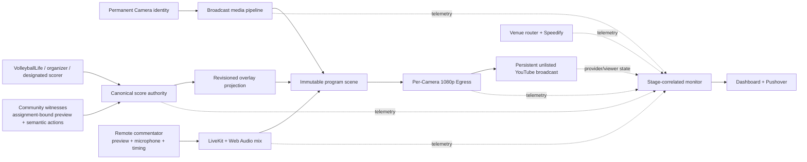
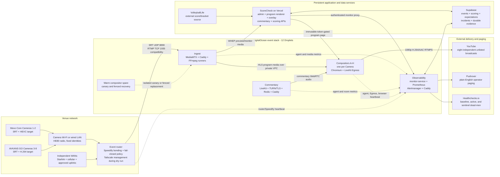
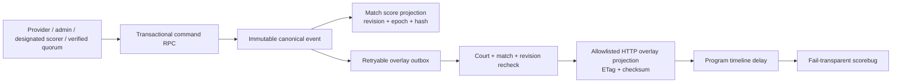

# ScoreCheck Current Tested System Architecture

- **Architecture date:** 2026-07-28
- **Scope:** Eight-camera event streaming, scoring, commentary, monitoring, delivery, and temporary infrastructure lifecycle
- **Implementation baseline reviewed:** `c02f93c723adfa3de588b2d58b241e01a3778359`
- **Dry-run debrief:** `docs/reports/SCORECHECK_FIRST_EIGHT_CAMERA_DRY_RUN_DEBRIEF_2026-07-26_TO_2026-07-28.md`
- **Status:** Current tested candidate architecture, not tournament production acceptance

> This document contains no passwords, publish credentials, stream keys, API tokens, private keys, or protected URLs. It describes logical identities, public service names, ports, trust boundaries, and the implementation actually exercised during the July 26-28 dry run.

## 1. Purpose and Qualification Boundary

ScoreCheck turns eight permanent camera identities into eight independent YouTube programs. Each program is intended to contain:

- 1920x1080 camera video;
- camera ambient audio;
- a live scoreboard overlay;
- optional remote commentary;
- an interruption slate when the camera is unavailable; and
- telemetry sufficient to locate a problem at the venue, ingest, renderer, encoder, provider, or control-plane layer.

The system's operating priorities are:

1. continuous, watchable YouTube playback;
2. audio/video/score synchronization;
3. video and audio fidelity;
4. predictable recovery and one-camera isolation; and
5. latency only after the preceding requirements are satisfied.

The July dry run changed one major architectural choice: the long-running program renderer now uses buffered HLS instead of WHEP. WHEP remains appropriate for low-latency previews and scoring views, but its Chrome presentation behavior was not reliable enough for the final program renderer.

This document distinguishes four states:

| State | Meaning |
| --- | --- |
| Implemented | Present in the reviewed repository and configuration. |
| Exercised | Used during the July 26-28 physical-camera dry run. |
| Qualified | Passed its declared production-shaped acceptance gate. |
| Open | Implemented or proposed, but not yet proven safe for a tournament. |

The architecture is implemented and substantially exercised. It is not fully qualified. The most important open gates are HLS memory stability, persistent Egress ownership recovery, final eight-camera source admission, end-to-end audio quality, and venue upload reserve.

### 1.1 ScoreCheck is five integrated products

The infrastructure exists to operate five connected products, not merely to relay camera video. They share Camera 1-8 identity, event/court/match state, Supabase authority, the browser program scene, and one operator control surface.

| Product | Primary user | What it delivers | Main implementation |
| --- | --- | --- | --- |
| Broadcast production and delivery | producer and YouTube viewer | Camera video, ambient audio, scorebug, optional commentary, interruption slate, and one persistent 1080p output per Camera | venue router, MediaMTX, HLS/WHEP, immutable Next.js program scene, LiveKit Egress, YouTube |
| Scoring and scoreboard overlays | official scorer, organizer, community witness, and viewer | canonical match score, score authority, set/match progression, synchronized scorebug, and last-good fallback | Supabase Postgres/RPCs, server-side scoring APIs, VolleyballLife poller, overlay materialization, Realtime invalidation, HTTP repair |
| Remote commentary | remote commentator and producer | low-latency court return, microphone publication, other-commentator return, mix-minus behavior, measured timing, and program audio mix | LiveKit, TURN/TLS, commentary web client, Web Audio, clock exchange, browser telemetry |
| Monitoring and incident response | on-site operator | one-page desktop/mobile diagnosis from venue uplink through viewer delivery, plus plain-English paging | host agents, router heartbeat, browser heartbeat, Prometheus, Alertmanager, monitor-service, Supabase incidents, Pushover, Healthchecks.io |
| Turnkey event infrastructure | producer and lifecycle operator | repeatable zero-to-12 startup, readiness/admission, event operation, evidence capture, and provider-zero teardown | DigitalOcean API, protected event manifests, lifecycle controllers, cloud-init, Docker Compose, Reserved IPv4 anchors, runbooks |

These products are intentionally coupled by contracts rather than by process ownership:

- the broadcast can continue when scoring, commentary, monitoring, Vercel APIs, or Supabase are temporarily unavailable;
- the score system can accept official, manual, designated, or community evidence without allowing each browser to mutate the broadcast score directly;
- remote commentary can join or leave without restarting the Camera video or Egress job;
- monitoring observes every product but is not permitted to stop the media path; and
- lifecycle tooling provisions all required roles from versioned configuration instead of relying on unique state inside a Droplet.

### 1.2 Integrated product flow



### 1.3 Broadcast production product

For each permanent Camera identity, the production system builds one independent program:

1. the Camera publishes through the fail-closed bonded venue router;
2. MediaMTX authenticates the source and exposes raw, normalized, preview, program, monitor, and calibration path classes;
3. the compositor reads buffered HLS for the long-running program and WHEP only where low latency is operationally useful;
4. the immutable program page renders video, ambient audio, the delayed scorebug, optional commentary, and interruption graphics;
5. one LiveKit Web Egress job captures that browser scene at 1920x1080; and
6. the encoded H.264/AAC output publishes to one Camera-owned YouTube stream/broadcast.

The output is designed to outlive a Camera interruption. Source loss changes the scene to an interruption slate; it does not grant permission to stop Egress or complete the YouTube broadcast.

### 1.4 Scoring and scoreboard product

The scoring product has three responsibilities that remain distinct:

- **observation:** accept what an official source, organizer, designated scorer, or community witness reports;
- **authority:** decide which source is currently permitted to advance the canonical match score; and
- **presentation:** materialize a revisioned overlay and align its display with buffered program video.

The public `/score` portal discovers the current event and presents its courts. A participant joins a match-scoped assignment and receives an HttpOnly session rather than database credentials. Ordinary fan taps are immutable evidence. A designated scorer or eligible verified consensus can advance the canonical score through transactional server-side RPCs. Organizers can promote/revoke assignments, issue match-scoped invitations, resolve disputes, freeze a court, correct a score, or transition a match through authenticated admin APIs.

Every canonical change carries an authority epoch, expected revision, source identity, state hash, immutable event, and retryable outbox item. The overlay worker publishes only after rechecking that the same court, match, and revision are still current. This prevents a delayed result from an old match from appearing on a newly assigned court.

### 1.5 Remote commentary product

The commentary product gives a remote participant a Camera-scoped browser room rather than access to production infrastructure. The participant:

1. opens `/commentary/court/N` and obtains a short-lived server-issued LiveKit token;
2. watches the low-latency Camera preview rather than delayed YouTube;
3. publishes one microphone track to the deterministic Camera room;
4. hears ambience and remote peer tracks, but never receives their own locally published track back; and
5. emits preview-timing and clock-exchange samples used by the program mixer.

The program page subscribes to commentary tracks and adds them to a stable Web Audio graph containing per-source delay, gain, dynamics processing, metering, and silence continuity. Commentary failure is therefore an optional audio degradation, not a video or output lifecycle event.

### 1.6 Monitoring and incident-response product

The monitoring product answers an operator question in operational language: **where is the earliest proven failure, which Cameras are affected, and what should I do first?** It combines:

- router and Speedify link/queue/route state;
- source transport, codec, bitrate, frame, loss, and publisher identity;
- branch and normalizer progress;
- browser rendering, HLS delay, freezes, audio, score, commentary, reconnect, and build identity;
- Egress ownership, health, CPU, memory, and `/dev/shm`;
- YouTube lifecycle, binding, stream health, issues, and viewer checks; and
- explicit event expectations so intentionally idle Cameras do not page.

The dashboard is a low-bandwidth diagnostic client. Its overview opens no live media readers, while a selected Camera can open one bounded data-saver or detail reader. Durable incident episodes and Pushover continue to work when the dashboard is closed.

### 1.7 Turnkey event-infrastructure product

The lifecycle product makes the media system disposable without making it improvised. A protected event manifest pins Droplet roles, images, renderer revision, Camera profiles, YouTube ownership, Reserved IPv4 assignments, DNS, monitoring contracts, and evidence locations. Startup creates and qualifies the stack in bounded stages. Teardown first completes/stops event-owned outputs as explicitly directed, exports evidence, then deletes temporary compute and audits provider-zero state.

This product is what allows ScoreCheck to avoid paying for idle Droplets between tournaments while still rebuilding the same tested architecture the day before an event.

## 2. System Invariants

The design is organized around these non-negotiable properties:

1. **Permanent camera identity:** Camera 1 through Camera 8 keep stable media identities and credentials across events. A physical court label is event-specific metadata.
2. **One-camera output isolation:** each active camera has its own compositor and YouTube output. A failure on Camera 3 should not restart or stop Camera 1.
3. **Persistent public output:** camera loss must show an interruption slate. It must not stop or complete the YouTube broadcast.
4. **1080p output:** final output is explicitly 1080p30 or 1080p60. The monitor's low-resolution path can never select or downgrade public output quality.
5. **Monitoring outside the media path:** monitoring may detect and page on media failure, but monitoring failure cannot stop media.
6. **Scoring and commentary are optional dependencies:** their failure must not blank camera video or stop Egress.
7. **Fail-closed venue routing:** camera publish traffic uses the bonded Speedify tunnel or is blocked. It cannot silently escape through one ordinary WAN.
8. **Immutable event renderer:** every Egress output is bound to one exact renderer Git SHA and Vercel deployment.
9. **One active Egress per compositor:** duplicate output admission fails closed.
10. **Temporary compute:** event Droplets are created before an event and deleted afterward. Powering them off is not a billing boundary.
11. **No StreamRun:** the media platform is self-hosted.
12. **Fifteen-Droplet ceiling:** the normal event topology uses 12 temporary Droplets and does not require a quota increase.

## 3. Complete System Diagram



## 4. Persistent Resources Versus Event Resources

### 4.1 Persistent between events

The following survive when event compute is at zero:

- the Git repository and pushed implementation;
- protected event/lifecycle configuration on the operator machine;
- Supabase project and schema;
- Vercel application and deployment history;
- DNS zones and production hostnames;
- YouTube channel, reusable stream resources, and completed broadcasts;
- Pushover and Healthchecks.io accounts/checks;
- two DigitalOcean Reserved IPv4 endpoint anchors;
- retained Caddy TLS state for ingest, commentary, and observability;
- protected SSH material, known-hosts, lifecycle attestations, and evidence;
- the venue router configuration and permanent camera profiles.

### 4.2 Temporary per event

The following are created and later destroyed:

- all 12 DigitalOcean Droplets;
- event-owned Droplet IDs and tags;
- event VPC assignments and role firewall attachments;
- generated per-host service configuration;
- isolated event renderer resources when the lifecycle uses them;
- active LiveKit Egress jobs;
- temporary output-owner records on compositor hosts;
- event monitoring targets and high-frequency Prometheus data;
- event-scoped evidence collectors and synthetic qualification processes.

The July dry run ended with a passing provider-zero audit: zero temporary Droplets, event snapshots, volumes, temporary event tags, isolated event projects, or event DNS residue. The eight event broadcasts were explicitly completed and remained unlisted.

## 5. Venue and Camera Architecture

### 5.1 Camera identities and target profiles

The current target profile is:

| Camera | Device family | Target transport | Target source codec | Default mode | Conditional mode |
| ---: | --- | --- | --- | --- | --- |
| 1 | Mevo Core | SRT | HEVC | 1080p30 | 1080p60 after qualification and bandwidth admission |
| 2 | Mevo Core | SRT | HEVC | 1080p30 | 1080p60 after qualification and bandwidth admission |
| 3-8 | AVKANS GO | SRT | H.264 | 1080p30 near 3 Mbps | None currently admitted |

The target differs from the mixed comparison cohort. During the dry run, Camera 2 and Cameras 3-4 also exercised RTMP/H.264, while Cameras 5-6 exercised SRT/HEVC. That comparison was diagnostic, not the final production profile.

### 5.2 Why SRT is the target transport

SRT is preferred because the venue connection is variable and bonded:

- bounded retransmission is explicit;
- latency and receive buffering are configurable;
- MediaMTX exposes useful SRT loss and transport counters;
- SRT avoids the vendor-specific RTMP URL behavior observed in the AVKANS app;
- recovery can be separated from application-level reconnect behavior; and
- UDP fits the router's tested Speedify streaming mode.

RTMP remains a compatibility path on TCP 1935. It is not the selected AVKANS production standard. During the dry run, an AVKANS RTMP setup repeatedly showed `Connect timeout` without opening a TCP session at ingest, even when the visible host and key looked correct. Adding the application path fixed the endpoint, but the supportability was worse than SRT.

### 5.3 Why the device families use different source codecs

AVKANS GO targets H.264 because:

- the camera exposes the required H.264/SRT combination;
- direct H.264 avoids an extra decode/encode generation;
- it reduces compositor normalizer CPU and memory;
- it produces a simpler failure chain; and
- it is easier to inspect with ordinary H.264 tools.

Mevo Core retains HEVC because its bandwidth savings are useful on constrained venue uplinks. HEVC is never delivered directly to Linux Chromium. A Mevo assigned to HEVC must use its owning compositor's isolated HEVC-to-H.264 normalizer and pass a production-shaped capacity gate.

HEVC is therefore not assumed to be universally better. It trades venue bandwidth for cloud decode/encode cost, latency, and another recovery process.

### 5.4 Source admission contract

An event manifest binds each enabled Camera to:

- permanent Camera number;
- device model and firmware;
- selected transport;
- source codec and source-path mode;
- exact frame-rate mode: 30000/1001, 30/1, 60000/1001, or 60/1;
- 1920x1080 progressive geometry;
- expected pixel format;
- B-frame rules;
- maximum two-second keyframe interval;
- monotonic DTS and bounded timestamp gaps;
- source bitrate minimum/maximum and event cap;
- AAC 48 kHz stereo source audio;
- publisher generation and duplicate ownership checks; and
- a continuous stability window.

Direct browser H.264 additionally requires `yuv420p` and zero B-frames. HEVC or unsafe H.264 must use an explicitly assigned browser normalizer.

The dry run proved why the contract is necessary. Different H.264 cameras reported Main or High profile, `yuv420p` or `yuvj420p`, and zero or one B-frame. A positive bitrate and 1080p dimensions alone were not enough to prove browser compatibility.

## 6. Event Router, Speedify, and Management Plane

### 6.1 Data-plane routing

The event router selectively sends only camera publish traffic through Speedify:

- SRT: UDP destination port 8890;
- RTMP: TCP destination port 1935.

Ordinary laptops, camera-control traffic, and non-camera internet use do not automatically enter the tunnel.

Two controls make camera routing fail closed:

1. routing table `900` sends admitted camera traffic through `connectify0`, while guard table `901` blackholes it when the primary route is absent;
2. an early firewall chain rejects matching camera traffic on any output interface other than `connectify0`.

The managed watchdog reconciles Speedify state, policy rules, route tables, firewall guards, and stale camera connection tracking. It uses a lifetime lock so only one watchdog owns reconciliation.

### 6.2 Speedify operating profile

The current checked-in and live diagnostic router contract uses:

- Speed mode;
- Multi-TCP transport;
- fixed delay 75 ms;
- default packet pool;
- default route off;
- PEP on for RTMP;
- automatic target connection count; and
- a 5 GHz camera radio configured for `HE80`.

This is not yet an eight-camera production-qualified transport selection. In
the earlier July 29 physical-camera gate, Speed with single TCP, Enhanced
Streaming with UDP, Speed with UDP, and Speed with Multi-TCP all failed
sustained eight-camera delivery. A later matched six-camera comparison of plain
Speed/Multi-TCP against Enhanced Streaming/Multi-TCP preserved clean viewer
delivery in both modes, but Enhanced Streaming increased SRT loss/drop rates on
Cameras 2-6 without reducing router CPU. Plain Speed/Multi-TCP therefore remains
the measured default. All saved Speedify input priorities must remain Automatic
in every mode.

### 6.3 Capacity admission

Venue admission is based on measured sustained goodput, not an ISP plan, one speed-test peak, or Speedify's headline estimate. The intended reserve is at least 25-30 percent above the sum of configured camera payloads.

The July run demonstrated the failure mode:

- all eight raw feeds totaled about 19.4 Mbps;
- measured tunnel output averaged about 20.61 Mbps;
- the observed range was about 19.05-22.56 Mbps;
- simultaneous SRT loss grew on several cameras; and
- there was effectively no operating reserve.

The router must also reject multiple interfaces that lead to the same modem or ISP gateway as independent capacity. They are one failure domain even when Speedify lists them separately.

### 6.4 Starlink rejoin behavior

When Starlink rebooted and rejoined the tunnel during the dry run, Speedify admitted it before it was stable. The tunnel queue grew to about 11.8 MB and 4.4-5.8 seconds of delay. Deprioritizing the adapter did not clear the stale scheduler state. A bounded fail-closed tunnel reconnect restored the previously functioning links.

This behavior is detected and documented, but automatic safe rejoin quarantine/drain handling is not yet qualified.

### 6.5 Router observability

The router sends a bounded write-only heartbeat to the monitoring service. It includes:

- Speedify connection and route state;
- per-link and aggregate throughput;
- latency, jitter, loss, congestion, and queue metrics;
- primary and guard rule counts;
- kill-switch state;
- camera flow count;
- router load and available memory;
- Speedify RSS;
- interface counters; and
- accidental long-running stats-process detection.

The heartbeat does not include WAN addresses, camera credentials, or media payloads.

### 6.6 Operator access

The MacBook is an operator console, not a media relay. The cloud stack, camera publishing, program rendering, monitoring, and YouTube output continue without it.

Tailscale was used during the dry run so the MacBook could leave the event router's data path while still reaching the router management plane. That reduced test interference. Tailscale bootstrap and authorization are not yet fully integrated into rebuild-day lifecycle automation, so this remains an operational dependency to formalize.

## 7. DigitalOcean Fleet

The event stack is exactly 12 temporary Droplets in `sfo2` on the event VPC.

| Count | Logical role | Tested size | Primary responsibility |
| ---: | --- | --- | --- |
| 1 | `bvm-commentary-01` | `s-2vcpu-2gb` | LiveKit commentary SFU, TURN/TLS, Redis, Caddy |
| 1 | `bvm-observability-01` | `s-2vcpu-4gb` | monitor-service, Prometheus, Alertmanager, node-exporter, Caddy |
| 1 | `bvm-preview-01` | `c-4` | MediaMTX ingest, derived branches, HLS/WHEP serving, path telemetry |
| 8 | `bvm-compositor-a` through `-h` | `s-8vcpu-16gb-480gb-intel` | one Camera's Chromium scene and 1080p YouTube encoder |
| 1 | `bvm-compositor-spare` | `s-8vcpu-16gb-480gb-intel` | isolated canaries and fenced recovery capacity |

### 7.1 Why one compositor per Camera

The browser plus native 1080p encoder is the largest per-output workload. One host per Camera provides:

- one-camera failure isolation;
- predictable CPU, memory, and `/dev/shm` ownership;
- exact output and credential ownership;
- a hard one-Egress ceiling;
- independent restarts; and
- simpler monitoring and root-cause attribution.

Consolidating outputs would save some compute but would enlarge every failure domain. The current architecture keeps isolation until a production-shaped benchmark proves a better cost/reliability trade.

### 7.2 Warm spare

The spare is normally idle. It is used for:

- isolated media/browser canaries;
- a fenced replacement compositor;
- a proposed priority-camera YouTube backup publisher; and
- a proposed dual-role ingest recovery transaction.

Those recovery roles are implemented or regression-tested in parts, but they are not all live-qualified. The spare must not start a second publisher without exact owner and destination-role fencing.

### 7.3 Shared ingest tradeoff

The ingest Droplet is the largest shared media failure domain. Its failure removes source media for all eight outputs. The current approach mitigates this with:

- a retained Reserved IPv4 ingest anchor;
- reproducible configuration and TLS state;
- a warm-spare ingest recovery controller;
- private VPC compositor rebinding;
- exact monitoring-role transfer; and
- protected rollback evidence.

The architecture does not use active-active ingest. A thirteenth warm ingest host is deferred until the simpler spare takeover is measured and found insufficient.

## 8. MediaMTX Ingest and Path Graph

### 8.1 Ingest service stack

The ingest host runs:

- MediaMTX `1.19.2` with the AVKANS audio compatibility build;
- Caddy `2.11.4` for public TLS/proxy responsibilities;
- FFmpeg branch runners under an init/reaping boundary;
- a read-only monitoring agent; and
- local API, metrics, and progress files.

Important listeners:

| Port | Exposure | Purpose |
| ---: | --- | --- |
| 1935/TCP | public, firewall constrained | RTMP camera publishing compatibility |
| 8890/UDP | public, firewall constrained | SRT camera publishing and local delayed branch reads |
| 8888/TCP | TLS/proxy controlled | fMP4 HLS program playback |
| 8889/TCP | TLS/proxy controlled | WHEP signaling for preview/monitor/scoring |
| 8189/UDP | public, firewall constrained | WebRTC media |
| 8554/TCP | loopback/private | RTSP branch reads and publishes |
| 9997/TCP | loopback | MediaMTX API |
| 9998/TCP | loopback | MediaMTX metrics |

### 8.2 Path classes

For each Camera `N`, MediaMTX defines:

| Path | Purpose | Video handling | Audio handling | Typical reader |
| --- | --- | --- | --- | --- |
| `courtN_raw` | authenticated camera input | source native | source AAC | admission, normalization, branch runners |
| `courtN_normalized` | browser-safe output for assigned unsafe source | HEVC/unsafe H.264 to H.264 | normalized | preview/program branch runner |
| `courtN_preview` | low-latency preview/scoring/commentary return | stream-copy H.264 | AAC to Opus | WHEP browser |
| `courtN_program` | final program media before browser composition | stream-copy H.264 | AAC 128 kbps/48 kHz | HLS program browser |
| `courtN_monitor` | selected low-bandwidth admin inspection | 360p, 10 fps, 350-450 kbps H.264 | Opus mono | one admin inspection reader |
| `courtN_calibration` | temporary sync qualification | timecoded H.264 | copied | attended calibration only |

Raw paths are not publicly readable. Each camera credential may publish only its own raw path. Each assigned compositor may publish only its own normalized path from its private source address.

The current checked-in MediaMTX template still grants anonymous read/playback permission to the derived preview, program, monitor, and calibration path classes. The Vercel application controls normal URL discovery, and raw publishing remains protected, but obscurity and application routing are not equivalent to media-path authorization. Before tournament acceptance, derived paths need purpose-scoped read authorization or an equivalently strict edge control, plus bounded reader-count enforcement. This document does not represent the current Gate 1 permission as already hardened.

### 8.3 On-demand branch lifecycle

Preview, program, monitor, and calibration branches start only when read. The shared runner:

- validates the exact path;
- waits for the required upstream path;
- launches one direct FFmpeg child;
- writes bounded progress telemetry;
- prevents overlapping owners;
- handles child reaping; and
- retires after the path-specific no-reader grace period.

Program and preview branches use longer close delays to avoid churn. The admin monitor path retires quickly because it should have only one selected reader.

### 8.4 Normalization placement

The shared `c-4` ingest host does not perform eight HEVC video transcodes. A Camera assigned `isolated-browser-normalizer` runs the normalizer on its owning compositor:

```text
courtN_raw HEVC
  -> private compositor normalizer
  -> H.264 yuv420p progressive, no B-frames
  -> courtN_normalized on ingest
  -> preview/program branches
```

This preserves camera isolation and avoids turning shared ingest CPU into the bottleneck for every Camera. It also consumes resources on the same host that renders and encodes the final program, so each HEVC mode must be capacity-qualified at 1080p30 or 1080p60.

### 8.5 HLS generation

MediaMTX serves fMP4 HLS with:

- two-second segments;
- 15 retained segments;
- on-demand remuxing;
- no forced always-on HLS generation.

The HLS media still comes from the `courtN_program` path. Program video is stream-copied after admission/normalization, while program audio is encoded to AAC 128 kbps at 48 kHz stereo.

## 9. Program Renderer: Buffered HLS

### 9.1 Why HLS replaced WHEP for program capture

The earlier architecture used WHEP in Linux Chromium for the final program scene. During the dry run, Chrome accumulated frame drops and freezes across RTMP/H.264, SRT/H.264, and SRT/HEVC while:

- upstream FFmpeg remained near 30 fps;
- browser RTP packet loss remained zero; and
- MediaMTX paths remained ready.

The cross-cohort pattern isolated the main defect to WHEP/Chromium presentation and scheduling rather than one source codec or camera transport.

A same-source HLS comparison produced about 29.88 fps with zero drops while the WHEP comparison produced about 28.48 fps with drops and freezes. Because latency is not a priority, buffered HLS became the program transport.

### 9.2 Current HLS client policy

The program page uses `hls.js` with low-latency mode disabled and the following bounded candidate policy:

| Setting | Current value |
| --- | ---: |
| Target live latency | 12 seconds |
| Maximum live latency | 24 seconds |
| Startup forward buffer | 10 seconds |
| Forward buffer length | 18 seconds |
| Back buffer | 4 seconds |
| Maximum compressed buffer | 32 MB |
| Initial segment count | 6 |

The browser waits for the startup buffer before playback. It samples actual rendered frames through `requestVideoFrameCallback`, records HLS stalls/freezes, and reports measured HLS latency in the heartbeat.

### 9.3 Important qualification warning

The first broad HLS configuration was not bounded correctly. Camera 8 and Camera 1 Egress workers reached roughly 7.02 GB and 7.14 GB and were terminated by the LiveKit memory guard. One Chrome renderer consumed roughly 5.44 GB.

The bounded policy above was implemented afterward. A short Camera 3 canary rendered smoothly, but memory rose from about 2.65 GB to 3.06 GB and effective playout delay fell from about 12.1 seconds to 2.1 seconds. The canary ended before the required long gate.

Therefore:

- HLS is the selected architecture;
- the old unbounded HLS configuration is rejected;
- the current bounded configuration is a candidate;
- event-long memory and latency stability are still open release gates.

### 9.4 Interruption behavior

The Program page remains mounted when camera media disappears. Its watchdog distinguishes waiting, stabilizing, playing, stalled, reconnecting, and fatal states. When frames stop:

- the last media connection is allowed to recover within bounds;
- the visible scene changes to a plain interruption slate;
- the overlay and browser process remain alive;
- browser heartbeats continue when the page is functioning; and
- Egress continues sending the composed page to YouTube.

The YouTube broadcast is not stopped by source loss.

## 10. Vercel Web Application

### 10.1 Technology stack

The web application uses:

- Next.js 15;
- React 19;
- TypeScript;
- Supabase JS 2;
- LiveKit client and server SDKs;
- `hls.js` 1.6;
- Zod validation; and
- Lucide icons.

It is deployed on Vercel. The active implementation root is `apps/web`.

### 10.2 Major operator and program surfaces

| Route family | Responsibility |
| --- | --- |
| `/admin/login` | shared current admin authentication boundary |
| `/admin/events` | event and court configuration |
| `/admin/production` | output start/stop/status controls |
| `/admin/monitor` | mobile/desktop camera pipeline dashboard |
| `/admin/commentary` | commentary administration |
| `/admin/events/[eventId]/fan-scoring` | community assignments, invitations, authority, disputes, and court coverage |
| `/program/bootstrap` | one-time program credential exchange |
| `/program/court/N` | immutable browser scene captured by Egress |
| `/overlay/court/N` | scorebug rendering |
| `/commentary/court/N` | commentator return video and audio client |
| `/score` and `/score/session` | official/community scoring surfaces |
| `/api/overlay/court/N/state` | authoritative overlay repair response |
| `/api/courts/[courtId]/*` | authenticated match assignment, score correction, freeze, and transition controls |
| `/api/community/*` | community join, session, evidence, command, heartbeat, media, and release broker |
| `/api/admin/fan-scoring/*` | assignment promotion/revocation, invitations, authority, and dispute resolution |
| `/api/commentary/*` | commentator login, token issuance, and scoring-role promotion |
| `/api/admin/monitor/*` | authenticated sanitized monitoring proxy |

### 10.3 Immutable renderer binding

Each event binds:

- exact renderer Git SHA;
- exact Vercel deployment ID;
- generated immutable Vercel deployment origin;
- asset namespace;
- overlay contract version;
- commentary contract version; and
- browser-heartbeat contract version.

The compositor start script rejects a production alias and requires the generated immutable deployment URL. A one-time token travels in the URL fragment, is exchanged for a scoped HttpOnly session, and is removed by navigation.

Program routes use private/no-store caching, no-referrer behavior, strict content security policy, and no third-party analytics or fonts.

### 10.4 Program scene composition

The browser scene contains:

- the HLS camera video element;
- camera ambient audio routed into Web Audio;
- optional commentary audio from LiveKit;
- the delayed scoreboard overlay;
- interruption graphics; and
- hidden telemetry/heartbeat logic.

The scene is authored at a fixed logical 1280x720 stage and scales to the Egress viewport. Egress captures it at 1920x1080. The 1280x720 DOM coordinate system is not a 720p public-output fallback.

### 10.5 Public service names

| Hostname | Owner | Purpose | Address lifecycle |
| --- | --- | --- | --- |
| `www.beachvolleyballmedia.com` | Vercel | Main, admin, commentary, and public application | persistent Vercel alias |
| `score.beachvolleyballmedia.com` | Vercel | ScoreCheck application and compatibility origin | persistent Vercel alias |
| `beachvolleyballmedia.com` | Vercel | apex application alias | persistent Vercel alias |
| generated `*.vercel.app` deployment | Vercel | immutable event program renderer | event/release bound |
| `preview.beachvolleyballmedia.com` | ingest Droplet | camera ingest plus HLS/WHEP media | retained ingest Reserved IPv4 |
| `rtc.beachvolleyballmedia.com` | commentary Droplet | LiveKit signaling and media | retained commentary Reserved IPv4 |
| `turn.beachvolleyballmedia.com` | commentary Droplet | TURN/TLS fallback | commentary Reserved IPv4 |
| `monitor.beachvolleyballmedia.com` | observability Droplet | monitor API and health | event host with lifecycle-managed DNS |

## 11. Scoring and Overlay Data Plane

### 11.1 Supabase responsibilities

Supabase is the durable application authority for:

- events and event settings;
- permanent Camera/event court mappings;
- matches and court queues;
- canonical score state and score actions;
- overlay materializations;
- poller leases and errors;
- scoring authority and community evidence;
- program-heartbeat history;
- monitoring expectations;
- incident episodes, events, notifications, and silences;
- monitoring checkpoints and summaries; and
- sync calibration evidence.

Browser clients do not receive the Supabase service role. Sensitive writes and monitor reads pass through server-side APIs or service processes.

### 11.2 Score authority

The scoring system supports server-authorized semantic actions and explicit authority modes. The canonical score state carries monotonic revisions, authority epochs/fencing, and state hashes. Community observations do not directly overwrite canonical score state.

VolleyballLife can act as an external score/bracket source through bounded polling, schema validation, leases, error recording, and fallback to manual/community authority.

### 11.3 Overlay delivery

The Program page treats HTTP as authoritative:

1. fetch the materialized overlay body;
2. validate event, Camera, match, schema, revision, and checksum identity;
3. apply only a newer valid generation;
4. use Realtime as an invalidation signal rather than trusting payload order; and
5. perform a bounded repair poll with ETag/304 support.

The overlay follows the buffered media timeline. Score changes are applied after the measured program-media delay so viewers do not see a point before the corresponding video action.

If Supabase or overlay rendering fails, the last valid score remains visible or the scorebug fails transparent. Camera video and YouTube output continue.

### 11.4 Official, manual, and provider scoring

ScoreCheck can obtain an authoritative score from:

- a bounded VolleyballLife poller when the provider is available and healthy;
- an authenticated organizer using the court admin score and match controls;
- a designated scorer assigned to the active match; or
- verified community consensus when that authority mode is explicitly active.

Provider liveness is stored separately from score changes. Repeated identical provider payloads refresh source health without manufacturing score revisions. Poller leases and fencing prevent two workers from owning one source generation. Schema validation, poller errors, and manual fallback preserve operator control when the external provider changes or fails.

Manual controls operate on semantic commands such as adding/removing a point, changing the current set, correcting a score, assigning/advancing a match, freezing/unfreezing a court, or forcing the next match. Browsers never write `score_states` directly.

### 11.5 Live fan and community scoring

Community scoring is a match-scoped evidence system, not a group of browsers competing to overwrite a court row.

The public flow is:

1. `/score` resolves the current event and shows active courts, current match context, scoring coverage, and which court needs help;
2. a participant joins through `/api/community/join`, receiving a secure HttpOnly device/session cookie and one active assignment for that match;
3. the session page presents the owned Camera preview, actual team names, set context, canonical score, and explicit Add/Remove controls;
4. an ordinary witness submits one immutable, idempotent observation for the current base revision;
5. the participant receives a truthful personal receipt such as recorded, confirmed, differed, late, corrected, or review-triggering; and
6. the canonical score changes only when the currently authorized source commits or a qualified verified quorum reaches consensus.

The responsive scorer supports phone portrait, tablet portrait, desktop split view, and a contained fullscreen/focus mode. Side switching and control placement are local display preferences; they never swap canonical Team A/Team B request identity.

### 11.6 Community authority, consensus, and disputes

Authority is explicit and epoch-scoped, in descending precedence:

1. `ADMIN_LOCKED`;
2. `PROVIDER_PRIMARY`;
3. `DESIGNATED_PRIMARY`;
4. `VERIFIED_CONSENSUS`; and
5. `PAUSED_DISPUTE`.

Commands include both the expected canonical revision and authority epoch. A stale browser cannot write through a provider recovery, admin correction, scorer reassignment, or match transition.

Ordinary witnesses contribute evidence but cannot directly own the broadcast. Verified courtside consensus requires at least three eligible witnesses and a two-thirds exact action/team majority. Five eligible votes without a two-thirds result can pause the match for review. Anonymous dissent after an authoritative score remains visible to that participant but does not page the operator; a global post-canonical review requires two active verified-courtside dissenters.

The organizer dashboard can inspect active designated/verified assignments, bounded ordinary-observer summaries, collective coverage, and open disputes. It can promote, verify, end, or revoke an assignment; issue an expiring match-scoped grant; change authority; and apply or dismiss a dispute proposal. Every operation is attributable and revisioned.

### 11.7 Community media and command timing

Fan scoring uses the low-latency `courtN_preview` WHEP path, not the delayed public YouTube player. Direct MediaMTX credentials and stream paths are never returned to the browser. A same-origin media broker:

- derives the Camera path from the HttpOnly assignment;
- reserves and activates one resource per assignment within court/global capacity limits;
- retains read-edge credentials and affinity server-side;
- exposes only an opaque same-origin WHEP resource and DELETE lifecycle;
- renews a short media lease; and
- closes resources on release, revocation, match transition, expiry, or lost browser heartbeat.

Remote designated commands fail closed without a fresh brokered frame. Their diagnostic evidence includes WHEP session identity, frame age, media time, connection state, score revision, and command ID. That evidence helps investigation and rejects stale remote taps, but is not falsely presented as cryptographic proof of the physical rally. A verified organizer physically at the court can use the explicit direct-sight exemption.

Ordinary contributions use bounded idempotent retry with one stable client action ID. An uncertain remote authoritative point is not submitted later against a newer rally: reconnect checks whether the original command committed and otherwise requires fresh live entry.

### 11.8 Score-to-program synchronization

The score path from action to viewer is:



The overlay client keeps its last valid generation, discards stale or mismatched invalidations, repairs through the authoritative HTTP endpoint, and applies the projection according to the current buffered media timeline. This separates fast score entry from when the viewer should see the update.

## 12. Commentary and Audio

### 12.1 Commentary host

The commentary Droplet runs:

- LiveKit Server `1.13.3`;
- Redis 7;
- Caddy Layer 4;
- TURN/TLS fallback; and
- a read-only monitoring agent.

Commentary rooms use deterministic Camera-scoped names. A commentator receives a short-lived Camera-scoped token from the Vercel application.

### 12.2 Return and mix architecture

The intended commentator experience is:

- low-latency WHEP camera preview;
- camera ambience;
- other commentators;
- no return of the commentator's own microphone; and
- headphones rather than open speakers.

The Program page creates one stable Web Audio graph. It mixes:

- HLS camera audio;
- remote LiveKit commentary tracks;
- configured camera and commentary gains;
- compression/limiting;
- fine commentary delay; and
- an inaudible continuity source so final audio does not disappear when a track leaves.

The browser reports camera and commentary RMS/peak/clipping/silence, track counts, packet statistics, clock RTT, configured/target/applied delay, and synchronization state.

### 12.3 Current audio qualification boundary

The July run implemented AAC program audio through HLS, but Nathan still heard subtle robotic/reverberant Camera 1 audio during the earlier output. An end-to-end human A/B after the final HLS/AAC configuration was not completed.

The system therefore still needs:

- direct camera-audio versus final YouTube comparison;
- duplicate-path/echo validation;
- clap or flash synchronization calibration;
- commentary join/drop/rejoin testing; and
- TURN/TLS qualification from a restrictive external network.

Commentary was intentionally absent from the July dry run and did not block output.

### 12.4 Commentator workflow and trust boundary

The commentator application is Camera-scoped:

1. the participant authenticates through the commentary login flow;
2. the server issues a short-lived token for one deterministic `scorecheck-court-N` LiveKit room;
3. the browser starts the low-latency Camera return and requests microphone permission;
4. the participant joins with adaptive receive behavior and publishes one mono microphone track;
5. a local meter must show speech before the room is considered broadcast-ready; and
6. the participant may mute, leave, reconnect, or be promoted into a trusted scoring assignment without receiving service credentials.

The client receives remote tracks from other participants but not its own local publication. This provides the mix-minus property for commentary return. Headphones are an operating requirement so camera ambience or peer audio is not acoustically fed back into the microphone.

Commentary failure is isolated by design. A token error, TURN failure, microphone denial, muted track, silent participant, or room disconnect raises commentary state and telemetry; it does not replace the Camera picture or terminate Egress.

### 12.5 Synchronization model

The commentator client reports the presentation time of its low-latency preview and participates in a monotonic clock ping/pong exchange. The program mixer combines those samples with current HLS program timing to estimate how much later the commentary track should be presented.

Each remote audio track owns a bounded `DelayNode` and a controller that moves toward a safe target rather than making an abrupt jump. The configured fallback delay remains active when timing samples are stale or clock quality is insufficient. The browser heartbeat exposes configured, target, and applied delay; clock RTT; sample age; and locked/fallback status.

This transport math is not accepted as proof of semantic lip sync. Event readiness still requires a visible clap/flash and audible observation through the final YouTube program, repeated after a meaningful network or commentary-path change.

### 12.6 Stable program audio graph

The program scene creates one long-lived audio graph for the Egress session:

- HLS Camera audio enters through a `MediaElementAudioSourceNode` and Camera gain;
- each LiveKit commentary track enters through its own delay node;
- commentary tracks share gain, compressor, and metering stages;
- Camera and commentary audio remain separately measurable;
- an inaudible constant source keeps the graph alive when a source disappears; and
- audio joins/leaves change nodes without replacing the browser scene or output job.

Health telemetry includes RMS, peak, clipped-sample ratio, silence age, packet loss/receipt, jitter-buffer delay, participant count, published/available track count, and mute state. The final Egress contract remains stereo AAC at 128 kbps/48 kHz; commentary sources are centered in the stereo program.

## 13. Compositor and Egress Architecture

### 13.1 Per-host services

Each compositor runs:

- Redis as a disposable local job bus;
- a local LiveKit server used only as the Egress control API;
- LiveKit Egress `1.13.0`;
- headless Chromium, Xvfb, PulseAudio, GStreamer, x264, and RTMPS output;
- an optional profile-scoped normalizer;
- a monitoring agent; and
- protected output-owner records.

No production commentary room or camera media passes through the compositor's local LiveKit server. It exists to dispatch Web Egress jobs to the local Egress worker.

### 13.2 Resource and isolation controls

The Egress container has:

- a 3 GB `/dev/shm` allocation for Chromium;
- the version-matched Chrome sandbox seccomp profile;
- no broad `SYS_ADMIN` capability;
- a 7 GB cgroup-memory admission/kill ceiling;
- health and Prometheus endpoints on loopback; and
- one-web-request admission enforced both by Egress configuration and the start script.

One host can have exactly one active web Egress. A second start request is serialized and rejected.

### 13.3 Final output profiles

The start script permits only:

| Profile | Geometry | Frame rate | H.264 target | AAC | Keyframe interval |
| --- | --- | ---: | ---: | --- | ---: |
| `1080p30` | 1920x1080 | 30 | 10,000 kbps High | 128 kbps, 48 kHz | 2 seconds |
| `1080p60` | 1920x1080 | 60 | 12,000 kbps High | 128 kbps, 48 kHz | 2 seconds |

The Egress request is not accepted as proof by itself. The production contract captures an encoded sample and verifies geometry, frame rate, profile, bitrate, GOP, scan, color, aspect ratio, and audio through `ffprobe`, then binds the result to the output generation and YouTube destination.

### 13.4 Output ownership

Every start creates a protected owner record binding:

- event;
- Camera;
- YouTube destination ID;
- destination role, primary or backup;
- output generation;
- output profile;
- renderer Git SHA and deployment ID;
- Egress ID; and
- request digest.

Resume, stop, replacement, and failover must reconcile the exact record. Ambiguous ownership fails closed instead of launching another RTMPS publisher.

### 13.5 Persistent-output recovery

The host-local supervisor now restores only the exact owned generation and refuses ambiguous owner or active-output state. In the July 29 Camera 5 physical gate, the active Egress was removed without a normal stop intent. The supervisor confirmed three missing observations, replaced the worker container, verified idle admission and PulseAudio state, and replayed the immutable request. Exactly one replacement became active in 20.705 seconds and no old/new publisher overlap occurred. The external low-latency YouTube viewer nevertheless stalled for 24.001 seconds.

A fresh Camera 6 normal-latency gate separated provider buffering from host recovery timing. Normal latency with the original five-second/three-observation supervisor reduced the viewer stall to 11.750 seconds but still failed continuity. A measured hard cut to a two-second interval and two missing observations reduced absence confirmation from 12.372 seconds to 2.262 seconds while retaining the full worker recycle, PulseAudio/admission validation, immutable request replay, two-attempt generation bound, and a maximum active count of one. The repeat external viewer's longest stall was 1.499 seconds with continuous decoded audio and no pause or counter reset.

That repeat proves the timing and ownership path, but Camera 6's physical scene was already nearly black. The evaluator therefore could not certify visual fidelity and preserved seven quarter-second `readyState=2` observations. A measured correction now records transient reduced readiness without failing when the viewer remains unpaused, its playhead stall stays within two seconds, audio continues, and real-time advancement passes. Re-evaluating the preserved trace leaves only the pre-existing black-scene failure. Persistent-output recovery remains conditionally accepted for timing and exact ownership, with a final nonblack physical repeat plus handler, container, and host-restart gates still required.

The measured supervisor script was then deployed service-only to compositors A-H and the warm spare. All Egress container IDs and active-output identities were preserved; the one active Camera 5 Egress remained live/active/good, idle hosts stayed idle, and every supervisor reconciled healthy with no incident. New event builds inherit the same two-second/two-observation contract from the versioned compositor artifact.

## 14. YouTube Delivery

Each Camera owns a distinct YouTube stream/broadcast binding. Event tests use unlisted broadcasts.

New broadcasts use YouTube normal latency. Low-latency delivery is not appropriate for the public program because continuity, synchronization, and fidelity take priority over delay.

Before output admission, the controller verifies:

- exact stream ID and broadcast ID;
- correct binding;
- unlisted privacy;
- lifecycle state;
- primary and backup ingestion identities;
- active/good stream health;
- configuration issues;
- watch-page reachability; and
- absence of another publisher using the same generation.

The broadcast lifecycle is independent from camera source state:

```text
camera down
  -> program page shows interruption slate
  -> Egress continues RTMPS
  -> YouTube broadcast remains live
  -> camera recovery restores moving video
```

Only an explicit operator/lifecycle action completes a broadcast.

The warm spare can potentially publish a Tier 1 Camera to YouTube's backup ingestion endpoint. The ownership and transition controller exists, but live continuous-viewer qualification is not yet complete.

## 15. Monitoring and Operator Dashboard

### 15.1 Monitoring stack

The observability host runs:

- Node.js 22 monitor-service using Express 5, Zod, Supabase JS, and `prom-client`;
- Prometheus `3.13.1` with 14-day and 48 GB retention caps;
- Alertmanager `0.33.1`;
- node-exporter `1.12.0`;
- Caddy `2.11.4`; and
- a protected local monitor-state volume.

Prometheus and Alertmanager bind to loopback. Caddy exposes public health and authenticated `/v1/*` monitoring APIs.

### 15.2 Host agents

Every temporary host runs one read-only monitor agent. Agents access Docker through a GET-only socket proxy rather than receiving the Docker socket directly.

The agent contract includes:

- service running/health/restart/OOM state;
- CPU and memory;
- native Egress capacity;
- MediaMTX path readiness, codecs, dimensions, rates, readers, bytes, errors, and SRT counters;
- FFmpeg branch frames/fps/bitrate/drop/dup/speed;
- camera visual and audio content samples;
- LiveKit room/participant/track state; and
- host identity and freshness.

### 15.3 Browser heartbeat

The Program page sends a versioned authenticated heartbeat containing:

- Camera number and credential identity;
- sequence, sample time, and page-load time;
- renderer build and configuration version;
- transport and connection state;
- rendered frames and measured fps;
- dimensions, HLS playout delay, or WHEP network statistics;
- reset-safe drops, freezes, reconnects, and reloads;
- visual black/freeze analysis;
- camera and commentary audio activity;
- commentary room/track/sync state; and
- score-source/render alignment.

The heartbeat is fail-transparent: inability to report monitoring cannot throw or destabilize the program page.

### 15.4 Correlation model

The monitor evaluates stages instead of displaying unrelated red lights:

1. venue/router;
2. raw ingest;
3. preview;
4. program path;
5. program browser;
6. commentary;
7. score source;
8. score render;
9. Egress;
10. YouTube;
11. host/control/monitoring/notification dependencies.

It correlates downstream symptoms into the earliest proven root dependency. A shared venue incident can inhibit duplicate per-Camera network pages while retaining the individual evidence.

### 15.5 Expected state

Each Camera has explicit expectations for:

- coverage phase: off, warmup, live match, intermission, final hold, or teardown;
- media: off, warm, or required;
- broadcast: off, testing, or live;
- commentary: none, optional, or required; and
- scoring: none, scheduled, live, or final hold.

An intentionally idle Camera is `EXPECTED_OFF`, not failed. Temporary fault gates override an expectation only for their bounded test window and preserve their reason.

### 15.6 Incidents and paging

The monitor maintains durable incident episodes:

- each recurrence receives a new episode ID;
- one active fingerprint is allowed at a time;
- opening, update, acknowledgement, silence, expectation-end, and recovery events are recorded;
- notifications are idempotent within the episode;
- false recovery pages are suppressed when an expectation expires while the dependency remains down; and
- local WAL/outbox state preserves incidents and pages during a Supabase outage.

Pushover is the only operator paging provider. Twilio is removed from the architecture. Alerts use plain language and a first action. Emergency receipt IDs are stored and cancelled when the incident recovers or is acknowledged.

Healthchecks.io provides three external dead-man roles:

- baseline monitor availability;
- active-coverage cadence; and
- an external platform sentinel.

All three are paused between events so provider-zero does not intentionally page.

### 15.7 Dashboard behavior

The authenticated `/admin/monitor` page is designed for desktop and mobile operation. It shows permanent Camera 1-8 identities, stage health, incidents, source/profile/bitrate/fps/readers, browser quality, Egress/YouTube state, host resources, and router/Speedify metrics.

Bandwidth controls are deliberate:

- the overview does not open eight live readers;
- thumbnails come from program-browser heartbeats;
- only one selected Camera inspection can open a monitor reader;
- data-saver inspection uses the 360p/10 fps branch;
- detail inspection is explicit; and
- range history uses fixed server-side PromQL and a bounded refresh cadence.

The dashboard cannot submit arbitrary PromQL or receive raw provider credentials.

### 15.8 What the monitor must tell the operator

For every permanent Camera identity, the operator view is intended to answer these questions without reading infrastructure jargon:

| Question | Evidence presented |
| --- | --- |
| Is the Camera reaching the cloud? | raw-path readiness, publisher identity, transport, codec/profile, resolution, bitrate, fps, bytes, frame errors, and source loss |
| Is the media being prepared correctly? | normalizer/branch running state, FFmpeg fps/speed/drop/dup, preview/program readiness, and reader counts |
| Is the actual browser scene moving? | fresh heartbeat, state, rendered fps, HLS delay, reset-safe drops/freezes, reloads/reconnects, black/frozen-frame analysis, and renderer SHA |
| Is audio usable? | Camera/commentary RMS, peaks, clipping, silence age, room/track state, packet loss, and sync state |
| Is the scoreboard current? | score source, canonical/render revision, checksum/generation alignment, last update, and stale/error state |
| Is the final encoder healthy? | exact Egress ID/owner, active count, error, CPU, memory, `/dev/shm`, restart, and admission state |
| Is YouTube receiving and serving it? | expected stream/broadcast binding, lifecycle, ingestion status, provider health/issues, privacy, and watch/viewer probe |
| What should Nathan do first? | the earliest correlated incident, affected Cameras, plain-English cause, and one first action |

The page labels streams by permanent Camera number rather than venue court name because the stream credentials follow the hardware across events. Event court labels remain contextual metadata.

### 15.9 Router and Speedify monitoring

The router is a first-class stage in the same dashboard. Its panel includes:

- router heartbeat freshness, CPU, memory, temperature where available, and Speedify process RSS;
- Speedify connected/disconnected state and active exit identity;
- each WAN link's availability, mode, latency, loss, throughput contribution, and reconnect transitions;
- aggregate sent/received rate, packet retransmission/loss, queued bytes, and queue delay;
- fail-closed policy-rule/table/kill-switch integrity;
- Camera conntrack/publisher-flow count; and
- current admission profile versus measured bonded upload reserve.

The router data prevents a healthy Camera from being blamed for a shared bonded-uplink event. It also prevents the opposite error: total bandwidth is not declared the cause unless synchronized link, queue, flow, and media evidence support it.

### 15.10 Notifications and unattended operation

Pushover messages are intentionally short and nontechnical. A page names the Camera or shared dependency, says what viewers are likely experiencing, and tells Nathan the first physical or operator action. Incident deduplication prevents one dependency failure from producing repeated pages for every downstream stage.

Healthchecks.io monitors whether the monitoring system itself is still executing. During active coverage, the external checks can notify Nathan even when the laptop dashboard is closed. Between events they are paused so provider-zero is treated as intentional rather than as an outage.

## 16. Network and Security Boundaries

### 16.1 DigitalOcean VPC

Compositor-to-ingest media and monitor-agent traffic use private VPC addresses. Compositors retain the public ingest hostname for TLS/SNI but resolve it to the private ingest address through controlled host mapping.

Public exposure is limited to services needed by external cameras, commentators, operators, or dead-man checks. Internal RTSP, APIs, metrics, Redis, and compositor control remain loopback or VPC-only.

### 16.2 Secret ownership

| Secret class | Owner | Browser exposure |
| --- | --- | --- |
| Camera publish credentials | camera profile and ingest protected config | never |
| YouTube stream keys | assigned compositor protected environment | never |
| LiveKit API secret | commentary/compositor server environment | never |
| Program bootstrap secret | Vercel server and assigned compositor | one-time fragment exchange only |
| Supabase service role | server routes, worker, monitor-service | never |
| Monitor service credential | Vercel server proxy and authorized agents | never in normal browser JavaScript |
| Pushover/Healthchecks credentials | monitor-service protected environment | never |
| DigitalOcean and lifecycle credentials | operator protected files/process | never on event pages |

Protected generated files use restrictive permissions. Logs redact program tokens, stream keys, bearer tokens, private key material, and credential-bearing URLs.

### 16.3 Admin and commentator access

The current small-operation admin boundary uses server-side authenticated sessions and rate limiting. Individual administrator identities and MFA are deferred rather than represented as already implemented.

Commentary tokens are short-lived and Camera/room scoped.

### 16.4 Bastion and SSH

The observability host is the sole intended event bastion. SSH is key-only and provider/network contracts restrict source access. Interactive sessions and accepted-key fingerprints are included in final evidence without recording command contents.

## 17. Lifecycle and Turnkey Operation

### 17.1 Sources of truth

Reconstruction depends on:

- clean pushed Git commit;
- immutable event manifest;
- protected operator profile and secret bundle;
- retained TLS state;
- endpoint anchor records;
- SSH key and known-hosts;
- renderer binding;
- venue/source/output profiles; and
- lifecycle attestation.

No existing Droplet is required as a template or rollback source.

### 17.2 Day-before startup

The intended operator request is effectively "prepare the event stack." Automation then:

1. proves provider baseline and exact account capacity;
2. validates clean Git/deployment provenance;
3. prepares immutable renderer and unlisted YouTube resources while compute is zero;
4. creates exactly 12 Droplets;
5. assigns VPC, firewalls, DNS, and retained endpoint anchors;
6. deploys commentary, ingest, observability, and nine compositor-role hosts;
7. restores retained TLS state;
8. registers all monitoring agents;
9. verifies public and private service health; and
10. stops at lifecycle phase `ready` before camera/output traffic begins.

The operator laptop does not need to be connected to the venue router for cloud reconstruction.

### 17.3 Event start

After physical readiness and explicit authorization:

1. verify independent WANs, Speedify, fail-closed routes, camera LAN, power, and sustained upload reserve;
2. admit each Camera against its exact source profile;
3. start each output serially;
4. verify exact output owner and one Egress per host;
5. verify encoded 1080p conformance;
6. verify YouTube binding, privacy, lifecycle, and health;
7. verify browser heartbeat, score, audio, and viewer probe;
8. arm event monitoring expectations and active dead-man; and
9. begin protected evidence collection.

### 17.4 Event operation

During coverage:

- cameras publish without the MacBook relaying media;
- output stays live through camera interruptions;
- operator pages are exception-oriented;
- monitoring records high-frequency data and durable incidents;
- no deployment or configuration mutation occurs without coordination;
- disruptive qualification gates are serialized; and
- no automatic teardown is scheduled.

### 17.5 Shutdown

Retirement order is:

1. explicitly complete public broadcasts;
2. stop exact Egress jobs and confirm zero active output;
3. close coverage expectations;
4. capture final evidence and hashes;
5. stop public Caddy services in order and refresh retained TLS state;
6. stop the monitor sender and pause all Healthchecks roles;
7. destroy exact owned Droplet IDs;
8. remove event-owned DNS/project/tag resources;
9. reconcile endpoint anchors; and
10. independently audit provider zero.

If final attestation is unhealthy, that failure is preserved in evidence but must not strand billable compute after the operator has authorized teardown.

## 18. Failure Behavior

| Failure | Intended viewer behavior | Automatic behavior | Operator action |
| --- | --- | --- | --- |
| One camera stops | interruption slate on that Camera only | branch/player retry within bounds; output remains live | inspect/restart that Camera if it does not return |
| Venue capacity exhausted | affected feeds may degrade; outputs remain present | correlate shared venue incident; no silent direct-WAN fallback | reduce admitted load or restore WAN capacity |
| Speedify unavailable | camera publish traffic blocked | watchdog restores bonded route or keeps traffic blocked | inspect router/WAN if recovery exhausts |
| Starlink rejoins badly | queue/loss may rise | currently detected; bounded manual tunnel reset proved effective | automated quarantine/drain policy remains open |
| Ingest host fails | all programs lose source and show slates | spare takeover controller exists but is not live-qualified | invoke fenced recovery after qualification |
| One compositor fails | one YouTube output loses program media | owner-safe persistent restart is not yet complete | restore exact owned Egress without duplicate publisher |
| HLS browser stalls | slate or reconnect state on one output | bounded browser/player recovery | investigate if retries exhaust |
| HLS memory grows | Egress memory guard may terminate output | guard prevents host exhaustion but creates output loss | current HLS policy must pass endurance gate |
| Commentary fails | video, ambient, score, and output continue | LiveKit reconnect and stable audio graph | page only when commentary is required |
| Supabase fails | video and audio continue; last score holds/stales | local incident outbox and overlay repair recover later | investigate control plane without touching media |
| Overlay throws | video remains visible; scorebug fails transparent | local overlay retry/boundary | repair scoring/renderer separately |
| Monitor host fails | streams continue | Healthchecks/platform sentinel pages externally | restore observability host |
| YouTube API fails | existing RTMPS output continues | provider polling retries within bounds | do not stop healthy output solely due API read failure |
| Router heartbeat fails | media may continue | monitoring marks venue telemetry unknown | check Tailscale/router management and heartbeat process |

## 19. Technology Inventory

| Layer | Technology |
| --- | --- |
| Camera transport | SRT primary, RTMP compatibility |
| Camera codecs | HEVC for qualified Mevo profile; H.264 for AVKANS target |
| Venue bonding | Speedify on OpenWrt-compatible event router |
| Router management during dry run | Tailscale plus local SSH fallback |
| Cloud provider | DigitalOcean temporary Droplets and Reserved IPv4 anchors |
| Ingest/router | MediaMTX 1.19.2 |
| Media transforms | FFmpeg, x264, Opus, AAC |
| Program transport | fMP4 HLS via MediaMTX and `hls.js` |
| Low-latency preview | WHEP/WebRTC via MediaMTX |
| Program renderer | Next.js/React browser scene on immutable Vercel deployment |
| Commentary | LiveKit, TURN/TLS, Redis, Web Audio |
| Final encoder | LiveKit Web Egress, Chromium, GStreamer/x264 |
| Delivery | YouTube RTMPS, separate stream/broadcast per Camera |
| Application database | Supabase Postgres, RLS, RPCs, Realtime invalidation |
| Web application | Next.js 15, React 19, TypeScript, Zod |
| Official/manual scoring | server-authorized semantic APIs, canonical score projection, provider poller, leases and fencing |
| Live fan scoring | Community Witness assignments, immutable observations, verified consensus, disputes, receipts, bounded retry |
| Fan scoring media | assignment-bound same-origin WHEP broker with per-court/global capacity and cleanup leases |
| Scoreboard overlay | revisioned Supabase projection, transactional outbox, HTTP/ETag repair, Realtime invalidation, buffered timeline alignment |
| Commentary client | Camera-scoped Next.js client, low-latency preview, LiveKit microphone/peer audio, monotonic timing exchange |
| Program audio mix | Web Audio media source, per-track delay, gain, compressor, silence continuity, RMS/peak/clipping telemetry |
| Metrics | Prometheus, node-exporter, custom host agents |
| Alert grouping | Alertmanager |
| Incident service | Node.js 22, Express 5, Supabase, local WAL/outbox |
| Paging | Pushover only |
| External dead-man | Healthchecks.io |
| TLS/proxy | Caddy and Caddy Layer 4 |
| Lifecycle | Node.js controllers, protected JSON manifests/state, cloud-init, Docker Compose |
| Evidence | JSON/JSONL/TSV/Markdown, hashes, protected local event root |

## 20. What Is Current, Rejected, and Open

### 20.1 Current selected architecture

- 12 temporary DigitalOcean Droplets.
- one compositor per Camera plus one spare.
- SRT camera transport.
- H.264 from AVKANS GO.
- HEVC from Mevo only through isolated compositor normalization.
- buffered HLS for final program rendering.
- WHEP for low-latency preview/scoring use.
- persistent independent 1080p YouTube output per Camera.
- Pushover-only paging.
- provider-zero teardown between events.

### 20.2 Rejected or retired paths

- StreamRun.
- WHEP as the final long-running Chromium program transport.
- direct HEVC into Linux Chromium.
- eight HEVC normalizers on the shared ingest host.
- automatic direct-WAN fallback around Speedify.
- automatic timer-based teardown.
- 720p public-output fallback.
- Twilio as a monitoring dependency.
- eight simultaneous live preview readers on the dashboard.
- active-active ingest at the current scale.

### 20.3 Open production blockers

1. Prove bounded HLS memory and stable target latency for the complete event duration.
2. Add and prove owner-safe persistent Egress auto-recovery.
3. Re-admit all eight final camera profiles in fresh sessions, especially Cameras 2, 5, and 6.
4. Prove Mevo HEVC normalizer capacity at the exact 1080p30/60 modes intended.
5. Repeat the event with measured venue upload plus 25-30 percent reserve.
6. Complete end-to-end camera and commentary audio quality/sync qualification.
7. Rehearse Starlink/link rejoin without stale Speedify queue growth.
8. Live-qualify warm-spare ingest recovery and, separately, priority-camera YouTube backup.
9. Integrate rebuild-day Tailscale/router management authorization into the operator runbook.
10. Replace anonymous derived-media reads with purpose-scoped authorization or an equivalent strict edge contract.
11. Pass the complete physical eight-camera endurance and terminal provider-zero matrix.

## 21. Repository Source Map

### Lifecycle and fleet

- `infra/event-stack/eventctl.mjs`
- `infra/event-stack/event-stack.mjs`
- `infra/event-stack/compositor-pool.json`
- `infra/event-stack/production-soak.mjs`
- `infra/event-stack/program-supervisor.mjs`
- `infra/event-stack/renderer-binding.mjs`
- `infra/event-stack/output-conformance.mjs`
- `infra/event-stack/venue-admission.mjs`
- `infra/event-stack/ingest-recoveryctl.mjs`
- `docs/EVENT_INFRASTRUCTURE_LIFECYCLE.md`

### Venue router

- `infra/venue-router/README.md`
- `infra/venue-router/scorecheck-speedify-routing.sh`
- `infra/venue-router/scorecheck-speedify-watchdog.init`
- `infra/venue-router/scorecheck-router-heartbeat.sh`
- `infra/venue-router/scorecheck-speedify-soak-recorder.sh`

### MediaMTX and branches

- `infra/mediamtx/mediamtx.template.yml`
- `infra/mediamtx/docker-compose.yml`
- `infra/mediamtx/scorecheck-ffmpeg-runner.sh`
- `infra/mediamtx/scorecheck-preview-runner.sh`
- `infra/mediamtx/scorecheck-program-runner.sh`
- `infra/compositor/normalize-camera.sh`

### Compositor and output

- `infra/compositor/docker-compose.yml`
- `infra/compositor/egress.yaml`
- `infra/compositor/start-court.sh`
- `infra/compositor/stop-court.sh`
- `infra/compositor/list-egress.sh`

### Web renderer and media client

- `apps/web/src/app/program/bootstrap/ProgramBootstrapClient.tsx`
- `apps/web/src/app/program/court/[courtNumber]/ProgramClient.tsx`
- `apps/web/src/app/program/court/[courtNumber]/ProgramAudioMixer.tsx`
- `apps/web/src/components/StreamPlayer.tsx`
- `apps/web/src/lib/programTimeline.ts`
- `apps/web/src/app/overlay/court/[courtNumber]/OverlayClient.tsx`
- `apps/web/src/lib/overlayState.ts`
- `apps/web/src/lib/overlayHttp.ts`
- `apps/web/src/lib/overlayInvalidation.ts`
- `apps/web/src/app/commentary/court/[courtNumber]/CommentaryAudioClient.tsx`
- `apps/web/src/lib/commentary.ts`
- `apps/web/src/lib/commentarySync.ts`

### Monitoring

- `infra/monitoring/README.md`
- `infra/monitoring/docker-compose.yml`
- `infra/monitoring/src/contracts.ts`
- `infra/monitoring/src/agent.ts`
- `infra/monitoring/src/correlator.ts`
- `infra/monitoring/src/incidents.ts`
- `infra/monitoring/src/notifications.ts`
- `infra/monitoring/src/routerHeartbeats.ts`
- `apps/web/src/app/admin/monitor/MonitorDashboardClient.tsx`

### Scoring and durable state

- `apps/web/supabase/migrations/001_initial_schema.sql`
- `apps/web/supabase/migrations/019_monitoring_control_plane.sql`
- `apps/web/supabase/migrations/022_monitoring_incident_episodes.sql`
- `apps/web/supabase/migrations/023_community_witness_schema.sql`
- `apps/web/supabase/migrations/024_community_witness_transactions.sql`
- `apps/web/supabase/migrations/026_security_boundary_hardcut.sql`
- `apps/web/supabase/migrations/031_buffered_program_commentary_timing.sql`
- `apps/web/src/lib/overlayState.ts`
- `apps/web/src/lib/poller.ts`
- `apps/web/src/lib/manualScoring.ts`

### Live fan and community scoring

- `apps/web/docs/community-witness-architecture.md`
- `apps/web/src/app/score/ScorePortalClient.tsx`
- `apps/web/src/app/score/session/CommunityWitnessSessionClient.tsx`
- `apps/web/src/app/score/session/CommunityWitnessScorer.tsx`
- `apps/web/src/app/score/session/CommunityWatchAndScore.tsx`
- `apps/web/src/app/score/session/CommunityScoreOverlay.tsx`
- `apps/web/src/lib/communityWitness.ts`
- `apps/web/src/lib/communityMedia.ts`
- `apps/web/src/lib/communityPlaybackTiming.ts`
- `apps/web/src/app/api/community/join/route.ts`
- `apps/web/src/app/api/community/session/observations/route.ts`
- `apps/web/src/app/api/community/session/commands/route.ts`
- `apps/web/src/app/api/community/session/media/whep/route.ts`
- `apps/web/src/app/admin/events/[eventId]/fan-scoring/page.tsx`

## 22. Evidence and Related Documents

Primary dry-run debrief:

`docs/reports/SCORECHECK_FIRST_EIGHT_CAMERA_DRY_RUN_DEBRIEF_2026-07-26_TO_2026-07-28.md`

Protected event evidence:

`~/.config/scorecheck/event-stack/events/weekend-dry-run-20260726`

Main synchronized diagnostic evidence:

`~/.config/scorecheck/event-stack/events/weekend-dry-run-20260726/final-evidence/diagnostic-20260726T2301Z`

Abrupt shutdown and provider-zero evidence:

`~/.config/scorecheck/event-stack/events/weekend-dry-run-20260726/final-evidence/abrupt-stop-20260728T0129Z`

Production qualification ledger:

`docs/ARCHITECTURE_PRODUCTION_QUALIFICATION.md`

The protected evidence is the authority for what happened during the test. This architecture document is the authority for how the current candidate is assembled. Neither document alone is a production acceptance certificate.

## 23. Final Architectural Summary

ScoreCheck is a three-plane system:

- the **media plane** moves each Camera through fail-closed bonded venue routing, MediaMTX, optional isolated normalization, buffered HLS, one dedicated browser compositor, and one persistent YouTube output;
- the **control plane** uses Vercel and Supabase for event configuration, immutable program scenes, scoring, commentary authorization, production ownership, and operator actions; and
- the **observability plane** uses read-only host agents, router heartbeats, browser telemetry, Prometheus, Alertmanager, durable incident episodes, Pushover, Healthchecks.io, and a mobile monitor dashboard.

Those planes deliver five integrated products: per-Camera broadcast production, authoritative and community-assisted scoring with synchronized scoreboard overlays, remote commentary with measured audio timing, stage-correlated operator monitoring, and a turnkey temporary event fleet. The products share event/Camera identity and explicit contracts, but each optional subsystem fails without taking the core YouTube picture down.

The architecture's strongest properties are permanent Camera identity, one-camera compositor isolation, persistent YouTube output, control-plane failure tolerance, detailed stage correlation, and reproducible zero-to-12-to-zero infrastructure.

The main remaining risk is no longer an unclear overall wiring problem. It is a bounded set of qualification gaps: long-running HLS memory behavior, exact output ownership recovery, final physical source profiles, venue reserve, audio acceptance, and attended recovery gates. Those should be resolved with measured tests rather than another wholesale platform redesign.
