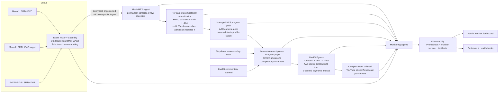

# ScoreCheck First Eight-Camera Dry Run Debrief

- **Event:** `weekend-dry-run-20260726`
- **Event ID:** `e04d7463-a2c9-459c-b73b-336aad151045`
- **Infrastructure generation:** `04608006-9ec9-4dda-8d37-d8c5b02c70cd`
- **Coverage window:** 2026-07-26 17:07:14 UTC through 2026-07-28 01:30:47 UTC
- **Final provider-zero audit:** 2026-07-28 01:42:59 UTC
- **Report status:** Evidence-backed diagnostic debrief, not production acceptance

## 1. Executive Verdict

This run was successful as a failure-finding and architecture-selection exercise. It was not a successful production qualification.

The test proved that the basic ScoreCheck system can:

- reconstruct the complete 12-Droplet event stack from protected configuration;
- receive multiple camera models, codecs, and transports concurrently;
- keep eight separate unlisted YouTube broadcasts bound and live while camera and internal program paths fail and recover;
- preserve camera isolation through one compositor per camera;
- correlate camera, bonded-network, ingest, branch, browser, Egress, YouTube, and host telemetry;
- send actionable Pushover incidents without turning every downstream symptom into a separate network page;
- preserve evidence and return DigitalOcean to zero temporary compute after an abrupt operator-requested shutdown.

The run also exposed four release-blocking defects:

1. **Venue upload reserve was insufficient.** The two-link bonded uplink repeatedly operated at its measured ceiling. SRT loss grew across several cameras at the same time, and Starlink rejoin behavior could leave Speedify with seconds of queued media even after that adapter was deprioritized.
2. **The WHEP-to-Chromium program-renderer path was not reliable.** Browsers dropped and froze frames across RTMP/H.264, SRT/H.264, and SRT/HEVC sources while upstream FFmpeg stayed near 30 fps and browser RTP loss stayed at zero.
3. **The first broad HLS configuration retained too much decoded media.** Camera 8 and Camera 1 Egress jobs hit the LiveKit memory guard at approximately 7.02 GB and 7.14 GB. Their exact outputs had to be restarted manually.
4. **There is no owner-safe persistent-output supervisor outside the production-soak process.** If an Egress job disappears, the current static program supervisor does not safely recreate the missing owned job. The YouTube broadcast remains live, but the stream receives no program until an operator or active soak runner restores Egress.

The current architectural direction is therefore:

- **Cameras 1-2, Mevo Core:** SRT + HEVC, 1080p30 by default and 1080p60 only when the event profile and bandwidth gate explicitly admit it.
- **Cameras 3-8, AVKANS GO:** SRT + H.264, 1080p30 around 3 Mbps.
- **Browser/program delivery:** buffered HLS, not WHEP, because reliable continuous presentation matters more than latency.
- **Final YouTube output:** persistent 1080p H.264/AAC Egress, independent of source availability. Camera loss must show the interruption slate; it must not complete the broadcast.

This target is the best current fit, but it is not fully qualified. The next event-shaped test must finish HLS memory/latency qualification, persistent-output auto-recovery, final AVKANS profile admission, audio verification, and a reserved-bandwidth rerun.

## 2. What Was Actually Tested

### 2.1 Infrastructure scale

The event used 12 temporary DigitalOcean Droplets in `sfo2`:

| Count | Role | Size used in this run | Purpose |
| ---: | --- | --- | --- |
| 1 | Commentary/control media | `s-2vcpu-2gb` | LiveKit, Redis, TURN/TLS, commentary rooms, and control-plane media services |
| 1 | Observability | `s-2vcpu-4gb` | Monitor service, Prometheus, Alertmanager, Caddy, incident correlation, and evidence collection |
| 1 | Shared ingest | `c-4` | MediaMTX camera ingest, raw paths, derived media paths, and managed branch runners |
| 8 | Camera compositors A-H | `s-8vcpu-16gb-480gb-intel` | One isolated Chromium/LiveKit Egress pipeline per camera |
| 1 | Spare compositor | `s-8vcpu-16gb-480gb-intel` | Isolated canaries, diagnostics, and recovery capacity |

Two persistent Reserved IPv4 anchors were retained between events for ingest and commentary. All 12 compute instances were destroyed at the end.

### 2.2 Camera cohorts during the comparison window

The long stable mixed-cohort window used:

| Camera | Model | Transport | Source codec | Intended source mode during comparison |
| ---: | --- | --- | --- | --- |
| 1 | Mevo Core | SRT | HEVC | 1080p30 |
| 2 | Mevo Core | RTMP | H.264 | 1080p30 |
| 3 | AVKANS GO | RTMP | H.264 | 1080p30, approximately 3 Mbps |
| 4 | AVKANS GO | RTMP | H.264 | 1080p30, approximately 3 Mbps |
| 5 | AVKANS GO | SRT | HEVC | 1080p30, approximately 3 Mbps |
| 6 | AVKANS GO | SRT | HEVC | 1080p30, approximately 3 Mbps |
| 7 | AVKANS GO | SRT | H.264 | 1080p30, approximately 3 Mbps |
| 8 | AVKANS GO | SRT | H.264 | 1080p30, approximately 3 Mbps |

Later, Nathan changed the intended production standard for AVKANS cameras to SRT/H.264 and attempted to move Cameras 3-8 to that profile. At the final pre-shutdown checkpoint:

- Cameras 3, 4, 7, and 8 were confirmed as SRT/H.264 High, 1920x1080, AAC, at roughly 3.2 Mbps.
- Cameras 5 and 6 were sending H.264/AAC packets, but their existing sessions still lacked trustworthy profile and dimension metadata and had no healthy downstream program branch. They needed a camera-side stream off/on to establish a fresh source session. That step did not occur before teardown.
- Camera 2 was not publishing.
- Camera 1 remained SRT/HEVC but had an abnormally low observed source bitrate, generally around 0.4-0.5 Mbps rather than the intended 3 Mbps.

The final target profile is therefore an architectural decision, not a claim that all eight cameras passed that exact profile in this run.

### 2.3 What was deliberately not tested

- No commentators participated. Commentary publishing, return video, mix-minus, and HLS-era clap synchronization were not accepted in this run.
- No official scoring match was active. Score overlay plumbing remained available, but scoring correctness was not the focus.
- 1080p60 was not qualified. The run was effectively 1080p30.
- The spare-to-YouTube-backup path was not exercised.
- The shared-ingest Reserved IP recovery path was not exercised.
- No final low-headroom production venue profile passed.

## 3. Current Architecture After This Iteration

### 3.1 Media plane

1. Each physical camera has a permanent Camera 1-8 destination identity. A camera does not change identity when it moves to another court.
2. The event router forces camera SRT/RTMP traffic through the Speedify tunnel. Guard rules and a kill switch block camera egress if the bonded path is unavailable.
3. MediaMTX admits one publisher per raw camera path and exposes per-path readiness, bitrate, frame errors, codec metadata, reader count, and SRT transport counters where available.
4. Browser-incompatible media is normalized to H.264 High, progressive 1920x1080, browser-safe pixel format, controlled timestamps, and continuous AAC audio.
5. The program branch is packaged as ordinary buffered HLS for the headless Chromium renderer. Low latency is intentionally disabled.
6. The event-pinned Program page combines camera video/audio, scoreboard overlay, interruption slate, and optional commentary.
7. One LiveKit Web Egress per compositor captures the Program page and sends one continuous RTMPS output to the camera's bound YouTube stream.
8. Camera or branch loss changes the Program page to an interruption slate. It does not own YouTube broadcast lifecycle.

### 3.2 Control and scoring plane

- Supabase is authoritative for event/camera mapping, expected state, score/overlay materialization, monitor incidents, and notification history.
- Realtime is an invalidation mechanism; HTTP repair remains authoritative.
- Expectations distinguish `EXPECTED_OFF` from an actual camera or output failure.
- Broadcast ownership is event- and camera-scoped. A camera outage cannot silently stop or complete YouTube.

### 3.3 Observability plane

- Every host sends agent state to the observability service.
- Camera pipeline telemetry includes raw/normalized/program readiness, bitrate, codec, transport loss, FFmpeg progress, browser rendered frames, reset-safe drops/freezes, Egress count/resources, and YouTube state.
- The router sends Speedify aggregate and per-uplink throughput, latency, congestion, queue, route, kill-switch, memory, and flow data.
- Monitor snapshots are correlated into one earliest-root incident instead of paging every dependent stage.
- Pushover is the operator paging channel. Healthchecks provides monitor dead-man coverage.
- Compact evidence recorders run off the media path.

### 3.4 Lifecycle plane

- Event infrastructure is temporary. A protected manifest reconstructs all hosts, DNS, Reserved IP assignments, secrets, firewall contracts, software revisions, and renderer binding.
- Coverage close and provider destruction are separate, explicit operations.
- Powered-off Droplets are not considered cost-safe. Deletion is the billing boundary.
- Teardown preserves retained TLS state, pauses event checks, deletes temporary compute/tags/renderer resources, and verifies provider zero.

## 4. Why We Landed on the Current Codec and Protocol Plan

### 4.1 SRT is the preferred camera transport

SRT is preferred over RTMP for this venue because it provides:

- packet retransmission over lossy bonded WAN links;
- explicit RTT, received, lost, retransmitted, dropped, and receive-buffer telemetry;
- a configurable recovery latency window;
- persistent caller behavior that matches the Mevo operating model;
- better diagnostic separation between source loss and shared network congestion.

RTMP did connect and carry stable video in several windows, but that does not prove it was more reliable. RTMP's TCP backpressure and source stalls were largely invisible in the current per-camera monitor, whereas SRT made impairment measurable.

The Camera 3 AVKANS RTMP failure also showed a practical support risk. The camera UI repeatedly returned `Connect timeout`, while the ingest server saw no TCP connection or SYN from that camera. Camera 2 remained connected to the same ingest host and port through the same router and Speedify path. The AVKANS XLog export used a vendor-private encryption key and could not be decoded with Tencent's public sample key. The endpoint was eventually corrected to include `/live`, and RTMP worked for Cameras 3-4, but the failure mode was harder to observe and support than SRT.

### 4.2 AVKANS GO uses H.264

AVKANS GO Cameras 3-8 should use SRT/H.264 because:

- Linux Chromium cannot be assumed to decode HEVC through WebRTC;
- H.264 avoids a mandatory HEVC decode on every AVKANS camera;
- removing six HEVC transcodes reduces compute, heat, restart, and reference-frame failure risk;
- H.264 source problems are easier to inspect with ffprobe and browser-compatibility gates;
- the final YouTube output is H.264 anyway.

This does **not** mean every AVKANS H.264 session is safe to copy directly. Direct probes found:

| Camera/session | Profile | Pixel format | Progressive | B-frames | Interpretation |
| --- | --- | --- | --- | ---: | --- |
| Camera 2 Mevo RTMP | Main | `yuvj420p` | yes | 0 | Decodable, but the reported average-rate metadata was inconsistent |
| Camera 3 AVKANS RTMP | High | `yuv420p` | yes | 1 | Not safe for direct browser WHEP; requires rejection or H.264 cleanup |
| Camera 4 AVKANS RTMP | High | `yuv420p` | yes | 0 | Basic browser-safe admission passed |
| Camera 7 AVKANS SRT before restart | unknown | unknown | unknown | 0 | Malformed: no valid dimensions/profile and invalid H.264 access units |
| Camera 8 AVKANS SRT | High | `yuv420p` | yes | 0 | Basic browser-safe admission passed |

Therefore the production rule is: use AVKANS SRT/H.264, then strictly admit or normalize each source. Do not blindly stream-copy all H.264 into a browser path.

### 4.3 Mevo Core retains HEVC

The Mevo Cores retain SRT/HEVC because HEVC materially reduces venue upload for a given visual quality and the Mevo SRT mode is designed to reconnect continuously while enabled.

That benefit has a cost:

- every Mevo HEVC stream requires an isolated HEVC-to-H.264 compatibility normalizer before browser rendering;
- reference-frame and source-discontinuity behavior must be handled;
- 1080p60 requires its own event profile and host/bandwidth qualification;
- the normalizer cannot be moved onto the shared ingest host without proving aggregate CPU headroom and accepting a larger blast radius.

The safe compromise is HEVC only where it has high bandwidth value and a dedicated per-camera normalization boundary.

### 4.4 HLS is the program-renderer transport

The operating priority was clarified as:

1. continuous viewer playback;
2. synchronized camera audio, commentary, and score;
3. visual/audio fidelity;
4. predictable recovery;
5. latency only after the above.

That makes low-latency WHEP the wrong default for the internal program renderer. It remains useful for low-latency operator inspection and commentary return, but it did not provide reliable long-running Chromium presentation.

The strongest same-source evidence was the Camera 4 isolated comparison:

- HLS: 1920x1080, 5,395 rendered frames over 180.532 seconds, 29.8838 fps, zero Chromium playback drops, no browser errors.
- Simultaneous WHEP control: 28.4849 rendered fps, two dropped frames, three freezes, 1.663 seconds frozen, zero RTP loss, and 395-819 ms jitter-buffer delay.

The source and normalized program path were common. The transport/rendering path was the meaningful variable.

The HLS target after the memory correction is:

| Setting | Current candidate |
| --- | ---: |
| Target playout latency | 12 seconds |
| Maximum accepted latency | 24 seconds |
| Startup forward buffer | 10 seconds |
| Maximum forward/total HLS buffer | 18 seconds |
| Back buffer | 4 seconds |
| Compressed buffer cap | 32 MB |
| Initial segment count | 6 |
| Low-latency mode | disabled |

This is intentionally conservative. It still needs a long memory plateau and latency-contract test.

## 5. Chronological Dry-Run Timeline

All times below are UTC. Central time during this run was UTC-5.

### 2026-07-26: build, admission, and persistent-output preparation

- **13:23-13:43:** The lifecycle controller created and qualified all 12 Droplets, assigned the two Reserved IP anchors, rendered DNS, verified private networking, and sent the ready notification.
- **17:07:** Coverage was opened.
- The initial production runner was hardened so events could run without commentators, NTP used measured host offsets, HEVC reference-frame decoding was accepted, bounded frame-rate and GOP bitrate variation stopped causing false rejections, and output startup was decoupled from camera admission.
- Persistent YouTube output was changed to start on the interruption slate and remain independent from diagnostic success.
- Transient YouTube and monitor reads received bounded retries.
- MediaMTX SRT queues were increased to survive recovery bursts, while delayed-reader overflow was bounded.
- The eighth AVKANS camera was added during the run, bringing the system to eight active camera identities and eight YouTube outputs.

### 2026-07-27 02:00-05:00: source incompatibilities and mixed-codec hardening

- Camera 7 SRT/H.264 arrived malformed. Isolated decode errors included `missing picture in access unit`, unsupported data partitioning, `no frame`, and `invalid data found when processing input`.
- A fresh decoder restart did not repair Camera 7. The camera/device source session was implicated because Camera 8 on the intended peer profile decoded successfully.
- AVKANS RTMP audio compatibility was patched in the MediaMTX build and H.264/AAC raw paths for Cameras 3-4 were admitted. Startup logs still showed repeated on-demand branch start/exit/timeout churn before normalized/preview/program paths stabilized.
- The program browser/audio ownership model was simplified so the camera media element remained the stable audio owner instead of being repeatedly replaced during reconnects.
- Timestamp-continuity changes improved some courts, but a two-minute reset-safe report still showed severe WHEP presentation loss on several cameras despite zero RTP loss.

### 2026-07-27 07:00-11:00: direct H.264, buffers, child reaping, and timestamp evidence

- Direct H.264 canaries showed that Camera 2 could bypass its normalizer for 120 seconds at 29.92 rendered fps with only two short freezes. Camera 4 improved when its unnecessary normalizer was removed, but WHEP still accumulated drops/freezes and jitter-buffer delay.
- These results proved that removing unnecessary transcodes saves work, but does not solve the shared WHEP/Chromium pacing defect.
- Increasing ingest UDP buffering did not repair every slow program. Cameras 5-8 still showed extreme SRT RTT, loss, or under-real-time FFmpeg speed in the impaired network window.
- MediaMTX was recreated with an init process so orphaned runner and healthcheck children could be reaped. Monitoring and capacity code was updated to distinguish legitimate short-lived healthcheck/runtime children from persistent leaks.
- A raw Camera 4 packet probe found a maximum PTS/DTS gap of 5.086 seconds and 154 backward-or-duplicate timestamps in about one minute. Source timestamp irregularity was real, but it did not fully explain the cross-codec WHEP behavior.

### 2026-07-27 12:00-14:05: Speedify and wireless recovery experiments

- Monitoring was changed to correlate simultaneous SRT symptoms into one `VENUE_SRT_CONGESTION` root incident and suppress downstream per-camera alert fan-out while retaining the incidents and browser symptoms.
- Low variable bitrate was removed as a standalone camera-failure condition because real encoders pulse around a configured target.
- The router's 5 GHz channel configuration was adjusted and bounded per-camera reconnections were observed.
- A fixed 250 ms Speedify delay canary was started at 13:52:32 and aborted/restored about one minute later because it did not improve the system safely.
- A bounded Speedify disconnect/reconnect from 13:55:31 through 13:57:18 cleared stale tunnel/scheduler state and restored fail-closed routing.
- An all-eight acceptance window from 13:58 through 14:03 proved all upstream program FFmpeg processes could run near 30 fps with zero FFmpeg drops, but browser results remained uneven. Camera 4 rendered about 25.28 fps with 1,038 drops and 36.596 seconds frozen while upstream stayed near 30 fps.

### 2026-07-27 15:00-20:00: pacing experiments and camera recovery

- Real-time pacing was tested in several forms: input `-readrate`, normalizer pacing, a filter-based decoded timeline, and a two-process producer/queue. Unsafe variants were reverted.
- A representative Camera 7 comparison found:
  - normalizer-paced: 29.36 rendered fps, one drop, zero freezes;
  - fresh control: 28.55 rendered fps, 155 drops, four freezes;
  - local unpaced: 25.52 rendered fps, 42 drops, 12 freezes.
- The decoded-filter candidate later stalled after source discontinuities, and the two-process queue eventually exhausted buffered media because source throughput fell below real time. Neither was accepted.
- The Program watchdog was changed to recover genuinely degraded decoder sessions. Reset-safe counters and page identity were preserved so recovery did not erase evidence.
- Camera 7 was physically/application-restarted after malformed output. It recovered H.264 High, 1920x1080, AAC 48 kHz; normalized/program FFmpeg returned to approximately 30 fps with zero drops. A three-minute post-restart window ran at 29.69 rendered fps with no new browser drops, freezes, loss, reconnects, or reloads.
- Camera 5 was also restarted after malformed HEVC/reference behavior. Its source and branches recovered, but restoring the eighth source pushed the venue uplink back to its aggregate ceiling.

### 2026-07-27 20:39-22:03: HLS isolation and venue-capacity confirmation

- The spare compositor ran isolated HLS canaries without mutating production output.
- HLS video pacing passed at 29.8838 fps with zero playback drops while the simultaneous WHEP control continued dropping/freezing.
- HLS camera-audio extraction passed. Browser decoded audio grew continuously and RMS remained non-silent.
- A 25-second isolated HLS relay outage produced bounded retries, preserved page identity, and recovered video/audio. Stable recovery began about 15.7 seconds after relay restart. The 150.5-second post-recovery hold ran at 29.878 rendered fps with 12 playback drops, retained as a minor caveat.
- The complete Program page candidate then held 125 seconds at about 29.991 renderer fps, two Chromium drops, zero reconnect/reload, 1920x1080, and active camera audio.
- A synchronized 122-second mixed-cohort interval confirmed all eight raw/program paths and all eight YouTube outputs remained up, but both Speedify uplinks and the aggregate tunnel were congested. WHEP browser loss crossed every codec/transport cohort.
- The final stable mixed cohort held 23.5 minutes with raw readiness at 100% on all cameras, but accumulated large browser drop/freeze totals and simultaneous SRT loss. This was classified `FAIL_VENUE_HEADROOM_AND_WHEP_PACING_WITH_OUTPUT_CONTINUITY`.

### 2026-07-28 00:10-01:30: partial HLS rollout, OOM, bounded fix, and interrupted canary

- The event renderer moved selected program pages to the HLS candidate while preserving the existing unlisted YouTube outputs.
- The first broad HLS configuration retained too much decoded media in Chromium.
- **00:54:11:** Camera 8 Egress was killed at about 7.02 GB used. Its Chrome renderer was approximately 5.44 GB.
- **00:54:20:** Camera 1 Egress was killed at about 7.14 GB used. Its Chrome renderer was also approximately 5.44 GB.
- Both failures were LiveKit memory-guard/OOM failures, not camera loss. YouTube ingestion went inactive/no-data while each broadcast itself remained live.
- Exact output ownership was preserved. Camera 1 was restarted as `EG_sd24jrvGDHAR` and Camera 8 as `EG_TKX8N6ngJ84W`, using the same event output generation and existing destinations. Both returned to YouTube active/good.
- HLS buffer/back-buffer limits were then hard-bounded in commit `ed6e5f432`.
- Camera 3 ran the corrected candidate starting at page load `2026-07-28T01:26:25.920Z`. It played 1080p near 29-31 fps with zero freezes/reconnects/reloads and four dropped frames.
- The short Camera 3 canary did not pass its release gate:
  - Egress cgroup memory rose from about 2.65 GB to 3.06 GB in roughly 90 seconds and no long plateau was observed.
  - Reported playout delay started around 12.1 seconds but unexpectedly fell to about 2.1 seconds.
  - The intended 10-minute hold was interrupted by the requested cost-safe shutdown.

### 2026-07-28 01:30-01:43: abrupt protected teardown

- Nathan requested immediate teardown before Codex usage limits were exhausted.
- A resume checkpoint and pre-teardown monitor snapshot were saved.
- Coverage closed at `01:30:47`.
- The normal final-evidence command first encountered an existing evidence directory without its completion marker, then found a reconstruction-attestation mismatch for `/opt/scorecheck-monitor-agent/agent-compose.yml` on the commentary host.
- The lifecycle code was corrected so a failed final attestation is written as unhealthy evidence instead of stranding billable compute. Thirty-six lifecycle tests passed.
- The event preserved the unhealthy final state rather than claiming a healthy acceptance.
- Retained ingest, commentary, and observability TLS state was captured.
- All 12 Droplets were deleted between `01:36:52` and `01:39:10`.
- Baseline, active-event, and sentinel Healthchecks were paused.
- The isolated Vercel renderer project and event tags were removed.
- All eight live unlisted YouTube broadcasts were explicitly transitioned to `complete`; `autoStop=false` correctly prevented Droplet deletion from owning broadcast lifecycle.
- The provider-zero audit passed at `01:42:59`: zero Droplets, exact two unassigned Reserved IPs, zero event snapshots/tags/rehearsal projects/DNS, and all eight reusable YouTube streams idle.

## 6. Important Quantitative Findings

### 6.1 Venue capacity

After Camera 5 returned, the eight raw feeds totaled approximately 19.4 Mbps. Speedify measured:

- tunnel average: 20.61 Mbps;
- tunnel range: 19.05-22.56 Mbps;
- AT&T average contribution: 5.43 Mbps;
- T-Mobile average contribution: 15.86 Mbps;
- both per-link send windows reached capacity;
- effectively no operating reserve remained after tunnel overhead.

During the same interval, reset-safe SRT loss increased:

| Camera | SRT packet-loss growth |
| ---: | ---: |
| 1 | +368 |
| 5 | at least +1,015 in its new session |
| 6 | +9,799 |
| 7 | +11,043 |
| 8 | +10,624 |

In another 122-second synchronized interval, Camera 6 lost +1,992 packets, Camera 7 +880, and Camera 8 +1,097 while both usable adapters and the tunnel were marked upload-congested.

This demonstrates why a Speedify headline estimate is not an admission gate. Production needs measured sustained goodput above all source payloads plus at least a 25-30% reserve.

### 6.2 Starlink rejoin event

When Starlink rebooted and rejoined Speedify, it entered the available-link set before it was stable. The bonded scheduler accumulated approximately 11.8 MB with roughly 4.4-5.8 seconds of queue delay. Deprioritizing the adapter alone did not drain the stale scheduler state. A bounded fail-closed Speedify tunnel reconnect cleared the queue and restored the previously functioning links.

This was a real operational issue, but it was not the only system defect. WHEP pacing failures continued under stable upstream conditions and across transports.

### 6.3 WHEP program-browser loss

The 23.5-minute mixed-cohort window accumulated:

| Camera | Source cohort | Browser drops | Freezes | Freeze duration | Browser RTP loss |
| ---: | --- | ---: | ---: | ---: | ---: |
| 1 | SRT/HEVC | 0 | 1 | 2.119 s | 0 |
| 2 | RTMP/H.264 | 577 | 411 | 148.676 s | 0 |
| 3 | RTMP/H.264 | 2,999 | 163 | 123.601 s | 0 |
| 4 | RTMP/H.264 | 2,281 | 159 | 103.667 s | 0 |
| 5 | SRT/HEVC | 40 | 6 | 4.028 s | 0 |
| 6 | SRT/HEVC | 31,107 | 66 | 120.868 s | 0 |
| 7 | SRT/H.264 | 11,329 | 196 | 345.834 s | 0 |
| 8 | SRT/H.264 | 37,316 | 270 | 522.509 s | 0 |

All eight program FFmpeg processes ended near 30 fps with zero FFmpeg drops and zero MediaMTX frame errors. The defect was downstream of source transport and FFmpeg production.

### 6.4 HLS canary results

| Test | Result | Key evidence |
| --- | --- | --- |
| Isolated HLS vs WHEP | Pass for HLS, fail for WHEP | HLS 29.8838 fps/0 drops; simultaneous WHEP 28.4849 fps with drops/freezes |
| HLS camera audio | Pass | One audio track, decoded bytes increasing, non-silent RMS, no audio error |
| HLS 25-second relay outage | Pass with minor drops | Same page, bounded retries, stable recovery in 15.7 s, final 150.5 s hold |
| Full Program page over HLS | Pass with minor drops | 125 s, 29.991 fps, two drops, zero reconnect/reload, active audio |
| First broad HLS memory behavior | Fail | Camera 1 and 8 Egress killed at 7.14/7.02 GB |
| Bounded-buffer Camera 3 candidate | Inconclusive | Smooth short playback, but memory rose and delay fell from 12.1 s to 2.1 s before test ended |

### 6.5 YouTube output behavior

- Eight broadcasts remained unlisted throughout.
- During the long mixed-cohort window all eight were live, recording, bound, active, and provider-health good.
- Camera or branch loss generally produced the interruption slate while the broadcast remained live.
- Egress OOM was the important exception: the broadcast stayed live, but the ingestion stream became inactive/no-data until Egress was manually restarted.
- Provider status occasionally reported informational `bitrateHigh` or `audioBitrateLow`. `audioBitrateLow` remained present on several final samples and needs output-level verification.

## 7. Confirmed Fixes and Changes Made During the Run

### 7.1 Media and output resilience

- Events can run with commentary explicitly absent.
- Host clock readiness uses measured NTP offset rather than a misleading local comparison.
- HEVC reference-frame decoding was enabled in the compatibility normalizer.
- Source admission tolerates bounded real encoder cadence variation and GOP bitrate pulses.
- YouTube output startup is decoupled from source admission and starts on the interruption slate.
- Diagnostics no longer block persistent-output startup.
- Transient YouTube and monitor reads use bounded retries.
- MediaMTX SRT queues and delayed-reader overflow handling were hardened.
- The mixed-codec media path gained AVKANS AAC compatibility, opaque RTMP key handling, isolated normalizer ownership, and explicit program-runner behavior.
- Program browser/audio ownership was simplified to reduce reconnect churn.

### 7.2 Process and capacity handling

- MediaMTX and monitoring containers gained init-based child reaping.
- Capacity evidence distinguishes bounded healthcheck/runtime zombies from persistent process leaks.
- Missing normalizer progress files receive bounded retry instead of immediate false failure.
- External viewer probes were bounded and cleaned up.
- Program cadence alerts were added without equating low variable bitrate with failure.

### 7.3 Network monitoring and alerting

- Router heartbeats now carry Speedify aggregate/per-link throughput, latency, jitter, loss, queue, congestion, failover, route, kill-switch, flow, CPU, and memory data.
- SRT routes preserve Speedify's stream-aware behavior.
- One shared venue-congestion incident inhibits downstream SRT/browser symptom paging without deleting those symptoms.
- Pushover copy for venue congestion was rewritten in plain operator language.
- Browser symptom dedupe remains reset-safe in Prometheus.

### 7.4 Program renderer

- WHEP was hard-cut to buffered HLS for the program-renderer candidate.
- HLS camera audio is emitted as AAC.
- Egress prefers the managed HLS path.
- The Program page waits for a 10-second startup buffer.
- HLS memory was bounded with an 18-second buffer, 4-second back buffer, and 32 MB compressed cap.
- Overlay/commentary timing follows measured HLS playout delay rather than assuming the old WHEP timing model.

### 7.5 Lifecycle

- Failed final attestation is now durably captured as unhealthy evidence while teardown remains cost-safe.
- The fix was covered by 36 lifecycle tests.
- Provider-zero teardown completed successfully despite the unhealthy final attestation.

## 8. Code Change Ledger

The main dry-run branch is `codex/hevc-reference-decode-fix`. Important commits in chronological order:

| Commit | Change | Outcome |
| --- | --- | --- |
| `28abdf114` | Support events without commentators | Accepted |
| `3f1fbdd8c` | Use host NTP offset for lifecycle clock gate | Accepted |
| `f7400c70e` | Allow HEVC reference-frame decoding | Accepted, still requires per-camera qualification |
| `3e77478a0` | Allow bounded live frame cadence variance | Accepted |
| `6cca0017e` | Decouple persistent output from camera admission | Accepted, core invariant |
| `00e3c21b4` | Allow bounded GOP bitrate pulses | Accepted |
| `10629b278` | Resume startup evidence collectors safely | Accepted |
| `9c0ba8624` | Start persistent output on interruption slate | Accepted |
| `cc04539c1` | Do not let diagnostics block persistent output | Accepted |
| `6f7a884e1` | Retry transient YouTube reads | Accepted |
| `019d69ae3` | Retry transient monitor snapshots | Accepted |
| `c1ade0896` | Accept emitted workload zombie classifications | Accepted |
| `4f99d291b` | Tolerate bounded SSH observation stalls | Accepted |
| `96575134c` | Track bounded MediaMTX workload zombies | Accepted |
| `139362e68` | Prevent delayed SRT reader overflow | Accepted |
| `244886343` | Increase MediaMTX queue for HEVC recovery bursts | Accepted with continued host-capacity monitoring |
| `1467e070d` | Harden production-soak startup monitoring | Accepted |
| `c1e6c8ee3` | Stabilize program playback and audio ownership | Accepted but did not solve WHEP pacing |
| `eaa6b946d` | Harden mixed-codec production media paths | Accepted as compatibility foundation |
| `98e90a3e8` | Collect compositor normalizer telemetry | Accepted |
| `6009bf115` | Alert on sustained program source cadence loss | Accepted |
| `ce0ee24f7` | Bound external viewer probes | Accepted |
| `83467693d` | Reap orphaned MediaMTX children | Accepted |
| `c649812b9` | Retry disappearing normalizer progress files | Accepted |
| `8207a60ce` | Recognize init-wrapped MediaMTX healthchecks | Accepted |
| `8ae6c7a87` | Classify MediaMTX runner child waits | Accepted |
| `15d54253a` | Preserve Speedify stream-aware routing | Accepted |
| `070088e95` | Reap monitor-agent healthcheck children | Accepted |
| `0413d2a70` | Enforce validated venue transport settings | Accepted |
| `be5c34829` | Pace normalized program input in real time | Reverted after live risk |
| `bfc86077a` | Revert normalized-input pacing | Correct rollback |
| `125015b1a` | Pace browser normalizer input in real time | Reverted after unsafe behavior |
| `2762a9cb9` | Revert unsafe normalizer input pacing | Correct rollback |
| `0cd7c32cf` | Correlate venue SRT congestion without alert fan-out | Accepted |
| `5c3d6aaa3` | Repair stale monitoring rollback image tags | Accepted |
| `dba05c41c` | Allow rebuilt monitoring rollback images | Accepted |
| `2c741b97e` | Use plain venue-congestion notifications | Accepted |
| `b40f31067` | Prevent post-congestion alert fan-out | Accepted |
| `65060672a` | Keep browser-symptom dedupe in Prometheus | Accepted and deployed during diagnostic |
| `52353137a` | Stop treating low VBR as camera failure | Accepted |
| `2f0632d3b` | Protect live monitoring targets during deploy | Accepted |
| `62662bbc1` | Recover degraded program decoder sessions | Accepted, but WHEP remained unsuitable |
| `14d457bca` | Escalate required unready media paths | Accepted |
| `70bb6f738` | Keep Prometheus scrape config mounted during deploy | Accepted |
| `252d657b7` | Honor Alertmanager incident inhibition | Accepted |
| `c82570ff6` | Hard-cut program rendering to HLS | Candidate direction accepted; rollout not qualified |
| `c89e78cac` | Complete buffered HLS reliability and router monitoring | Partial: functional, but old HLS memory policy later failed |
| `c2c6f5d6f` | Emit HLS-safe AAC program audio | Accepted, human end-to-end audio A/B still missing |
| `722e5889c` | Prefer managed HLS playback in Egress | Accepted candidate |
| `9fee06d80` | Build intended HLS startup buffer | Accepted candidate |
| `ed6e5f432` | Bound HLS program memory and startup | Local candidate only; long gate incomplete |
| `c02f93c72` | Preserve failed final evidence during teardown | Accepted and pushed |

The functional code candidate before this report was clean and pushed at `c02f93c723adfa3de588b2d58b241e01a3778359`.

## 9. Issue Register

### 9.1 Fixed or materially improved

| Issue | Classification | Evidence of improvement |
| --- | --- | --- |
| Camera loss prevented output startup | Fixed | Output starts on slate and remains independent from camera admission |
| Commentary absence blocked event | Fixed | Event ran with commentary expectation `NONE` |
| HEVC reference decode rejected valid Mevo streams | Fixed in decoder contract | Mevo HEVC paths admitted; full 30/60 qualification remains |
| AVKANS RTMP AAC incompatibility | Fixed in MediaMTX build | Cameras 3-4 produced H.264 + MPEG-4 Audio raw paths |
| Child/zombie accumulation from old shell/process handling | Materially improved | Init and classifier changes; inspected later samples showed clean bounded behavior |
| Camera 7 malformed H.264 source | Recovered operationally | Physical/application restart produced stable H.264 High 1080p30 and a clean three-minute hold |
| Camera 5 malformed HEVC/reference session | Recovered operationally | Restart restored source and branches; later network saturation was independent |
| Duplicate per-camera network pages | Fixed | One shared venue SRT congestion incident with downstream inhibition |
| Low VBR false camera failures | Fixed | Low bitrate alone no longer opens a failure |
| WHEP root-cause ambiguity | Resolved | Same-source HLS/WHEP test isolated the defect to WHEP/Chromium delivery |
| Cost-safe teardown after unhealthy evidence | Fixed | Unhealthy final attestation recorded; all compute still destroyed and audited zero |

### 9.2 Partially fixed or not fully qualified

| Issue | Current state | Missing proof |
| --- | --- | --- |
| HLS presentation reliability | Strong isolated passes | Eight-camera, event-length hold with bounded memory and stable delay |
| HLS source-loss recovery | Isolated pass with minor drops | Production Egress/source cycle and operator-visible slate under full load |
| HLS audio | Browser extraction passed | Human end-viewer A/B after AAC cutover; commentary mix/sync |
| AVKANS SRT/H.264 | Chosen target; several cameras confirmed | Fresh complete metadata and strict admission on Cameras 3-8 together |
| Mevo SRT/HEVC | Retained target | Intended 3 Mbps visual-quality check and 1080p60 qualification |
| Direct H.264 bypass | Works for some sessions | Must reject B-frames and malformed sessions; cannot be universal |
| Speedify Starlink handling | Tunnel reset restored service | Automated safe rejoin quarantine/drain policy and repeat test |
| Router remote management | Tailscale allowed Mac to leave event data path | Rebuild-day independent authorization and no-expiry operational check |
| Monitoring dashboard | Pipeline and router telemetry operational | Final operator UX acceptance under the chosen HLS architecture |

### 9.3 Open release blockers

1. **Persistent Egress auto-recovery:** implement an owner-safe supervisor that recreates exactly one missing Egress for the existing event/camera/output generation, refuses duplicates, and never completes YouTube.
2. **HLS memory plateau:** rerun `ed6e5f432` or its successor for at least 30 minutes per camera and then eight cameras concurrently. Require stable cgroup memory, no OOM, no sustained growth, and adequate `/dev/shm`.
3. **HLS delay contract:** explain and fix the observed playout-delay collapse from about 12.1 seconds to 2.1 seconds. Reliability may use a larger buffer, but the score/commentary timeline must know the real delay.
4. **Venue capacity admission:** require measured sustained upload with at least 25-30% reserve over total configured camera payload. Do not admit an event from a single Speedify estimate.
5. **Starlink rejoin behavior:** ensure a newly booted poor link cannot poison the active scheduler queue. Any automated tunnel reconnect must preserve fail-closed routing and page the operator.
6. **Cameras 5-6 fresh H.264 sessions:** repeat source off/on, verify SRT/H.264 High, dimensions, audio, bitrate, no malformed access units, and healthy derived paths.
7. **Camera 1 bitrate:** determine why intended 3 Mbps HEVC arrived around 0.4-0.5 Mbps and perform a visual-quality comparison.
8. **Audio quality:** reproduce Nathan's subtle robotic/reverberant Camera 1 observation and compare source, normalized AAC, Program mix, Egress output, and YouTube recording.
9. **Output conformance:** ffprobe the actual final 1080p30 output and prove H.264 profile, 10 Mbps near-CBR behavior, two-second GOP, progressive Rec.709, AAC stereo 128 kbps/48 kHz. `audioBitrateLow` must be explained or eliminated.
10. **Commentary on HLS:** complete return video, mix-minus, silence continuity, TURN/TLS, and clap synchronization against the new buffered camera timeline.
11. **Final attestation drift:** reconcile the commentary monitor-agent compose hash so final evidence can be healthy when the stack is otherwise healthy.
12. **Recorder/lifecycle ownership:** `production-soak-state.json` was stale at `STARTING` while no runner process was active. Recorder and supervisor ownership must be explicit and restart-safe.

## 10. Important Negative Results

These approaches should not be repeated without a materially different design:

- Treating RTMP readiness as proof that RTMP is healthier than SRT.
- Blaming total bandwidth for browser freezes when upstream FFmpeg is healthy and browser RTP loss is zero.
- Assuming all H.264 is browser-safe. Camera 3 emitted B-frames and Camera 7 emitted malformed H.264.
- Pacing a live input with a simple `-readrate` hard cut. It reduced or stalled throughput under source discontinuity and was reverted.
- A decoded-filter pacing bridge that cannot survive source discontinuities.
- A two-process producer/queue that drains when source throughput falls below real time.
- Letting HLS.js retain a 30-second back buffer plus a large forward buffer in a long-running 1080p Chromium Egress.
- Using path readiness alone as a viewer-quality signal.
- Allowing the final-evidence health check to prevent cost-safe provider teardown.

## 11. What We Can and Cannot Claim

### We can claim

- The 12-host event stack can be reconstructed and destroyed safely.
- Eight separate unlisted YouTube broadcasts can be created, bound, kept live, and completed independently.
- Persistent output is architecturally independent from camera availability.
- SRT provides the best operational telemetry and recovery behavior for the venue path.
- AVKANS SRT/H.264 and Mevo SRT/HEVC are the best current source-profile choices.
- WHEP/Chromium is not acceptable as the long-running internal Program renderer under the tested conditions.
- Buffered HLS substantially improves same-source Chromium presentation.
- HLS audio extraction and bounded same-page recovery are feasible.
- The monitor can correlate venue congestion, source defects, browser defects, Egress state, and YouTube state.
- Provider-zero teardown succeeded after the interrupted run.

### We cannot claim

- Production readiness for an eight-camera tournament.
- Event-length HLS stability or memory safety.
- Automatic output recovery after Egress OOM/crash.
- Stable 1080p60.
- A qualified commentary workflow under HLS.
- Clean end-to-end audio quality.
- A clean full AVKANS SRT/H.264 eight-camera admission.
- A passing venue bandwidth profile.
- A passing healthy final reconstruction attestation.

## 12. Recommended Next Test Sequence

The next run should be narrower and ordered. Do not repeat another unconstrained overnight iteration before these gates.

1. **Offline code gate:** finish the owner-safe Egress supervisor and fix commentary attestation drift. Validate tests without creating event infrastructure.
2. **One-camera HLS memory gate:** use one stable AVKANS SRT/H.264 source. Run at least 30 minutes and require memory plateau, fixed delay contract, zero Egress restart/OOM, stable AAC, and healthy YouTube.
3. **One-camera loss/recovery gate:** stop/restart the camera. Require same YouTube broadcast, interruption slate, bounded HLS retry, one final reader, and automatic owned-Egress recovery if Egress is deliberately stopped.
4. **Mevo gate:** qualify one Mevo SRT/HEVC at actual 3 Mbps 1080p30, then separately 1080p60 if desired. Verify visual quality and normalizer headroom.
5. **AVKANS admission gate:** establish fresh SRT/H.264 sessions for Cameras 3-8. Reject B-frames/malformed metadata or normalize them explicitly.
6. **Eight-camera HLS capacity gate:** run all eight with enough venue upload reserve. Require all HLS memory plateaus, no output gaps, no branch stalls, and zero unexplained incidents.
7. **Controlled WAN impairment:** remove and restore one bonded WAN, including Starlink rejoin. Confirm bounded queue and no unrelated output stop.
8. **Human audio/commentary gate:** inspect each YouTube recording, then add commentary and perform clap/sync acceptance.
9. **Terminal lifecycle gate:** healthy final evidence, explicit broadcast completion, teardown, and provider zero.

## 13. Current End State

At the time this report was prepared:

- lifecycle phase: `destroyed`;
- temporary DigitalOcean Droplets: `0`;
- account Droplet limit: `15`;
- retained Reserved IPv4 addresses: exactly `2`, both unassigned;
- event snapshots: `0`;
- event tags: `0`;
- rehearsal Vercel projects/DNS: `0`;
- reusable YouTube streams: eight, all `inactive/noData`;
- event broadcasts: eight, all `complete` and `unlisted`;
- Healthchecks baseline/active/sentinel: paused;
- functional dry-run code candidate before this report: clean and pushed at `c02f93c723adfa3de588b2d58b241e01a3778359`.

## 14. Protected Evidence Index

Primary evidence root:

`/Users/nathanhicks/.config/scorecheck/event-stack/events/weekend-dry-run-20260726`

### Main synchronized diagnostic evidence

`/Users/nathanhicks/.config/scorecheck/event-stack/events/weekend-dry-run-20260726/final-evidence/diagnostic-20260726T2301Z`

Important files and directories:

- `INTERIM_COHORT_ANALYSIS_20260727T2203Z.md`: mixed-cohort stability and WHEP failure summary.
- `monitor-samples.jsonl`: 6,400+ synchronized monitor samples.
- `router-protocol-samples-v2.jsonl`: 1,400+ router/Speedify protocol samples.
- `speedify-speed-current-private-20260727T132016Z.jsonl`: approximately 1,900 Speedify samples.
- `speedify-capacity-20260727T2138Z/SUMMARY.md`: aggregate upload-headroom failure.
- `live-interval-20260727T215649Z/SUMMARY.md`: synchronized 122-second source/browser/YouTube comparison.
- `direct-h264-qualification-20260727T0417Z/`: codec/profile/pixel/B-frame/audio evidence.
- `camera7-h264-srt-decode-finding.json`: malformed Camera 7 source evidence.
- `avkans-xlog-decode-result.json`: vendor XLog limitation and RTMP network correlation.
- `camera7-restart-20260727T1956Z/SUMMARY.md`: Camera 7 recovery and later independent network event.
- `camera5-restart-20260727T2136Z/SUMMARY.md`: Camera 5 recovery and shared-capacity caveat.
- `post-recovery-all8-acceptance-20260727T135814Z/`: all-eight acceptance attempt.
- `camera7-normalizer-pacing-diagnostic-20260727T1532Z/`: pacing comparisons.
- `camera7-normalizer-filter-pacing-diagnostic-20260727T1602Z/`: failed filter pacing.
- `camera7-two-process-queue-diagnostic-20260727T1611Z/`: failed queue pacing.
- `c4-hls-spare-canary-20260727T2039Z/`: HLS versus WHEP same-source test.
- `c4-hls-audio-canary-20260727T2054Z/`: HLS camera-audio test.
- `c4-hls-recovery-canary-20260727T2103Z/`: HLS outage/recovery test.
- `c4-local-program-hls-candidate-20260727T2141Z/`: full Program page HLS test.
- `c3-ed6e5f432-canary.jsonl`: bounded-buffer Camera 3 HLS canary.
- `egress-oom-recovery-20260728T010806Z/`: exact Camera 1/8 output recovery commands and ownership evidence.

### Abrupt shutdown and provider-zero evidence

`/Users/nathanhicks/.config/scorecheck/event-stack/events/weekend-dry-run-20260726/final-evidence/abrupt-stop-20260728T0129Z`

- `pre-teardown-snapshot.json`: final live monitor snapshot and open incidents.
- `resume-checkpoint.json`: exact code/evidence/live-state continuation point.
- `youtube-broadcast-shutdown.json`: all eight live-to-complete/unlisted transitions.
- `provider-zero-audit-final.json`: passing terminal provider-zero audit.
- `SHA256SUMS`: evidence integrity hashes.

### Lifecycle evidence

`/Users/nathanhicks/.config/scorecheck/event-stack/events/weekend-dry-run-20260726/lifecycle-evidence-abrupt-20260728T0130Z`

- `stack-health.json`: truthful unhealthy final-attestation classification.
- `evidence.json`: captured generation/inventory/network evidence.
- `EVIDENCE_COMPLETE.json`: completion marker and evidence hash.
- `provider-inventory.json`: pre-destroy exact provider inventory.

### Source code worktree

`/Users/nathanhicks/.codex/worktrees/scorecheck-hevc-reference-decode-fix`

Branch: `codex/hevc-reference-decode-fix`
Functional code head before this report: `c02f93c723adfa3de588b2d58b241e01a3778359`

## 15. Final Assessment

The dry run did not reveal that the entire architecture is wrong. It revealed that the decomposition is useful: camera/source defects, bonded-network defects, raw timestamp defects, WHEP presentation defects, HLS memory defects, Egress ownership defects, and lifecycle evidence defects were separable and diagnosable.

The main design change is narrow but significant: the long-running Program renderer should prioritize buffered HLS reliability over WHEP latency. The source profile should standardize on SRT, with H.264 from AVKANS and HEVC from Mevo only where the isolated normalizer justifies its bandwidth savings. YouTube output remains a separate persistent responsibility and must survive source loss.

The next milestone is not another broad architecture rewrite. It is a bounded qualification of the corrected HLS buffer, automatic Egress ownership recovery, fresh final camera profiles, and a venue profile with real upload reserve. Until those gates pass, ScoreCheck should be treated as a strong diagnostic candidate, not tournament-qualified production infrastructure.
